> 分区表和分布式表都叫「把一张表拆成多份」，但拆的层级完全不同：
> - **分区表**是单机存储优化——同一张逻辑表，数据按规则分散到多个物理文件，对应用完全透明。
> - **分布式表**是多机分片策略——同一张逻辑表，数据按规则分散到多个数据库实例，应用必须通过中间层访问。
>
> 两者的核心差异在四个维度：**数据分布范围**（单机 vs 多机）、**对应用的透明性**（透明 vs 需中间件）、**扩展上限**（几十分区 vs 数千实例）、**运维代价**（标准 DBA 操作 vs 分片策略+数据迁移）。前者解决单机 I/O 热点，后者解决单机容量和吞吐上限。边界一句话：**是否跨机器**。

<!-- more -->

---

## 分区表：单机内的物理分片

分区表的本质是**存储层的优化手段**，不改变表的逻辑形态。



**工作方式**：
- 写入时，数据库引擎根据分区键（通常是时间或 ID）自动路由到对应分区文件。
- 查询时，分区裁剪（Partition Pruning）只扫描相关的分区，跳过无关数据。
- 应用层完全无感，SQL 保持不变。

**典型分区策略**：

| 策略           | 规则示例                    | 适用场景                 | 代价                           |
| -------------- | --------------------------- | ------------------------ | ------------------------------ |
| **RANGE**      | 按时间范围 / ID 范围        | 时序数据、ID 有序增长     | 新分区需 ALTER TABLE          |
| **HASH**       | 按分片键取模                | 数据均匀分布             | 范围查询需全分区扫描           |
| **LIST**       | 枚举值列表                  | 地区 / 类型等离散分类     | 分区数量不宜过多               |
| **INTERVAL**   | 等间隔自动创建              | 长期时序数据              | 需要 DBA 定期维护              |

**分区表的边界**：
- 所有分区仍在**同一台机器**上，共享同一个数据库实例。
- 分区数通常有限（几十到几百），不是无限扩展。
- 分区裁剪失败时退化为全表扫描，性能急剧下降。
- 分区键一旦选错，数据倾斜难以调整（除非重新分区）。

---

## 分布式表：跨机器的逻辑分片

分布式表的本质是**多机部署的分片策略**，逻辑上是一张表，物理上分布在多个数据库实例上。



**工作方式**：
- 中间件根据分片键将 SQL 路由到对应实例，或广播到所有实例。
- 每个实例只持有数据的一部分，单实例故障不影响整表可用性。
- 应用层通常通过中间件透明访问，但跨分片操作有额外开销。

**分布式表的分片策略**：

| 策略             | 规则示例                    | 适用场景                 | 代价                           |
| ---------------- | --------------------------- | ------------------------ | ------------------------------ |
| **HASH 分片**    | 按 user_id 取模            | 数据均匀、点查多          | 范围查询需广播                  |
| **RANGE 分片**   | 按时间范围 / ID 范围        | 时序数据、读多写少        | 热点数据集中在少数分片          |
| **复合分片**     | 主分片键 + 次分片键         | 多维度查询               | 实现复杂度高                    |

**分布式表的代价**：
- **跨分片 JOIN**：需要中间件聚合，性能远不如单机。
- **分布式事务**：需要 XA / 2PC / TCC 等协议，吞吐量下降。
- **全局 ID**：不能用自增 ID，需要 Snowflake 等方案。
- **扩容缩容**：数据迁移复杂，通常需要停机或维护窗口。

---

## 对比：同一张表，两种扩展

> 分区表解决的是「单机内的热点和顺序 I/O」，分布式表解决的是「单机的容量和吞吐上限」。选哪个取决于瓶颈在哪一层——磁盘 I/O 还是 CPU/内存/网络。

| 维度             | 分区表                              | 分布式表                              |
| ---------------- | ----------------------------------- | ------------------------------------- |
| **数据分布**     | 同一台机器的多个物理文件             | 多台机器的多个数据库实例               |
| **访问方式**     | 直连数据库，分区裁剪自动完成         | 必须经过中间层（Proxy / Agent）        |
| **SQL 兼容性**   | 完全兼容，无侵入                    | 部分兼容，跨分片操作有开销             |
| **扩展性**       | 分区数有限（几十到几百）             | 理论上可水平扩展到数千实例             |
| **单点瓶颈**     | 仍是单机 CPU/内存/网络               | 单实例故障可隔离，整体可用性更高       |
| **运维复杂度**   | 低，标准 DBA 操作                   | 高，需要分片策略、中间件、数据迁移     |
| **典型场景**     | 时序数据、大分区单表                | 超大规模、多租户、强一致要求高          |

**选择路径**：

```
数据量 > 单表 500 万行？
  ├─ 否 → 分区表（按时间 / ID 范围）
  └─ 是 → 单机读写吞吐打满？
           ├─ 否 → 分区表（解决热点 I/O）
           └─ 是 → 分布式表（分片 + 中间件）
```

---

## 常见误解

**M1. 分区表 = 分布式表**
错误。分区表是单机内的存储优化，所有分区在同一个数据库实例上。分布式表是多机部署，每个分片在独立的数据库实例上。

**M2. 分区表能解决单机写入瓶颈**
部分正确，但有限。分区裁剪减少了单次查询扫描的数据量，对读有效。写入仍然是单机处理，瓶颈在 CPU / 内存 / 网络。

**M3. 分布式表一定比分区表好**
错误。分布式表运维复杂度高、跨分片查询慢、事务一致性难保证。如果瓶颈只是单机 I/O，分区表是更简单的选择。

**M4. 分布式表不需要分区**
不一定。实际生产中，一张分布式表的每个分片内部仍然可以分区。分片解决水平扩展，分区解决单分片内的热点 I/O，两者互补。

---

## 组合：分布式表的每个分片再分区

> 分片解决水平扩展，分区解决单分片内的热点 I/O。两者不在同一层，可以叠加。

M4 提到「分布式表内部仍可分区」，这是大规模系统的常见做法。当单个分片的数据量或 I/O 压力仍然过大时，在每个分片内部再加一层分区，形成两级分拆：



**路由过程**（两级裁剪）：

```
SQL: SELECT * FROM orders WHERE user_id = 42 AND created_at > '2024-07-01'

第 1 级：中间件按 user_id 分片
  user_id=42 % 2 = 0 → 路由到分片0

第 2 级：分片0 内部按 created_at 分区裁剪
  '2024-07-01' 落在 Q3 → 只扫描 orders_0_p2
```

**什么时候需要叠加**：

| 条件                                 | 只分片够吗 | 是否需要分片+分区 |
| ------------------------------------ | ---------- | ----------------- |
| 单分片数据量 < 500 万行              | 够         | 否                |
| 单分片数据量大，但 I/O 无热点         | 够         | 否                |
| 单分片数据量大 + 时序写入热点         | 不够       | **是**            |
| 单分片数据量大 + 需要按时间归档/删除  | 不够       | **是**            |

**叠加的代价**：
- **路由逻辑变复杂**：中间件只管分片路由，分区裁剪由各实例自己完成——调试时需要分别在两层排查。
- **扩容更复杂**：增加分片时需要迁移数据，每个分片内部的分区结构也要保持一致。
- **运维两套规则**：分片键和分区键可能不同（如分片按 user_id，分区按 created_at），两套规则都要维护。

**实际案例**：
- 电商订单表：按 user_id 分 16 个分片，每个分片内按月 RANGE 分区，方便按月归档和清理历史数据。
- 日志表：按 service_name 分片，每个分片内按天 INTERVAL 分区，方便按天轮转。

**核心结论**：分片和分区不在同一抽象层——分片是「哪台机器」，分区是「哪个文件」。两层独立决策、独立裁剪，叠加时各管各的键。

---

## 小结

- **分区表**：单机内物理分片，对应用透明，解决热点 I/O 和时序数据场景。
- **分布式表**：多机逻辑分片，需要中间层，解决单机容量和吞吐上限，代价是运维复杂度和跨分片查询性能。
- **关键判断**：瓶颈在磁盘 I/O → 分区表；瓶颈在 CPU/内存/网络 → 分布式表。
