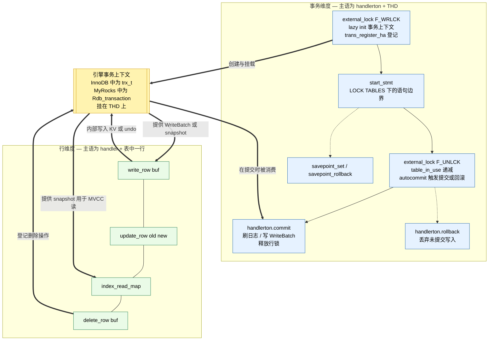

> `handler` 是 MySQL Server 与存储引擎之间的唯一接口层。执行器通过 `handler` 的虚函数调用读写数据，存储引擎只需实现这套接口即可接入 Server，而无需感知 SQL 解析与优化的细节。本文梳理 `handler` 接口的六个分族，重点分析事务族为何在 `handler`（per-table）与 `handlerton`（per-connection）上混合挂载，以及这种设计选择背后的事务语义约束。

<!-- more -->

---

## 1. `handler` 接口的分类

`sql/handler.h` 与 `sql/handler.cc` 中定义的存储引擎抽象层包含数百个虚函数与回调。按关注点归类，这些接口可划分为六个族：

| 接口族      | 代表方法                                                                                                               | 关注点                         |
| ----------- | ---------------------------------------------------------------------------------------------------------------------- | ------------------------------ |
| 元数据族    | `open` / `close` / `create` / `delete_table` / `rename_table`                                                          | 表的生命周期                   |
| 读 — 扫描族 | `rnd_init` / `rnd_next` / `rnd_end`                                                                                    | 顺序扫描                       |
| 读 — 索引族 | `index_init` / `index_read_map` / `index_next` / `index_end`                                                           | 索引访问                       |
| 写（DML）族 | `write_row` / `update_row` / `delete_row`                                                                              | 单行变更                       |
| **事务族**  | `external_lock` / `start_stmt`（挂 `handler`）<br>`commit` / `rollback` / `savepoint_*` / `prepare`（挂 `handlerton`） | 事务边界、并发控制、两阶段提交 |
| 信息族      | `info` / `records` / `table_flags` / `index_flags`                                                                     | 统计信息与能力声明             |

六个接口族中，元数据族、两个读族、写族、信息族这五族共享一个主语——**同一张表**。事务族打破了这个模式：其内部就按"per-statement 钩子"与"per-connection 回调"分为两层挂载。本笔记的后续章节将论证这种"混合挂载"形态并非设计疏漏，而是 handler API 在抽象事务语义时的必然选择。

---

## 2. 事务族与其他接口的三重错位

### 2.1 结构错位：事务族在 `handler` 与 `handlerton` 上混合挂载

读写接口都作为虚函数声明在 `class handler` 中，签名明确表达"对这张表"的语义：

```cpp
// 读/写：主语 = 这张表
virtual int write_row(uchar *buf);
virtual int index_read_map(uchar *buf, const uchar *key, ...);
```

事务族在挂载点上则呈现混合形态：

**(a)** 语句边界钩子挂在 `handler` 上（每张表各有一个实例）：

```cpp
virtual int start_stmt(THD *thd, thr_lock_type lock_type);
virtual int external_lock(THD *thd, int lock_type);
```

**(b)** 事务级回调挂在 `handlerton` 上（每个存储引擎只有一个单例）：

```cpp
typedef int (*commit_t)  (handlerton *hton, THD *thd, bool all);
typedef int (*rollback_t)(handlerton *hton, THD *thd, bool all);
typedef int (*prepare_t) (handlerton *hton, THD *thd, bool all);
```

以及 `savepoint` 相关回调：

```cpp
typedef int (*savepoint_rollback_t)(handlerton *hton, THD *thd, void *sv);
typedef int (*savepoint_set_t)     (handlerton *hton, THD *thd, void *sv);
typedef int (*savepoint_release_t) (handlerton *hton, THD *thd, void *sv);
```

这种划分有一个清晰的语义基础：**`handler` 上挂的是"这条语句要访问这张表"的边界通知**，因此按表（也即按 `handler` 实例）逐一调用；**`handlerton` 上挂的是"这个事务该提交了 / 该回滚了"的全局动作**，因此按引擎（也即按 `handlerton` 单例）只调用一次。一次涉及十张表的 COMMIT，Server 对每个参与的存储引擎只会调用 **一次** `handlerton::commit(hton, thd, all)`，而不会按表逐个调用——因为"事务"这件事不以"表"为主语。

### 2.2 时间错位：事务生命周期远超 `handler` 对象生命周期

`handler` 实例的寿命局限于"打开一张表 → 关闭这张表"；事务的生命周期则跨越**整个事务**——多条语句、多张表、甚至同一张表上的多个 `handler` 实例。

考虑以下场景：

```sql
BEGIN;
INSERT INTO t1 VALUES (...);   -- 为 t1 创建一个 handler，write_row，释放
SELECT * FROM t2 WHERE ...;    -- 为 t2 创建一个 handler，index_read，释放
UPDATE t1 SET ...;             -- 为 t1 再创建一个 handler，update_row，释放
COMMIT;                        -- 此时该 commit 哪个 handler？
```

COMMIT 触发时，事务过程中用到的那些 `handler` 对象早已被销毁。Server 直接调用的是 `handlerton::commit(hton, thd, /*all=*/true)`——签名里根本没有 `handler*` 参数，也不需要。

这一约束倒逼出一个统一的模式：**事务状态必须挂在 `THD` 上、由存储引擎自己维护一个连接级的事务上下文对象**，并在 `external_lock` 等 per-statement 钩子里 attach 到 `THD` 上。这个模式在不同存储引擎的实现中反复出现：InnoDB 叫 `trx_t`，MyRocks 叫 `Rdb_transaction`，具体命名与内部结构不同，但"挂载点是 `THD`"这件事是 handler API 强制的、不可选的。§3.5 会横向对比两种实现。

### 2.3 功能错位：事务族不参与数据流

读接口负责生产行，写接口负责变更行，二者都直接操纵 row buffer，是数据流的一部分。事务族不做这些——它们从不触碰 `uchar *buf`。其职责严格限定在"上下文维护"层面：

- 提交边界——内存中的写入何时落盘持久化（`handlerton::commit`）。
- 回滚 / savepoint 边界——内存中的写入何时被丢弃（`handlerton::rollback` / `savepoint_*`）。
- 语句/加锁边界——何时获取、何时释放表级或行级上下文（`external_lock`、`start_stmt`）。
- 两阶段提交协调——`prepare`、`commit_by_xid`、`rollback_by_xid`。

事务族配置的是行级接口赖以运行的"执行上下文"，它自身不产生也不消费数据。

---

## 3. 运行时咬合：事务族是读写族的"脚手架"

尽管存在上述三重错位，两个接口族在运行时并不独立。每一次 `write_row` / `update_row` / `index_read_map` 都运行在事务族事先构造好的上下文之内。这种耦合在 upstream 各个存储引擎的实现里呈现出高度一致的骨架：

```
external_lock(F_WRLCK)   ──→   取出或创建连接级事务上下文（挂在 THD）
                               注册本引擎为 trans_register_ha 参与者
                               设置本次 statement 的锁模式标志
                                             │
                                             ▼
write_row / update_row / index_read_map
                               直接操作事务上下文内部的 WriteBatch / snapshot
                                             │
                                             ▼
external_lock(F_UNLCK)   ──→   统计 table_in_use 归零后，对 autocommit 语句
                               触发一次 commit / rollback
                                             │
                                             ▼
handlerton::commit / rollback  ──→  消费事务上下文、做持久化或丢弃
```

这个骨架放之四海而皆准的原因是：**事务上下文的创建/销毁点，只能落在 `handler` 提供的 per-statement 钩子上**——因为 `handlerton` 上的回调只在事务结束时才被调用，而事务开始时 Server 并不知道是哪个引擎会参与，也就无从调用 `handlerton` 上的任何钩子。所以引擎只能在 `external_lock` 或 `start_stmt` 这两个"一进入语句就会被调到"的 `handler` 虚函数里做 "lazy init"。两个钩子互为补位：前者在普通语句里触发，后者在 `LOCK TABLES` 作用下触发（这是 `external_lock` 不会被调用的少数场景）。

---

## 3.5 横向对比：同一套 handler API 下的两种实现

同样一套事务接口，InnoDB 和 MyRocks 给出了风格迥异的实现，但都严格守住了 API 合约。下表从五个维度并列对比：

| 维度                            | InnoDB                                                                 | MyRocks                                                                     |
| ------------------------------- | ---------------------------------------------------------------------- | --------------------------------------------------------------------------- |
| 连接级事务对象                  | `trx_t`（挂在 `THD` 上，由 `check_trx_exists(thd)` 获取）              | `Rdb_transaction`（挂在 `THD` 上，由 `get_or_create_tx(thd)` 获取）         |
| 底层数据结构                    | 基于 redo log + undo log 的 MVCC；in-memory 的 insert/update buffer    | 基于 RocksDB `WriteBatchWithIndex`；MVCC 由 LSM-tree snapshot 提供          |
| `external_lock` 的职责          | attach/detach `trx_t`；注册到 `trans_register_ha`；管理 MDL 升级       | 同上（对象换成 `Rdb_transaction`）                                          |
| `handlerton::commit` 的主要动作 | 根据 `innodb_flush_log_at_trx_commit` 刷 redo log；释放行锁；清理 undo | 把 `WriteBatchWithIndex` 写入 RocksDB（一次原子 WriteBatch 提交）；释放行锁 |
| 锁机制                          | 行锁在内存中维护，随事务提交/回滚释放                                  | 行锁由 RocksDB 的 `TransactionLockMgr` 维护，行为与 InnoDB 相似但实现独立   |

几个观察值得展开：

**(1)** 两个引擎对"事务上下文"的选择都是"一个 per-`THD` 的对象"，而不是"一组 per-`handler` 的对象"。这不是巧合，而是被 §2.2 所述的时间错位逼出来的。换句话说，handler API 并没有明文规定引擎一定要把事务状态挂在 `THD` 上，但 `handlerton::commit` 签名里只有 `THD*` 这一事实，使得"挂在 `THD`"成为唯一可行的方案。**接口形态隐式地决定了实现形态。**

**(2)** 两个引擎的 `external_lock` 干的事情在"形状"上完全一致：取/建事务上下文、登记 2PC 参与者、设置锁模式——差异仅在于具体对象的类型名。这说明 `external_lock` 在 handler API 设计者眼里就是一个"语句边界通知"，其典型消费模式（lazy init 事务上下文 + 登记参与者）已经是业界共识。引擎命名可以不同，但通用路径一样。

**(3)** `handlerton::commit` 的实现差异最大：InnoDB 要处理 redo log 刷盘、undo log 清理、read view 回收；MyRocks 只需要把 `WriteBatchWithIndex` 整体写进底层 RocksDB，再释放事务对象。然而两者对外暴露的接口完全一样——`int (*commit)(handlerton*, THD*, bool all)`。这正是 handler API 作为"引擎无关事务协议"的价值：Server 不需要理解引擎内部的持久化机制，只需要在正确的时机调用 commit/rollback，引擎自行决定该做什么。

**(4)** 两个引擎都不得不各自维护一份行锁结构（InnoDB 在内存里、MyRocks 借助 `TransactionLockMgr`）。handler API 本身不定义行锁语义——它只规定"语句开始/结束时通知你一下"，至于怎么加锁、怎么解锁、锁的粒度，全由引擎自行决定。这使得锁机制可以独立演化，也解释了为什么 InnoDB 的间隙锁、MyRocks 的 next-key lock 实现细节不同却互不侵犯 Server 层的代码。

**结论**：同一套 handler API 在两个实现下产生了相似的骨架但不同的血肉——相似在"什么时候做什么"（由接口语义固化），不同在"具体怎么做"（由引擎内部自由实现）。这正是一个设计良好的抽象层应有的特征。

---

## 4. 正交性模型

两个接口族可沿两条独立的维度干净地分开：

| 维度           | 行接口族                  | 事务接口族                                                                   |
| -------------- | ------------------------- | ---------------------------------------------------------------------------- |
| **主语**       | 一张表的一行              | 一个连接上的一个事务                                                         |
| **挂载点**     | `class handler`（虚函数） | 混合：per-statement 钩子在 `handler`，事务级回调在 `handlerton`              |
| **载体对象**   | `uchar *buf` / 行镜像     | `THD` 上的引擎事务上下文（InnoDB 的 `trx_t` / MyRocks 的 `Rdb_transaction`） |
| **生命周期**   | 一次 fetch / 一条 DML     | 一个事务 / 一条语句                                                          |
| **数据流角色** | 生产 / 变更行镜像         | 配置上下文、框定批次                                                         |

两条维度在代数意义上是正交的——它们参数化的是彼此独立的关注点。但正交并不意味着运行时独立；两条维度**组合**之后才构成真实的 DML 执行过程：读写操作发生在事务的"信封"之内，而信封本身若无读写操作去承载，也失去意义。

### 4.1 两个维度的正交关系（Mermaid 图）



图中几处关键视觉表达：

- 两个维度被画成独立的 subgraph——事务维度的主语是 `(handlerton, THD)`，行维度的主语是 `(handler, row)`，各自内部独立成链。
- 中央黄色节点是挂在 `THD` 上的引擎事务上下文，InnoDB 与 MyRocks 都必须维护一个这样的对象，命名各异但职能同构。所有跨越两个维度的箭头都必须穿过它——两维度唯一的交汇点。
- 三种箭头语义：事务族**创建**上下文、行族**使用**上下文、事务族最终**消费**上下文（提交时持久化、回滚时丢弃）。

---

## 5. 常见误读

初次阅读这段代码时，几种直觉上合理但实际错误的心智模型很容易浮现：

**M1. "`handler` 上的所有方法都是关于一张表的。"**
错误。`class handler` 只是 MySQL 存放存储引擎虚函数的容器，归属该类并不意味着"以表为主语"。事务族中 `external_lock` 和 `start_stmt` 虽然挂在 `handler` 上，但其语义是"这条语句要访问这张表"，主语是语句而非表本身。

**M2. "COMMIT 时，每张表的 handler 会各自单独提交。"**
错误。事务状态挂在 `THD` 上。Server 对每个参与事务的存储引擎只调用一次 `handlerton::commit(hton, thd, all)`，与事务过程中用到过多少个 `handler` 对象无关。`commit_t` 的签名不接收 `handler*` 参数，正是这个原因。

**M3. "`external_lock` 是一个表锁原语。"**
部分正确，名字带有历史包袱——来自 MyISAM 时代的全表锁语义。对 InnoDB 和 MyRocks 这样的行级引擎来说，它实际作为**语句边界信号**使用：引擎借此 attach/detach 事务上下文、更新锁模式标志、并在 autocommit 场景下借 `F_UNLCK` 触发提交。真正的行锁、间隙锁则在读写路径内部获取，不在 `external_lock` 本身。

**M4. "事务族可以脱离读写族单独理解。"**
不可行。事务族的存在意义就是为读写路径搭脚手架。脱离具体 DML 流程去读 `commit` / `rollback` / `external_lock`，得到的只是模糊直觉。正确的阅读顺序是反过来——先沿读写路径走一遍具体 DML，再回头梳理这条 DML 隐式依赖了哪些事务族接口。

**M5. "事务族接口都在 `handlerton` 上。"**
错误。事务族内部按生命周期分两层：per-statement 钩子（`external_lock` / `start_stmt`）挂在 `handler` 上，per-transaction 回调（`commit` / `rollback` / `savepoint_*` / `prepare`）挂在 `handlerton` 上。前者为后者做"lazy init"铺路，二者不可替代。

---

## 6. 案例分析：一次 DML 在两个维度上的完整遍历

把前面各节的结论拼装起来，一条完整的 DML 路径长这样（下列链路对 InnoDB 和 MyRocks 通用，仅最末的"持久化动作"不同）：

```
BEGIN
  trans_register_ha                            (sql/handler.cc)
    ← 由各引擎的 external_lock 内部调用
      把本引擎登记为本事务的参与者

  ─── 语句开始 ───
  handler::external_lock(thd, F_WRLCK)         [sql/handler.h:7234]
    └─ lazy init 引擎事务上下文（trx_t / Rdb_transaction）
    └─ 设置 lock mode 相关的 per-handler 标志
    └─ 调用 trans_register_ha

      handler::write_row(buf)                  [读写族]
        └─ 引擎内部：把行数据转成 KV / 记录 undo / 产 WriteBatch 项
        └─ 写入挂在 THD 上的事务上下文

  handler::external_lock(thd, F_UNLCK)         [sql/handler.h:7234]
    └─ 递减 table_in_use 计数
    └─ (autocommit 场景) 触发本引擎的 commit / rollback
  ─── 语句结束 ───

COMMIT
  handlerton::commit(hton, thd, all=true)      [sql/handler.h:1427]
    └─ InnoDB: 刷 redo log → 释放行锁 → 清理 undo
    └─ MyRocks: 把 WriteBatchWithIndex 写入 RocksDB → 释放行锁
```

行维度的链条——`write_row` / `update_row` / `delete_row` / `index_read_map`——决定了**一行数据会被拆成哪些 KV 对或 undo 记录**。事务维度的脚手架——`external_lock`、`start_stmt`、`handlerton::commit`、`handlerton::rollback`——决定了**这些 KV 或 undo 累积在哪里、何时落盘持久化、失败时如何丢弃**。两个维度唯一的交汇点就是挂在 `THD` 上的引擎事务上下文，除此之外再无交集。

因此，接口层面观察到的"割裂"作为对 API 形态的陈述是成立的（事务族挂载点与读写族不同、主语与读写族不同、生命周期与读写族不同），但作为对运行时行为的陈述则是错误的——两个接口族在结构上正交，在执行上咬合。

---

## 7. 方法论沉淀

- **给存储引擎虚函数分类时，先分维度，再分族。** 是否归属 `class handler` 不决定主语；应从签名本身——尤其是挂载点和参数集——判定该方法是"表级、行级、还是连接级"。
- **遇到形态异常的接口，先定位其挂载点和主语。** `handlerton` vs `handler`、`THD` vs `table`——这两个问题能消除事务族相关的大半困惑。
- **事务族要反向阅读。** 先沿读写路径走一遍具体 DML，再枚举该 DML 的事务族前置依赖。自上而下地单独啃 `commit` / `rollback` / `external_lock`，没有具体例子作为锚点，只能得到含糊的印象。
- **横向对比同一接口的多种实现。** 若想验证对某个接口语义的理解是否准确，去看至少两个独立的存储引擎（InnoDB 与 MyRocks 是最好的一对）如何实现它：相同之处反映 API 合约的强制内容，不同之处反映引擎内部的自由度。
- **"结构上割裂"与"运行时割裂"是两种不同的属性。** 事务族属于前者、不属于后者。将二者混淆会导致把事务族当成一个可以孤立学习的主题，反而看不清它所支撑的组合关系。
