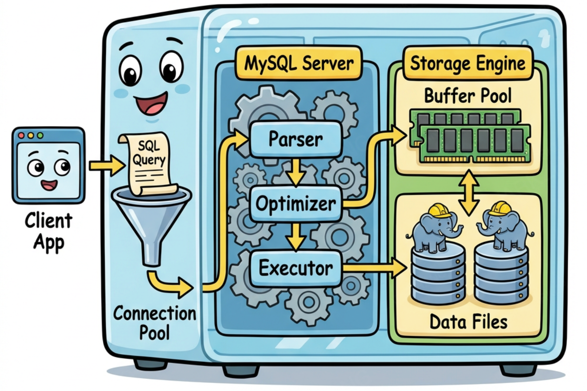

> MySQL 的架构可以沿 Client → Server → Engine 三段来看。Client 负责连接管理和协议编解码，Server 负责 SQL 解析、优化和执行调度，Engine（主要是 InnoDB）负责数据的实际存取。当单机到达瓶颈后，DB Proxy、DB Agent、读写分离、分库分表等方案会嵌入 Client 和 Server 之间。

<!-- more -->

## 单机 MYSQL 执行链路

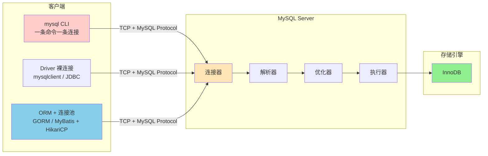

三种客户端形态最终都汇入同一个 TCP 端口。连接池、ORM 映射等复杂度存在于客户端进程内部，MySQL Server 侧看到的都是一条条 TCP 连接，没有区别。

**客户端与 Driver 的关系**：`mysql` CLI 内部静态/动态链接了 `libmysqlclient`（MySQL 官方 C Driver），二者是同一个项目的产物，一起编译发布。其他语言的 Driver 要么包装 `libmysqlclient`（如 Python `mysqlclient`），要么用各自语言重新实现 MySQL 协议（如 Go `go-sql-driver/mysql`、Python `PyMySQL`）。ORM（GORM、MyBatis、SQLAlchemy）由各语言社区独立实现，建立在 Driver 之上，与 MySQL 本身无关。

## 客户端

| 形态                   | 连接数 | 连接池 | 谁管连接       | 典型场景             |
| ---------------------- | ------ | ------ | -------------- | -------------------- |
| **CLI** (`mysql` 命令) | 1 条   | 无     | mysql 进程自己 | 运维、调试、手动查询 |
| **Driver 裸连接**      | 1 条   | 无     | 应用代码       | 脚本、一次性任务     |
| **ORM + 连接池**       | N 条   | 有     | 连接池自动管理 | Web 服务、微服务     |

> 三种形态的区别只在客户端进程内部。MySQL Server 侧看到的都是 TCP 连接，无差别。

### 1. `mysql` 命令行

执行：

```bash
mysql -h 127.0.0.1 -u root -p mydb
```

内部流程：

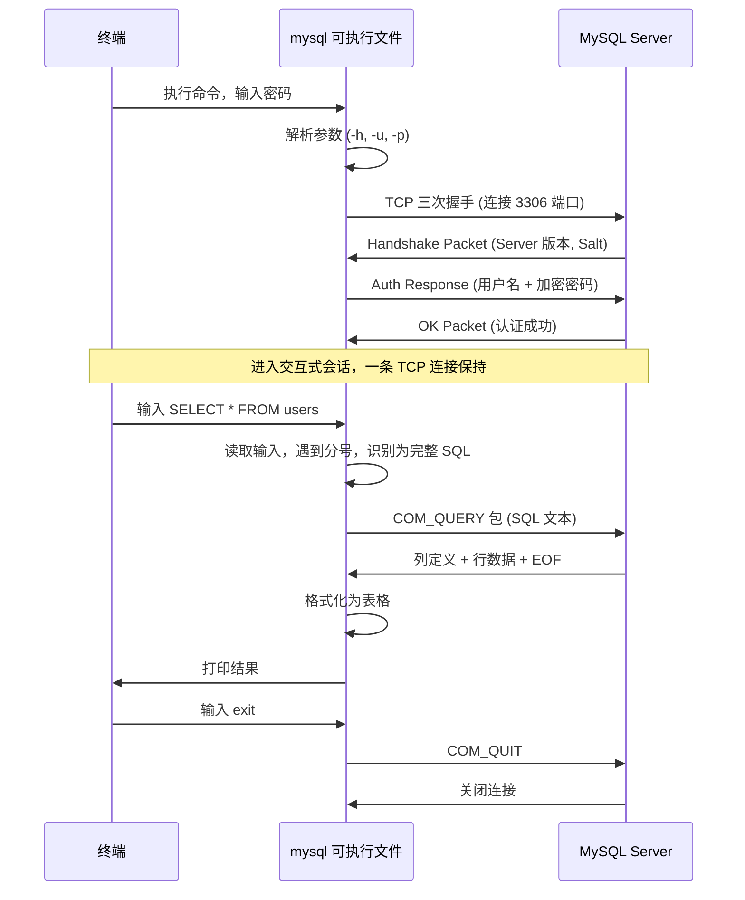

`mysql` 是一个编译好的 C 程序，内部链接 `libmysqlclient`（MySQL 官方 C Driver）。启动时建立一条 TCP 连接，整个会话复用。每条 SQL 封装为 `COM_QUERY` 包发送。没有连接池。`exit` 或 `Ctrl+D` 发送 `COM_QUIT`，关闭连接，进程退出。

`mycli`、`DBeaver`、`Navicat` 等工具底层相同——TCP 连接 + MySQL 协议，只是 UI 不同。

### 2. Driver 裸连接

脚本或一次性任务中，直接用 Driver 建连接，不需要连接池：

```python
# Python: 一条连接，用完关掉
import MySQLdb
conn = MySQLdb.connect(host='127.0.0.1', user='root', passwd='pass', db='mydb')
cursor = conn.cursor()
cursor.execute("SELECT * FROM users WHERE age > 18")
rows = cursor.fetchall()   # 拉取全部结果
conn.close()               # 关闭 TCP 连接
```

与 `mysql` 命令行等价——一条 TCP 连接，发 SQL，收结果，关连接。

### 3. ORM + 连接池

Web 服务并发处理大量请求，每次新建/关闭 TCP 连接的开销（三次握手 + 认证 ≈ 1-3ms）不可接受。连接池预先建好一批连接，请求到来时从池中借出，用完归还。

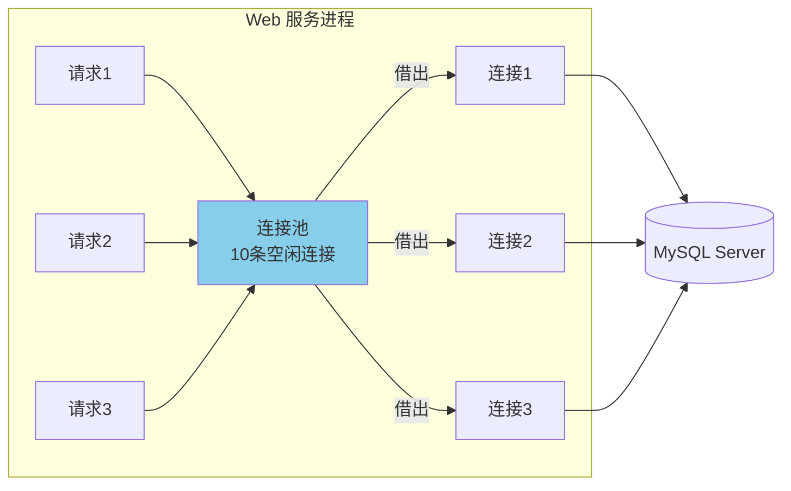

**Example: Java: MyBatis + HikariCP + JDBC Driver**

```java
// 调用链: MyBatis(ORM, 生成SQL) → HikariCP(连接池, 借还连接) → JDBC Driver(编码为MySQL协议包, 通过TCP收发)
HikariConfig config = new HikariConfig();
config.setJdbcUrl("jdbc:mysql://127.0.0.1:3306/mydb");
config.setMaximumPoolSize(100);     // 池中最多 100 条连接
config.setMinimumIdle(10);          // 至少保持 10 条空闲
config.setConnectionTimeout(3000);  // 3s 内拿不到连接就报错
config.setMaxLifetime(1800000);     // 每条连接最多活 30 分钟

HikariDataSource ds = new HikariDataSource(config);
// ds.getConnection() 从池中借，conn.close() 还回池中（不是真关闭）
```

## MySQL 协议

> TCP 连接建立后，所有客户端使用同一套 MySQL Protocol 通信。

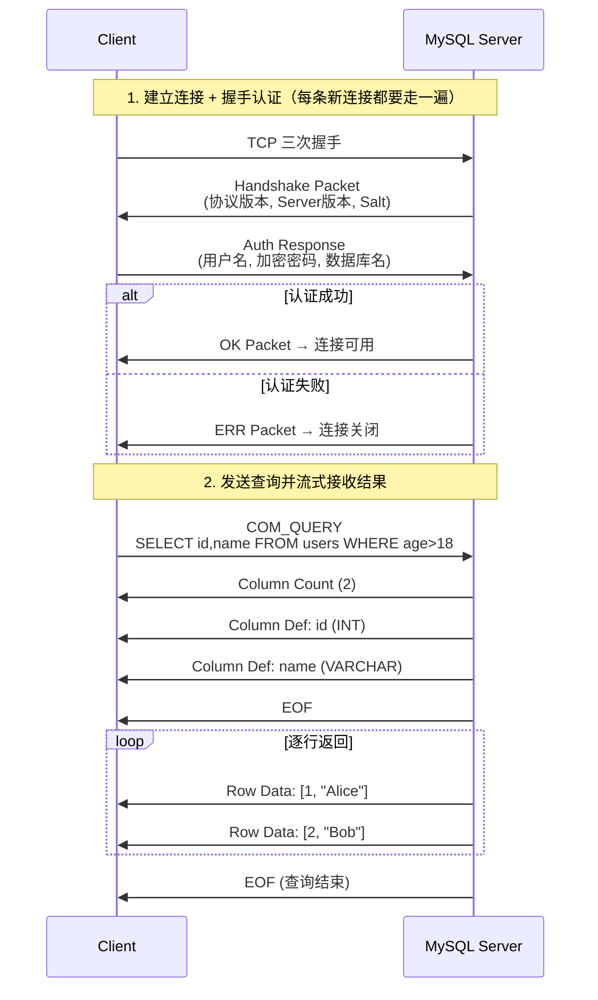

**协议要点**：

- 每个包最大 16MB（`max_allowed_packet`），超过会分片
- `COM_QUERY` 发送文本 SQL，`COM_STMT_PREPARE` + `COM_STMT_EXECUTE` 用于 Prepared Statement
- 结果集是**流式**返回的，Driver 可以选择逐行读取或全部缓存到内存

## MySQL Server

> Server 层负责 SQL 解析、优化和执行调度。

### 连接器：线程分配与会话管理

一条 TCP 连接到达 MySQL Server 后的处理流程：

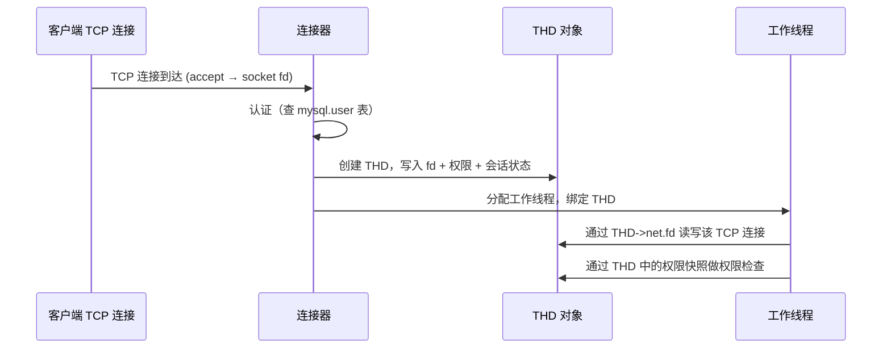

连接器的三个职责：

1. **认证**：验证用户名密码（`mysql.user` 表）
2. **授权**：加载用户权限到会话内存（连接期间权限不变，即使 `GRANT` 了也要重连才生效）
3. **创建 THD 并分配线程**：THD（Thread Handler Descriptor）是 MySQL 内部的核心结构体，持有该连接的所有上下文

三者在连接生命周期内一一绑定：

```
TCP 连接 (socket fd)
  └── THD 对象 (持有 fd + 权限 + 会话状态)
        └── 工作线程 (持有 THD 指针，通过它读写 TCP 和检查权限)
```

连接断开时，fd 关闭，THD 销毁，线程销毁或回到线程缓存。这也是 `GRANT` 不立即生效的原因——权限快照在 THD 创建时写入，连接期间不会刷新。

**Server 端的线程模型**：

**one-thread-per-connection（社区版默认）**

每条连接独占一个线程。问题：1000 个连接 = 1000 个线程，每个线程占 256KB-1MB 栈空间，大量线程之间的上下文切换成为瓶颈。大部分连接在等待客户端发 SQL（Sleep 状态），但线程资源一直被占着。

**Thread Pool（Enterprise 版 / Percona）**

问题的本质是：大量连接中，同一时刻真正在执行 SQL 的只是少数，但 one-thread-per-connection 模型为每条连接都分配了线程。Thread Pool 的设计思路是**把线程和连接解绑**：

1. 维护固定数量的工作线程（通常按 CPU 核数分组）
2. 所有连接的 socket fd 注册到 **epoll**（Linux）/ **kqueue**（macOS）事件队列
3. 当某条连接上有数据到达（客户端发了 SQL），epoll 通知一个空闲工作线程去处理
4. 工作线程处理完这条 SQL 后，不绑定在该连接上等待，而是回到线程池，继续处理其他连接的事件

```
one-thread-per-connection:
  连接1 ←→ 线程1 (Sleep 99% 的时间)
  连接2 ←→ 线程2 (Sleep 99% 的时间)
  连接3 ←→ 线程3 (Sleep 99% 的时间)
  ...1000 个线程，大部分空转

Thread Pool:
  连接1 ──┐
  连接2 ──┤ epoll 事件队列 ──→ 工作线程1
  连接3 ──┤                 ──→ 工作线程2
  ...     ┘                 ──→ ...
  1000 个连接，只需几十个线程
```

本质上就是事件驱动（epoll）+ 线程池，和 Nginx、Node.js 的 I/O 模型思路一致：**不为等待分配资源，只在有事做时才占用线程**。

客户端连接池解决的是应用侧频繁建连接的开销；Server 端 Thread Pool 解决的是 Server 侧空闲连接浪费线程资源的问题。二者独立工作，互不替代。

### 解析器 → 优化器 → 执行器

> 三个组件构成 SQL 处理流水线。

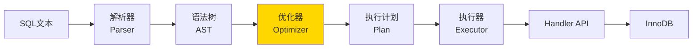

**解析器**：将 SQL 文本转为语法树。这一步纯语法检查，不涉及数据。

**优化器**：MySQL 架构中最复杂的部分，核心决策包括：

```sql
-- 一个实际的优化案例
SELECT o.id, u.name, p.title
FROM orders o
JOIN users u ON o.user_id = u.id
JOIN products p ON o.product_id = p.id
WHERE u.country = 'CN' AND o.created_at > '2024-01-01';

-- 优化器需要决定：
-- 1. JOIN 顺序: users → orders → products? 还是 orders → users → products?
-- 2. 访问方式: orders 用 created_at 索引? 还是 user_id 索引?
-- 3. JOIN 算法: Nested Loop? Hash Join (8.0.18+)?
```

```sql
-- 用 EXPLAIN 看优化器的决策
EXPLAIN FORMAT=TREE
SELECT o.id, u.name FROM orders o
JOIN users u ON o.user_id = u.id
WHERE u.country = 'CN';
```

**执行器**：按照执行计划，通过 **Handler API** 调用存储引擎。Handler API 是 Server 层和 Engine 层之间的接口边界：

```
handler->ha_open()         -- 打开表
handler->ha_index_read()   -- 索引定位
handler->ha_index_next()   -- 索引顺序读下一行
handler->ha_rnd_next()     -- 全表扫描读下一行
handler->ha_write_row()    -- 写入一行
handler->ha_update_row()   -- 更新一行
handler->ha_delete_row()   -- 删除一行
```

> Handler API 是 Server 层与存储引擎的接口边界。MySQL 通过这层抽象支持多种存储引擎。

## InnoDB 存储引擎

> InnoDB 是 MySQL 5.5+ 的默认存储引擎，其读写路径直接决定性能表现。

### 读路径

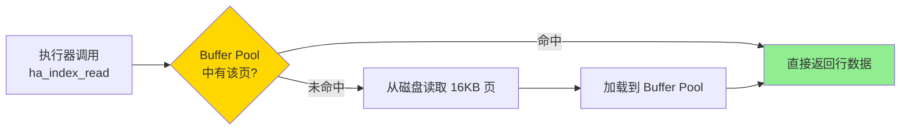

**Buffer Pool** 是 InnoDB 最核心的内存结构：

- 默认 128MB，生产环境建议设为物理内存的 60-80%
- 使用 LRU 变种算法管理页面淘汰
- 命中率应保持在 99% 以上

```sql
-- 查看 Buffer Pool 状态
SHOW STATUS LIKE 'Innodb_buffer_pool%';
-- Innodb_buffer_pool_read_requests: 总读请求数
-- Innodb_buffer_pool_reads: 需要读磁盘的次数
-- 命中率 = 1 - reads/read_requests
```

### 写路径

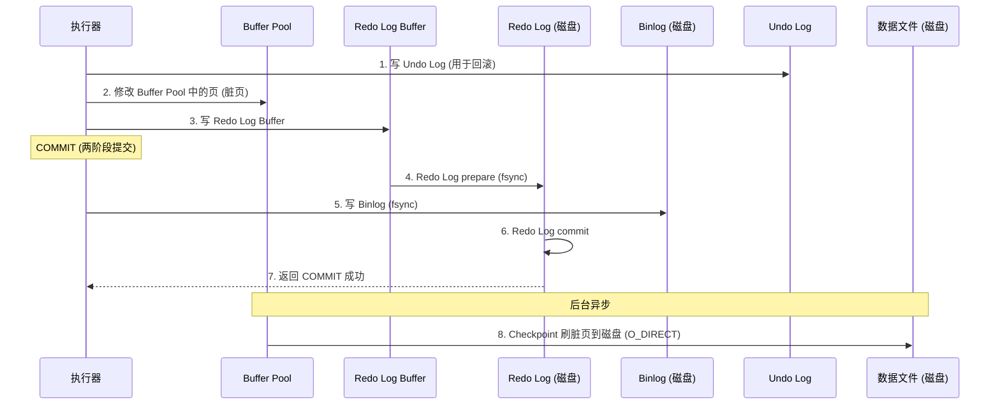

**关键设计**：

- **WAL（Write-Ahead Logging）**：先写日志再返回成功，保证崩溃恢复
- **脏页刷盘是异步的**：不需要每次写操作都刷数据文件

**Redo Log 与 Binlog 的两阶段提交（2PC）**：

Redo Log 是 InnoDB 引擎层的日志，保证崩溃恢复；Binlog 是 Server 层的日志，用于主从复制。两份日志必须一致，否则主从数据会不一致。MySQL 通过内部 2PC 保证：

1. **Prepare 阶段**：Redo Log 写入并 fsync，标记为 prepare 状态
2. **Commit 阶段**：Binlog 写入并 fsync → Redo Log 标记为 commit

崩溃恢复时的判断逻辑：

- Redo Log 是 prepare 且 Binlog **完整** → 提交事务（Binlog 已写成功，Slave 可能已经收到）
- Redo Log 是 prepare 且 Binlog **不完整** → 回滚事务

**刷盘策略**：

- `innodb_flush_log_at_trx_commit` 控制 Redo Log 的 fsync 时机：
  - `= 1`：每次 COMMIT 都 fsync，最安全，性能最低
  - `= 2`：每次 COMMIT 写到 OS 缓存，每秒 fsync，折中
  - `= 0`：每秒写+fsync，最快但可能丢 1 秒数据
- `sync_binlog` 控制 Binlog 的 fsync 时机：
  - `= 1`：每次事务提交都 fsync，与 `innodb_flush_log_at_trx_commit = 1` 配合使用时称为"双 1 配置"，最安全
  - `= 0`：由 OS 决定何时 fsync
  - `= N`：每 N 个事务 fsync 一次

**两条写入路径经过的 I/O 层不同**：

```
Redo Log:  Log Buffer → OS page cache → fsync → 磁盘
数据文件:   Buffer Pool → O_DIRECT → 磁盘（绕过 page cache）
```

数据文件使用 O_DIRECT 的原因：Buffer Pool 本身就是 InnoDB 管理的缓存，再经过 OS page cache 会导致同一份数据在内存中存两份，浪费且无收益。Redo Log 是顺序小量写入，经过 page cache 的开销可接受，且由 fsync 控制持久化时机。

## 分布式演进

> 单机 MySQL 存在连接数、QPS、存储容量的硬性瓶颈。生产环境通过在 Client 和 Server 之间插入中间层来扩展。

### 演进路线

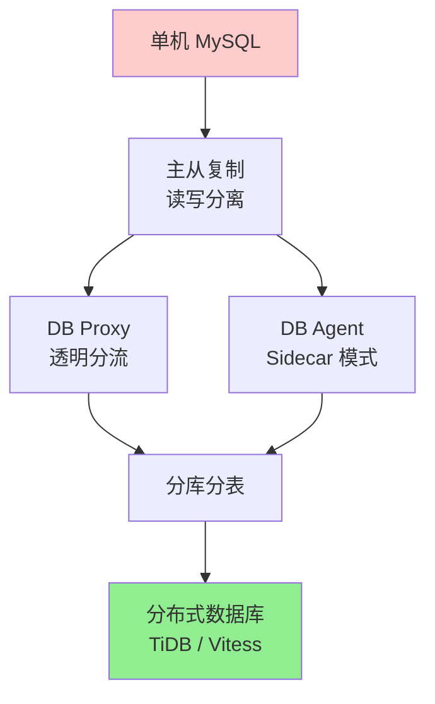

### 主从复制 + 读写分离

> 最基础的扩展方案。写走主库，读走从库。

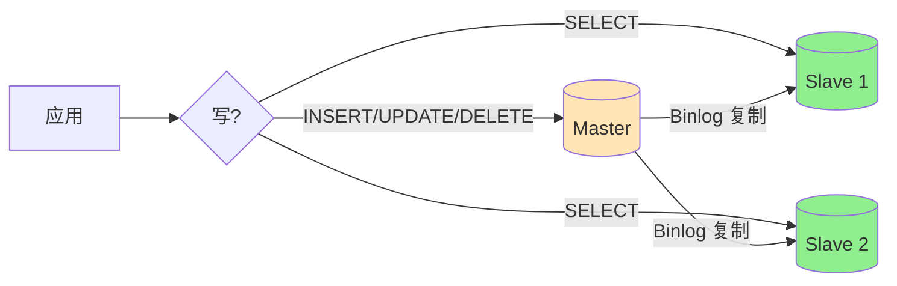

**Binlog 消费链路**：

异步/半同步复制中，Binlog **先落盘，再发送**：

```
Master 侧:
  事务提交 → Binlog 写入磁盘
    → Binlog Dump Thread 读磁盘上的 Binlog → TCP 发给 Slave

Slave 侧:
  IO Thread 接收 → 写 Relay Log → SQL Thread 回放 Relay Log
```

半同步多一步：Master 等 Slave IO Thread 确认收到 Relay Log 后才返回 COMMIT 成功。

组复制（MGR）中，Binlog **先广播，再落盘**：

```
发起节点:
  事务执行完 → 生成 Binlog 事件（未落盘）→ Paxos 广播给所有节点

所有节点:
  Paxos 多数派确认 → 各自写 Binlog 到磁盘 → 各自回放
```

关键区别：异步复制是"写完了再告诉别人"，Master 落盘后如果宕机，Dump Thread 还没发送，Slave 就丢数据。组复制是"大家同意了再写"，事务提交前多数节点已经拿到 Binlog 事件，所以能做到强一致。

**读写分离的实现方式**：

| 方式          | 实现                      | 优缺点                   |
| ------------- | ------------------------- | ------------------------ |
| **代码层**    | GORM 的 `DBResolver` 插件 | 简单直接，但侵入业务代码 |
| **Driver 层** | MySQL Router              | 对应用透明，但功能有限   |
| **Proxy 层**  | ProxySQL, MaxScale        | 完全透明，功能丰富       |

**一致性问题**：主从复制默认是异步的，Master 写完 Binlog 即返回，Slave 回放存在延迟（毫秒到秒级）。写完立刻从 Slave 读，可能读到旧数据。

MySQL 提供三种复制模式应对不同一致性需求：

| 模式                 | 机制                                                | 一致性                       | 代价       |
| -------------------- | --------------------------------------------------- | ---------------------------- | ---------- |
| **异步复制**（默认） | Master 写完 Binlog 即返回，不等 Slave               | 可能读到旧数据               | 无         |
| **半同步复制**       | Master 等至少一个 Slave 确认收到 Relay Log 后才返回 | Slave 有数据但可能还没回放完 | 写延迟增加 |
| **组复制 (MGR)**     | 基于 Paxos，多数节点确认后才提交                    | 强一致                       | 写吞吐下降 |

半同步只保证 Slave **收到**了 Binlog，不保证已**回放**，严格来说不是强一致。业务层常见的补偿方案：

- **写后读走主库**：刚写完的数据短时间内强制从 Master 读
- **因果一致性**：写操作返回 GTID，读时带上该 GTID，等 Slave 回放到该位点后再返回

### DB Proxy

> DB Proxy 部署在应用和 MySQL 之间，作为独立服务，对应用透明。

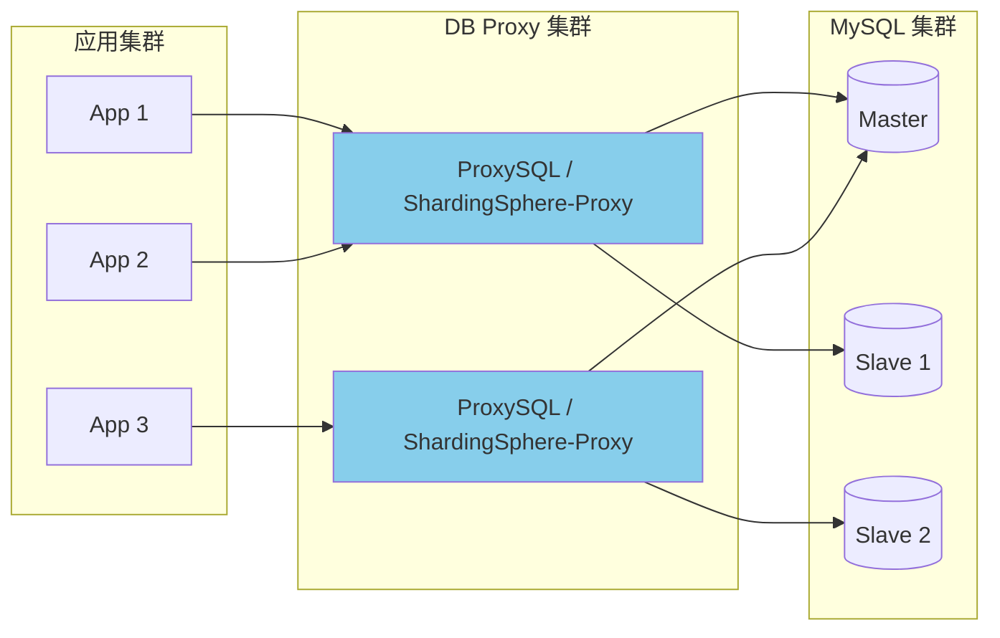

**DB Proxy 的核心能力**：

- **读写分离**：自动识别 SQL 类型，路由到主/从
- **连接池复用**：前端 1000 连接 → 后端 100 连接（连接多路复用）
- **SQL 审计**：记录慢查询、异常 SQL
- **限流熔断**：保护后端 MySQL 不被打垮
- **分库分表路由**：根据分片键路由到对应的库表

**典型产品**：

- **ProxySQL**：C++ 实现，高性能，MySQL 生态最流行
- **ShardingSphere-Proxy**：Java 实现，分库分表能力强
- **MaxScale**：MariaDB 官方，支持读写分离和故障转移
- **Vitess**：YouTube 开源，云原生 MySQL 方案

### DB Agent（Sidecar 模式）

> DB Agent 本质是部署在应用旁边的轻量级 DB Proxy。对应用暴露 `localhost:3306`，对后端 MySQL 负责路由、连接复用和保护。

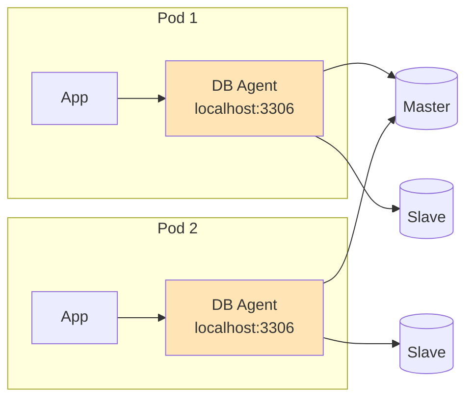

**DB Agent vs DB Proxy**：

| 维度           | DB Proxy                     | DB Agent                      |
| -------------- | ---------------------------- | ----------------------------- |
| **部署方式**   | 独立集群                     | 每个 Pod 一个 Sidecar         |
| **网络跳数**   | App → Proxy → MySQL (多一跳) | App → localhost Agent → MySQL |
| **故障影响**   | Proxy 挂了影响所有应用       | 只影响当前 Pod                |
| **运维复杂度** | 需要独立维护 Proxy 集群      | 随应用部署，但版本升级麻烦    |
| **连接复用**   | 效果好（集中式）             | 效果一般（分散式）            |
| **典型产品**   | ProxySQL, ShardingSphere     | 美团 DBProxy, 字节 DB Agent   |

中小规模、集中管控场景倾向 DB Proxy；大规模微服务、K8s 环境倾向 DB Agent。两者也常结合使用。

### 分库分表

> 单库数据量超过千万级、单表超过 500 万行时，通常需要分库分表。

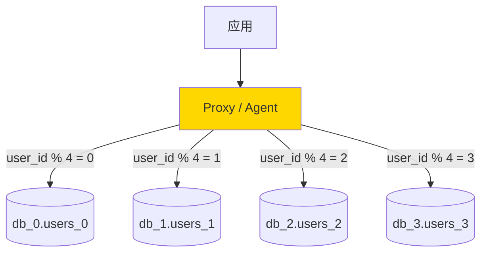

**分片策略**：

- **Range 分片**：按时间/ID 范围，适合时序数据，但存在热点
- **Hash 分片**：按分片键取模，数据均匀，但范围查询需要广播
- **一致性 Hash**：扩容时数据迁移量小

**分库分表带来的问题**：

- **跨分片 JOIN**：需要在 Proxy 层聚合
- **分布式事务**：需要 XA 或 TCC 等方案
- **全局唯一 ID**：不能用自增 ID，需要 Snowflake 等方案
- **扩容缩容**：数据迁移复杂

### 完整的生产架构

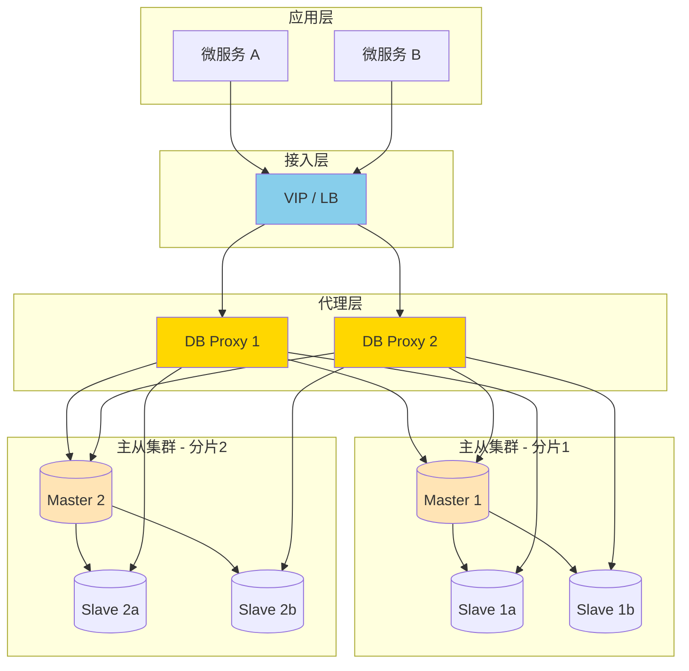

**这条链路上每一层的延迟**：

| 环节                  | 典型延迟   | 瓶颈点   |
| --------------------- | ---------- | -------- |
| 应用 → Proxy          | 0.1-0.5ms  | 网络     |
| Proxy SQL 解析/路由   | 0.01-0.1ms | CPU      |
| Proxy → MySQL         | 0.1-0.5ms  | 网络     |
| MySQL 连接器          | 0.01ms     | 线程分配 |
| 解析 + 优化           | 0.05-0.5ms | CPU      |
| InnoDB 执行 (命中 BP) | 0.1-1ms    | 内存     |
| InnoDB 执行 (读磁盘)  | 1-10ms     | 磁盘 IO  |
| **总计 (命中缓存)**   | **< 1ms**  |          |
| **总计 (读磁盘)**     | **2-15ms** |          |

## 总结

- **Client 层**：Driver 负责协议编解码，连接池管理并发连接。连接池配置不当是常见的生产事故来源
- **Server 层**：连接器分配线程，解析器生成语法树，优化器选择执行计划。优化器的决策直接影响查询性能
- **InnoDB**：Buffer Pool 命中率决定读性能，WAL 机制保证写的可靠性
- **分布式演进**：读写分离 → DB Proxy/Agent → 分库分表，本质都是在 Client 和 Server 之间插入中间层
