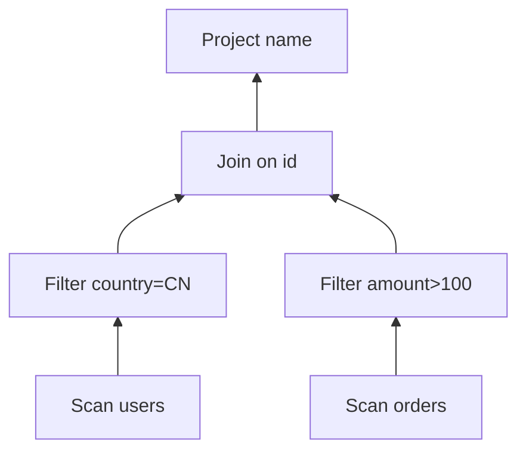

> **逻辑计划**是一棵用关系代数算子（`Scan / Filter / Project / Join / Aggregate…`）写成的树：它固定这条查询的**语义——算什么**，尚未绑定**物理——怎么算**（哪个索引、哪种 Join 算法）。它既不是 SQL 原文，也不是最终执行方式；而是解析完成之后、优化器开干之前的那层骨架。

<!-- more -->

**系列导航**：[一·全景](/database/mysql/traditional-query-optimizer/) · **二·逻辑计划（本篇）** · [三·谓词与改写](/database/mysql/predicate-and-rule-rewrite/) · [四·物理与 Join](/database/mysql/physical-plan-access-path-and-join/) · [五·代价与搜索](/database/mysql/cost-model-and-plan-search/)

---

## 1. 三种「树」，别混在一起

> 同一条 SQL 在 Server 里会先后落成三种不同职责的树。混称「执行树」时，歧义通常出在这里。

以这条语句为例：

```sql
SELECT u.name
FROM users u
JOIN orders o ON u.id = o.user_id
WHERE u.country = 'CN' AND o.amount > 100;
```

| 形态 | 回答的问题 | 节点长什么样 |
|---|---|---|
| **AST（语法树）** | 这句话语法上怎么拆 | `SelectStmt`、`From`、`Where`、标识符字符串 |
| **逻辑计划** | 语义上要算什么 | `Project` / `Filter` / `Join` / `Scan`，无索引名 |
| **物理计划** | 机器准备怎么算 | `IndexRangeScan` / `NestedLoopJoin` / `HashJoin`… |


常见误解：

- **「逻辑计划 = SQL 本来定义的执行方式」**——不准确。SQL 是声明式的，**没有**规定执行方式；逻辑计划只是把声明翻译成算子组合，仍允许无数种物理实现。
- **「逻辑计划 = 优化器输出」**——不准确。优化器的主输出是**物理计划**；逻辑计划是它的主输入（以及改写阶段的工作台）。

---

## 2. 从 SQL 文本到 AST：还只是语法

> 解析器只做词法 + 语法，把字符串变成嵌套结构。此时还没有「表对象」「索引」「行数」。

上面那条 SQL，AST 的示意形状是：

```text
SelectStmt
  ├── projections: [Column(u.name)]
  ├── from: Join
  │     ├── left: Table(users AS u)
  │     ├── right: Table(orders AS o)
  │     └── on: u.id = o.user_id
  └── where: AND(
        ├── u.country = 'CN'
        └── o.amount > 100)
```

特点：

- 节点跟着语法走（有 `SELECT` / `FROM` / `WHERE` 的影子）。
- 表名、列名仍是符号，尚未绑到 Catalog 里的表对象。
- **不包含**「用不用索引」「谁先 Join 谁」。

---

## 3. 逻辑计划：换成关系代数的语言

> 绑定（把名字解析到表 / 列 / 类型）之后，系统用关系代数算子重写同一语义。树的「语言」变了：从 SQL 语法变成算子管道。

同一查询的一种逻辑计划示意：

```text
Project[u.name]
  └── Filter[u.country = 'CN' AND o.amount > 100]
        └── Join[u.id = o.user_id]
              ├── Scan[users AS u]
              └── Scan[orders AS o]
```

也可以先把 Filter 拆开写（语义仍等价，只是树形不同——这正是后续「改写」的起点）：

```text
Project[u.name]
  └── Join[u.id = o.user_id]
        ├── Filter[u.country = 'CN']
        │     └── Scan[users AS u]
        └── Filter[o.amount > 100]
              └── Scan[orders AS o]
```

两棵逻辑树**结果集相同**（在无 NULL 边界等细节约定下），但中间结果大小不同——优化器后半段会在物理层继续分化；前半段规则改写则可能把第一棵变成更接近第二棵的形状（谓词下推，见[第三篇](/database/mysql/predicate-and-rule-rewrite/)）。

### 3.1 常见逻辑算子在说什么

| 算子 | 直观含义 | 对应 SQL 片段的直觉 |
|---|---|---|
| `Scan(R)` | 读关系 R 的所有行（逻辑上） | `FROM users` |
| `Filter(p)` | 只保留使谓词 p 为真的行 | `WHERE …` / `HAVING …` 的一部分 |
| `Project(cols)` | 只留若干列（可含表达式） | `SELECT a, b` |
| `Join(cond)` | 按条件组合两输入 | `JOIN … ON …` |
| `Aggregate` | 分组与聚合 | `GROUP BY` / `SUM`… |
| `Sort` / `Limit` | 排序 / 截断 | `ORDER BY` / `LIMIT` |

逻辑 `Scan` **不等于**物理全表扫描：它只声明「需要关系 R 的行」；后面可以落实成全表、索引范围、覆盖索引等。

### 3.2 树怎么读

约定（与多数教材 / 引擎示意一致）：

- **数据从叶子流向根**：叶子是 `Scan`，根靠近最终输出（常是 `Project`）。
- **父节点消费子节点的输出**：`Filter` 的孩子是「被过滤的输入」；`Join` 通常有左右两个孩子。
- **执行器真正跑的是物理树**，但读逻辑树时同样按「自底向上出数」的直觉理解数据流即可。



这张图表达的是：**语义管道**，不是已经选定的执行算法。

---

## 4. 逻辑计划固定了什么、没固定什么

> 分清「语义约束」和「物理自由度」，才能理解优化器为什么还有事可做。

**已固定（动了就可能改语义）：**

- 读哪些表、哪些列进入最终结果。
- 过滤条件、连接条件、聚合与去重的逻辑含义。
- 外连接 / 半连接等会影响 NULL 与存在性的边界（改写必须保持等价）。

**未固定（优化器可选）：**

- 每张表用全表还是哪个索引。
- Filter 在引擎层做还是 Server 层做（在语义等价前提下）。
- Join 谁先谁后、用 Nested Loop 还是 Hash Join。
- 是否物化中间结果、是否临时表。

因此：逻辑计划是「SQL 语义的算子化」，**不是**「SQL 指定的执行方式」。SQL 从未指定执行方式；逻辑计划只是把「要什么」写成树，好让规则与代价模型能操作它。

---

## 5. 和物理计划并排放一次

同一逻辑片段的两种物理落实（细节见[第四篇](/database/mysql/physical-plan-access-path-and-join/)）：

```text
# 逻辑
Join[u.id = o.user_id]
  ├── Filter[country='CN'] → Scan[users]
  └── Filter[amount>100] → Scan[orders]

# 物理候选 A
NestedLoopJoin
  ├── IndexRangeScan(users, country='CN')
  └── IndexLookup(orders, user_id = ?) + Filter(amount>100)

# 物理候选 B
HashJoin
  ├── Build:  Filter+Scan 或 IndexScan(users)
  └── Probe: IndexRangeScan / TableScan(orders)
```

逻辑层只有一棵（或经改写后的一棵）「算什么」；物理层冒出多棵「怎么算」。CBO 的工作就是在后者里打分。

---

## 6. 本篇对齐

| 说法 | 更准确的理解 |
|---|---|
| 「逻辑执行树 = SQL 定义的执行方式」 | 逻辑树定义的是**语义管道**，不是执行方式 |
| 「优化器读 SQL」 | 优化器主输入是**逻辑计划**（加统计） |
| 「Scan = 全表扫」 | 逻辑 Scan 只表示读关系；全表/索引是物理概念 |

下一篇从逻辑树上最常见的改写讲起：**谓词是什么，下推把节点往哪挪**——[谓词与规则改写](/database/mysql/predicate-and-rule-rewrite/)。
