> 物理候选枚举出来之后，传统优化器靠两样东西收束：**代价模型**（给每条候选打一个标量分）和**搜索 / 剪枝**（在指数级空间里留下估计最优）。分打得准不准，取决于统计与基数估计；搜得完搜不完，取决于表数量与启发式。本篇把「燃料 → 打分 → 搜索 → EXPLAIN 所见」串成一条链。

<!-- more -->

**系列导航**：[一·全景](/database/mysql/traditional-query-optimizer/) · [二·逻辑计划](/database/mysql/from-sql-to-logical-plan/) · [三·谓词与改写](/database/mysql/predicate-and-rule-rewrite/) · [四·物理与 Join](/database/mysql/physical-plan-access-path-and-join/) · **五·代价与搜索（本篇）**

---

## 1. CBO 的核心循环

> 对每个（或部分）物理候选：读统计 → 估输出行数 → 估 I/O·CPU·内存代价 → 与当前最优比较 → 剪枝或保留。



代价常抽象为：

\[
Cost \approx \alpha \cdot \#I/O + \beta \cdot \#CPU + \gamma \cdot \#Memory\ (spill)
\]

系数因引擎而异；比较的是**同一模型下的相对大小**，不是秒表测出的真实耗时。

---

## 2. 统计信息：代价的燃料

> CBO 在编译期看不到真实数据页，只能查 Catalog 里的摘要。摘要错了，后面都是「错误世界里的精确算术」。

| 统计量 | 回答 | 典型用途 |
|---|---|---|
| 表行数 \(N\) | 表多大 | 全表扫描基线 |
| NDV / 索引基数 | 某列（前缀）多少不同值 | 等值选择度 \(\approx 1/\mathrm{NDV}\) |
| NULL 比例 | 空值多少 | `IS NULL`、外连接 |
| 直方图 | 是否均匀、哪里倾斜 | 范围谓词 |
| 索引页数 / 树高 | 探路成本 | 索引扫描 vs 回表 |

`ANALYZE TABLE`（及同类命令）是在刷新这些摘要，不是无意义的运维仪式。

---

## 3. 选择度与基数：分从哪来

> **选择度（selectivity）**：谓词为真的行占比估计。  
> **基数（cardinality）**：某算子输出大约多少行。代价几乎总是基数的函数。

### 3.1 单表过滤

```text
Filter(country = 'CN') on users
  估计行数 ≈ N_users × (1 / NDV_country)
```

若有直方图，可按桶面积估 `age > 18` 的比例，而不是假定均匀。

### 3.2 Join 输出

```text
Join(orders ⋈ users ON orders.user_id = users.id)
```

常见启发式（示意）：用两侧 NDV、外键 1:N 假设等估算「匹配后膨胀多少」。  
**Join 基数估错一个数量级**，NLJ 与 Hash Join 的胜负、表顺序的选择都会翻盘——这是传统优化器最脆弱的环节之一。

### 3.3 独立性假设及其坑

多个谓词默认当独立事件：

```text
P(city=X AND zip=Y) ≈ P(city=X) × P(zip=Y)
```

但 `city` 与 `zipcode` 强相关时，乘积会**系统性低估**剩余行数，从而高估索引过滤效果、选错计划。多列统计 / 直方图是补丁，仍属编译期静态信息。

---

## 4. 给物理候选打分（直觉）

> 不代入引擎源码公式，也能建立「分从哪几项来」的直觉；具体系数以实现为准。

沿用[第四篇](/database/mysql/physical-plan-access-path-and-join/)的单表例子：

```text
A. TableScan + Filter(age>18)
   I/O ≈ 整表页数；CPU ≈ 检查 N 行

B. IndexRangeScan(idx_age) + 回表
   I/O ≈ 索引范围页 + 回表次数×（随机页代价）
   回表次数 ≈ 估计命中行数

C. IndexOnlyScan
   I/O ≈ 索引范围页；无回表
```

NLJ 片段：

```text
Cost ≈ Cost(Outer) + Card(Outer) × Cost(一次 Inner 探测)
```

故 Outer 基数估大，或 Inner 变成全表级探测时，NLJ 分数会失控——Hash Join 才有机会胜出。

Hash Join：

```text
Cost ≈ Cost(Build 输入) + Cost(建表) + Cost(Probe 输入) + 溢写惩罚
```

---

## 5. 搜索空间与剪枝

> 产品承诺通常是：**可接受优化时延内的估计最优**，不是穷举全局最优。

### 5.1 空间有多大

- 仅左深 Join 顺序：约 \(n!\)。
- 再乘每张表的 access path 数、每种边的 Join 算法 → 指数级。

### 5.2 常见收束手段

| 手段 | 做法 |
|---|---|
| **只搜左深树** | 丢掉大部分 bushy 形 |
| **动态规划（System R 风格）** | 最优 k 表计划由最优子集拼接，记备忘避免重算 |
| **代价上界剪枝** | 部分计划估计已 ≥ 当前最优完整计划 → 丢弃 |
| **等价类 / Memo** | 同一语义多种写法合并，少搜重复 |
| **启发式禁用** | 如 Outer 过大且无索引的 NLJ 直接不进候选 |
| **Hint** | `STRAIGHT_JOIN`、强制索引：人在统计失真时钉死空间 |

#### 何谓「只搜左深树」

多表 Join 不仅有「谁和谁先连」的**排列**，还有括号怎么加的**结合形状**。四表时两种极端：

```text
左深（left-deep）：每次只把「一张基表」接到当前中间结果上
  ((A ⋈ B) ⋈ C) ⋈ D

bushy（bushy / 丛生）：允许「中间结果 ⋈ 中间结果」
  (A ⋈ B) ⋈ (C ⋈ D)
```



- **左深**：计划树里，每个 Join 的右侧（或一侧）几乎总是**一张尚未连接的基表**；左侧才是越长越大的中间结果。对应执行直觉是一条「流水」：当前结果当 Outer（或 Probe），下一张表当 Inner（或 Build/Probe 的另一侧）。
- **bushy**：可以先各自算出两坨中间结果，再把两坨拼起来。有时更优（两边都能先滤得很小，再做一次 Join），但形状数量从「大约 \(n!\) 种左深顺序」膨胀到 Catalan 数 × 排列量级，搜索贵得多。

「只搜左深」= 优化器**故意不枚举**（或默认很少枚举）bushy 形，只在左深顺序里做 DP / 启发式。这是用**可能错过某些最优形状**，换**编译时延可控**。

和 NLJ 很合拍：Index NLJ 天然就是「当前结果逐行 × 下一张表索引探测」，左深链一路接下去即可。Hash Join 更吃 bushy（两边都可先物化再拼），现代分析型引擎往往会放宽「只左深」；传统 OLTP 优化器仍常以左深为主搜索空间。



OLTP 短查询还会走「简单查询快速路径」：表少、形状简单时不做深度搜索，避免优化比执行还慢。

---

## 6. 输出与 EXPLAIN：看到的是估计，不是实测

> 搜索结束只留一棵物理树。`EXPLAIN` 是这棵树的可读投影；默认列里的 `rows` 是**优化器估计**。

示意输出对应关系：

```text
物理计划:
Project
  └── NestedLoopJoin
        ├── IndexRangeScan(users, country='CN')     rows≈800
        └── IndexLookup(orders, user_id=?)        rows≈5 / 次
```

`EXPLAIN` 中常见字段的含义（直觉）：

| 字段 | 大致含义 |
|---|---|
| `type` | 访问方法量级（const / ref / range / ALL…） |
| `key` | 选用的索引 |
| `rows` | 估计要读/探测的行数 |
| `filtered` | 估计过滤后剩余比例 |
| `Extra` | Using index / Using where / Using join buffer… |

`EXPLAIN ANALYZE`（支持的版本）会在同一形状上叠加**真实**迭代次数与耗时，用来对照「估计 vs 实测」——两者差一个数量级时，优先怀疑统计与基数，而不是先怀疑执行器算错。

计划缓存 / prepare 复用时，第一次编译绑定的参数可能塑造整棵树（参数嗅探）：后续选择性不同的参数仍走旧计划。这是传统「编译期固化」的副作用，不是执行器随机抽风。

---

## 7. 传统 CBO 的边界（系列收束）

| 失配 | 现象 | 传统路径内的上限 |
|---|---|---|
| 统计过期 / 倾斜 | 选错索引或顺序 | 重收集；Hint |
| 列相关 | 选择度乘错 | 多列统计（仍静态） |
| 参数嗅探 | 缓存计划不适配 | 重准备 / 调整策略 |
| 执行期才知的过滤力 | 小表 Build 后本可裁大表 | 需 Runtime Filter 等 |
| 中段估计崩塌 | 中间结果爆炸 | 默认不重优化 |

系列五篇合在一起的闭环：

```text
SQL → AST → 逻辑计划
         → 规则改写（谓词下推等）
         → 物理枚举（访问路径 + Join 算法）
         → 统计驱动的代价搜索
         → 固化物理计划 → 执行
```

理解传统优化器，是为了看清自适应、Runtime Filter、学习型代价各自补的是哪一块缺口，而不是用新名词替换这条链。

---

## 8. 本篇对齐

1. **燃料**：Catalog 统计 → 选择度 → 基数。  
2. **打分**：基数进入 I/O·CPU·内存公式，给每个物理片段一个相对分。  
3. **搜索**：DP / 启发式 + 剪枝，换「够用」而非穷举。  
4. **看见**：`EXPLAIN` 读估计；`EXPLAIN ANALYZE` 对照实测。

回到入口：[传统查询优化器（一）：全景](/database/mysql/traditional-query-optimizer/)。
