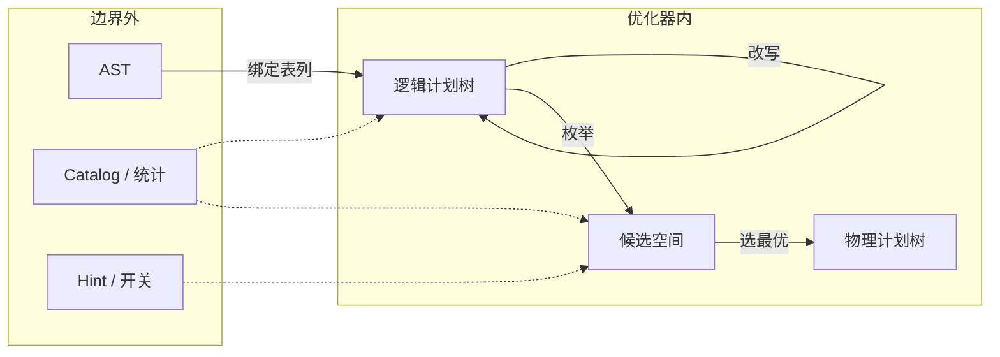

> **传统查询优化器**做的事可以压成一句：在 SQL **执行之前**，把「语义等价的若干物理执行方式」缩成一棵计划树，再交给执行器按树跑完。它解决的是**声明式 SQL 与命令式执行之间的鸿沟**——用户只写「要什么」，优化器负责「怎么算更划算」。所谓「传统」，是相对后来的自适应 / Runtime Filter / 学习型优化而言：计划在编译期一次性定死，执行期默认不再改道。

<!-- more -->

**系列导航**

| 篇 | 主题 | 解决什么疑问 |
|---|---|---|
| **一（本篇）** | [全景](/database/mysql/traditional-query-optimizer/) | 优化器在链路上的位置、输入输出、两段工作、边界 |
| 二 | [从 SQL 到逻辑计划](/database/mysql/from-sql-to-logical-plan/) | 逻辑计划是不是「SQL 本来的执行方式」？树节点是什么 |
| 三 | [谓词与规则改写](/database/mysql/predicate-and-rule-rewrite/) | 什么是谓词、如何下推、规则改写还改什么 |
| 四 | [物理计划：访问路径与 Join](/database/mysql/physical-plan-access-path-and-join/) | 全表/索引怎么选；NLJ / Hash Join / Sort-Merge 怎么跑 |
| 五 | [代价模型与计划搜索](/database/mysql/cost-model-and-plan-search/) | 统计、选择度、搜索剪枝、EXPLAIN 在看什么 |

本篇只建立**宏观心智模型**；名词与机制的展开在后续篇。

---

## 1. 在整条链路上的位置

> 优化器是 Server 层流水线的一段：**解析给出语义，优化给出路径，执行按路径取数**。


- **解析器**：SQL 文本 → AST（语法形状），不碰索引与 Join 顺序。
- **逻辑计划**：关系代数树，描述「算什么」，尚未绑定「怎么算」。详见[第二篇](/database/mysql/from-sql-to-logical-plan/)。
- **优化器两段**：规则改写（缩小/规整逻辑树）→ 代价选型（枚举物理实现并打分）。
- **执行器**：只消费物理计划，用拉模型（`next()`）取数；引擎细节在 Handler 之下。

与「单机 SQL 链路」的衔接：那篇把优化写成一步「选访问路径」；本系列把这一步拆开。

---

## 2. 输入、输出与载体（边界）

> 划清边界后 I/O 很窄：**主输入是逻辑计划树，侧输入是目录统计，主输出是物理计划树**。



| | 形态 | 作用 |
|---|---|---|
| **主输入** | 逻辑计划树（`Scan / Filter / Join…`） | 描述算什么；改写与选型挂在这棵树上 |
| **侧输入** | 表行数、NDV、直方图、索引元数据 | 代价函数按需查阅，不是另一棵计划树 |
| **可选约束** | Hint、`optimizer_switch` | 缩小搜索空间 |
| **主输出** | 物理计划树 | 每个节点已绑定算法与访问路径 |

SQL 文本 / AST **通常不算**优化器的直接输入；结果行集属于执行器，不属于优化器输出。

中间载体（编译期三样东西，别揉成一个词）：

1. **逻辑计划树**——改写阶段的工作台。只说「算什么」，例如「users ⋈ orders，再滤 country」。
2. **候选空间**——选型阶段的草稿纸。同一逻辑片段会暂时挂上**多种**物理拼法，每条带着估计代价；比完只留最优，其余丢掉。  
   草稿纸上每一条完整候选，通常要拼齐好几维，例如：
   - **访问路径**：单表怎么读（`users` 全表？还是 `idx_country`？）
   - **Join 顺序**：先 `users` 再 `orders`，还是反过来？
   - **Join 算法**：NLJ 还是 Hash Join？  
   所以 access path ≠ 候选空间；它只是「单表怎么读」这一维，要和其他维拼完，才是一条可打分的物理计划。
3. **物理计划树**——选型结束的定稿。草稿纸上代价最低的那一条，固化成执行器要跑的树。

（Memo / 「部分计划表」是候选空间的一种实现叫法，不是第三种独立概念。）

更细的「逻辑树长什么样、和 SQL 差在哪」见[第二篇](/database/mysql/from-sql-to-logical-plan/)。

---

## 3. 要解决的问题：搜索空间太大

> 同一条 SQL 的合法物理执行方式往往指数级膨胀。优化器的工程承诺是：**在可接受的编译时延内，挑一个估计代价够用的计划**，而不是数学全局最优。

物理层至少要决定：访问路径、过滤位置、Join 顺序、Join 算法、是否物化等。n 表 Join 仅左深树顺序就约 \(n!\) 量级。

工程上拆成两步：

1. **规则改写**：先砍掉明显坏形、合并可合并的子树（详见[第三篇](/database/mysql/predicate-and-rule-rewrite/)）。
2. **代价选型**：用统计估代价，在剪枝后的空间里 DP 或启发式搜索（详见[第四](/database/mysql/physical-plan-access-path-and-join/)、[第五篇](/database/mysql/cost-model-and-plan-search/)）。

并明确接受：**估计最优 ≠ 真实最优**。

---

## 4. 两段引擎：RBO 与 CBO

> 历史上常讲 RBO → CBO；现代系统多半**叠用**：规则做等价变换，代价在候选里排序。

| | 规则改写（RBO） | 代价选型（CBO） |
|---|---|---|
| **依据** | 固定规则 / 优先级 | 统计 + 代价公式 |
| **改什么** | 逻辑树形状（下推、裁剪、子查询改写…） | 物理实现与 Join 顺序 |
| **能否选索引** | 纯规则时代靠启发式，不可靠 | 正职 |
| **确定性** | 同输入常得同输出 | 依赖统计质量 |

RBO 里最常被点名的「谓词下推」——谓词是什么、往哪推——单独放在[第三篇](/database/mysql/predicate-and-rule-rewrite/)。  
CBO 的燃料（统计）与搜索剪枝放在[第五篇](/database/mysql/cost-model-and-plan-search/)。

---

## 5. 闭环与传统边界

传统模型的闭环：

```text
统计 → 估计基数/代价 → 搜索剪枝 → 固化物理计划 → 执行
```

闭环在**编译期**结束。执行器按树跑，默认不再回头改道。

因此「传统」是一种契约：

- **保证**：在给定统计与代价模型下，过程可复现、计划可解释、优化时延可控。
- **不保证**：统计失真后的真实最优；执行期才出现的过滤力（需 Runtime Filter 等）；中段发现估计崩了之后的自动重优化。

后续技术都是在保留声明式 SQL 的前提下，放松「编译期一次定终身」。

---

## 6. 本篇心智模型

1. **位置**：解析 →（逻辑计划）→ 优化（改写 + 选型）→ 执行。
2. **I/O**：进逻辑树 + 统计，出物理树。
3. **两段**：规则规整形状，代价比较物理候选。
4. **承诺**：够用的估计最优，而非全局真实最优；执行期默认不改道。

下一篇先把「逻辑计划」从直觉里拎清楚：它**不是** SQL 文本的另一种写法，也**不是**最终执行方式，而是优化器真正开干前的语义骨架——[从 SQL 到逻辑计划](/database/mysql/from-sql-to-logical-plan/)。
