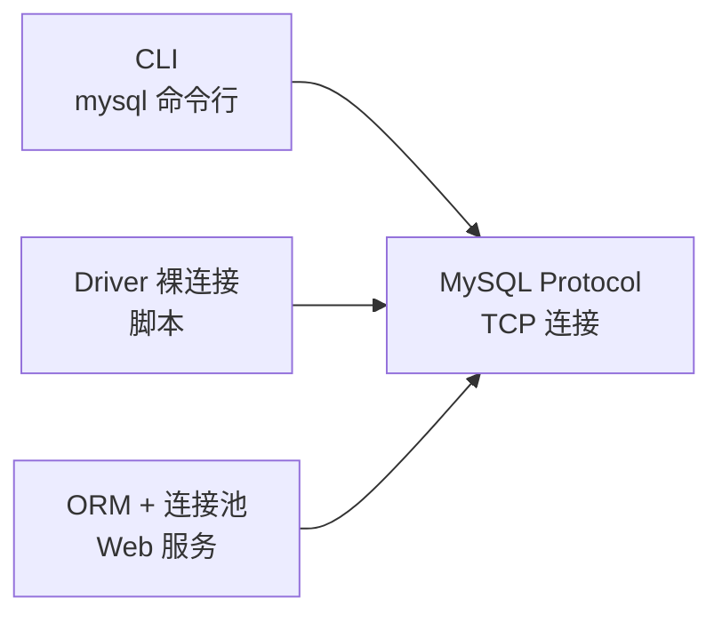
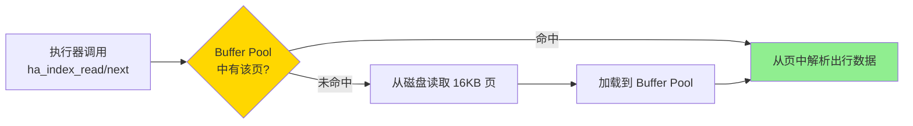
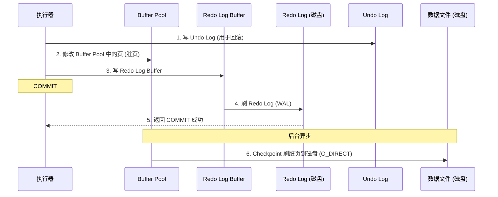

> 从单机视角梳理一条 SQL 从客户端发出、经过 MySQL Server，到 InnoDB 存储引擎落盘的完整路径，聚焦调用关系和关键设计点。

## 范围说明

- 只讨论单机 MySQL：客户端 → MySQL Server → InnoDB
- 不涉及主从复制、Proxy/Agent、分库分表等分布式演进（拆到其他文章）

## 粗略链路


后续小节按客户端、Server、InnoDB 三段展开，从一条 SQL 的视角看清楚：

- 谁发起连接、谁管理连接（CLI / Driver / 连接池）
- Server 内部如何解析 SQL、构造 AST 和执行计划
- 执行器如何用**迭代器 / 火山模型**拉取数据
- InnoDB 的读写路径：Buffer Pool 命中、Redo Log + 数据文件刷盘

## 客户端：谁在发 SQL，谁管连接

单机场景下，客户端可以抽象成三种形态：



- **CLI (`mysql`)**：每次手动连库，整个会话复用一条 TCP 连接，退出时关闭
- **Driver 裸连接**：脚本中直接 `connect → execute → close`，一条 SQL 或几条 SQL 用一条连接
- **ORM + 连接池**：Web 服务预先建好一批连接，多个请求复用，避免频繁建连

下面从 MySQL Server 的角度，只关心：**有一条 TCP 连接已经建立好**，Server 收到了 SQL 文本。

## Server：从 SQL 文本到执行计划

> Server 层的核心工作是：把一段 SQL 文本，变成一个可执行的“算子树”，再通过迭代器模型驱动执行。

### 1. 解析：从 SQL 文本到 AST

第一步是词法 + 语法解析，把字符串变成**抽象语法树（AST）**：

```text
SELECT name FROM users WHERE age > 18
```

解析后会得到类似这样的结构（伪代码形式）：

```text
SelectStmt
  ├── Projections: [Column(name)]
  ├── From: Table(users)
  └── Where: BinaryOp(>
        ├── Left: Column(age)
        └── Right: Const(18))
```

AST 仅仅描述了“这条 SQL 想干什么”，不涉及**怎么干**（比如先扫哪个索引、是否回表）。

### 2. 逻辑计划：关系代数视角

在很多数据库实现里，解析后的 AST 会被转换成一棵更接近**关系代数**的逻辑计划树：

```text
Project[name]
  └── Filter[age > 18]
        └── TableScan[users]
```

- `TableScan[users]`：从 `users` 表读取所有行
- `Filter[age > 18]`：只保留 `age > 18` 的行
- `Project[name]`：只输出 `name` 列

这一步仍然是“逻辑上怎么算”，还没落到具体索引、Join 顺序等物理细节。

### 3. 优化：选择具体访问路径

优化器的目标是：在所有**等价的物理执行方式**里，选一个代价相对更低的。对于简单查询，典型决策包括：

- 是否使用二级索引（比如 `idx_age`）代替全表扫描
- 条件能否下推到存储引擎层（Index Condition Pushdown）
- 多表查询时的 Join 顺序、Join 算法（Nested Loop / Hash Join 等）

优化器会基于统计信息（行数、基数、索引选择度）估算不同方案的成本，比如：

```text
Plan A: 全表扫描 users (100w 行) → 过滤 age > 18
Plan B: 使用 idx_age 索引 (10w 行满足条件) → 回表取 name
```

在 MySQL 中，这些决策体现在 `EXPLAIN` 的输出上：

```sql
EXPLAIN SELECT name FROM users WHERE age > 18\G
```

执行计划可以理解为一棵**物理算子树**，每个节点对应一个具体的执行算子（比如 `IndexScan`、`Filter`、`NestedLoopJoin` 等）。

## 执行器：迭代器 / 火山模型

> 执行器负责“跑起来”那棵执行计划树，MySQL 的典型实现是**迭代器（Iterator）/ 火山模型**：所有算子都暴露 `next()` 接口，按行拉取数据。

### 1. 火山模型的基本形态

可以把执行器想象成一棵由算子节点组成的树，每个节点都实现了：

```c
// 伪代码接口
bool next(Row *row);
```

- **上层算子**通过调用子节点的 `next()` 获取一行行数据
- 每个算子内部只关心“从子节点拉一行，做一点工作，再交给上层”

以 `SELECT name FROM users WHERE age > 18` 为例，对应的执行树可以表示为：

```
Project(name)
  └── Filter(age > 18)
        └── IndexScan(users.idx_age)
```

执行过程是自顶向下的**拉模式（pull-based）**：

1. 客户端请求一批结果 → Server 顶层 `Project` 调用 `next()`
2. `Project.next()` 内部调用 `Filter.next()` 拿一行
3. `Filter.next()` 调用 `IndexScan.next()` 拿一行，判断 `age > 18` 是否满足
4. 满足则把这行传回 `Project`，否则继续向下拉

所有算子以这种“按行迭代”的方式协作，这就是所谓的**火山模型**。

### 2. MySQL 中的 Row-by-Row 执行

MySQL 的执行器在实现上并不是教科书式的纯虚函数接口，但思想一致：

- Executor 层按照执行计划，调用存储引擎提供的 Handler API：

```c
handler->ha_index_init();      // 准备索引扫描
handler->ha_index_read();      // 按条件找第一行
handler->ha_index_next();      // 取下一行
```

- 每次 `ha_index_next()` 返回一行，执行器在 Server 内存中做过滤、投影、聚合等操作
- 最后把结果编码为 MySQL 协议包，通过 TCP 逐行或成批发给客户端

## InnoDB：读路径（Buffer Pool）

> InnoDB 把磁盘页缓存到 Buffer Pool 中。读路径的关键问题是：一条 `ha_index_read()` / `ha_index_next()` 调用，如何在 Buffer Pool 和磁盘之间取到行数据。

### 1. 从索引到页，再到行

当执行器通过 Handler API 发起索引读取时，InnoDB 做的事情大致是：

1. 根据索引键值，在 B+ 树上定位到对应的叶子节点
2. 叶子节点中包含了**页号 + 行偏移**
3. 根据页号去 Buffer Pool 查找该页是否在内存中

读路径可以用刚才的横向图来表示：



- 命中：直接在 Buffer Pool 中找到页，读取行
- 未命中：从磁盘读整个 16KB 页，放入 Buffer Pool，再读取行

### 2. Buffer Pool 与命中率

Buffer Pool 是 InnoDB 自己管理的缓存：

- 默认大小较小，生产中通常设置为物理内存的 60–80%
- 使用 LRU 变种算法管理页的淘汰
- 目标是尽量让“热点页”长期驻留内存

命中率可以通过状态量估算：

```sql
SHOW STATUS LIKE 'Innodb_buffer_pool%';
-- Innodb_buffer_pool_read_requests: 总读请求数
-- Innodb_buffer_pool_reads: 需要读磁盘的次数
-- 命中率 ≈ 1 - reads / read_requests
```

从单机 SQL 链路视角看，**Buffer Pool 命中率直接决定了读取阶段是亚毫秒级（内存）还是毫秒级（磁盘）**。

## InnoDB：写路径（WAL + 刷盘）

> 写路径关心的是：一次 `INSERT/UPDATE/DELETE` 到底写了哪些地方，什么时刻可以向客户端宣布 COMMIT 成功。

### 1. 写入顺序

以一个简单事务为例：

```sql
BEGIN;
UPDATE users SET age = age + 1 WHERE id = 1;
COMMIT;
```

在 InnoDB 内部，写路径大致如下：



关键点：

- Redo Log 先于数据文件刷盘（Write-Ahead Logging）
- 数据页修改先留在 Buffer Pool，刷盘是**异步**的 Checkpoint 行为

### 2. WAL 与崩溃恢复

Redo Log 记录的是“对某个页做了什么修改”，而不是整页内容：

- 如果 Server 崩溃但 Redo Log 已经刷盘，重启时可以根据 Redo Log **重做**这些修改
- 因为数据页最终也会刷盘，所以 Redo Log 只需保存最近一段时间的操作

单机视角下，COMMIT 返回成功的含义是：

- Redo Log（以及必要时 Binlog）已经按照配置刷到持久介质或至少 OS 缓存
- Buffer Pool 中的脏页稍后由 Checkpoint 线程异步写回

具体刷盘时机由配置控制（这里只保留直观理解，不展开参数细节）。

## 小结：一条 SQL 在单机上的关键链路

- **客户端**：
  - CLI / Driver / ORM+连接池 只是发起 SQL 和管理连接的方式不同
  - 从 MySQL Server 看过去，看到的都是一条条 TCP 连接和 SQL 文本

- **Server**：
  - 解析器把 SQL 文本变成 AST
  - 优化器基于统计信息选择执行计划
  - 执行器按火山模型逐行从存储引擎拉数据，按行处理

- **InnoDB**：
  - 读路径：通过索引定位页 → Buffer Pool 命中则内存返回，否则读盘
  - 写路径：先写 Undo / Redo Log，再异步刷脏页，依赖 WAL 做崩溃恢复

从客户端的 `db.Query()` 或 `mysql` 命令，到行数据真正落在 InnoDB 的数据文件上，所有这些步骤构成了**单机架构下的一条 SQL 链路**。在理解了这条链路之后，再看主从复制、读写分离、Proxy/Agent 之类的扩展层，会更容易判断：它们插在链路的哪一层、改变了什么、不改变什么。
