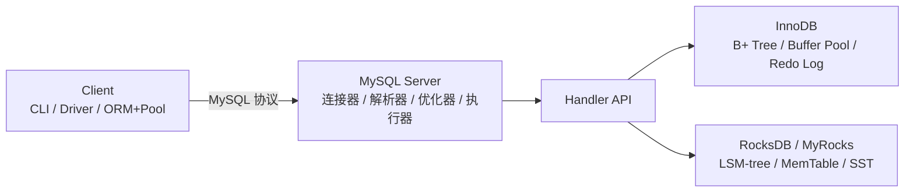
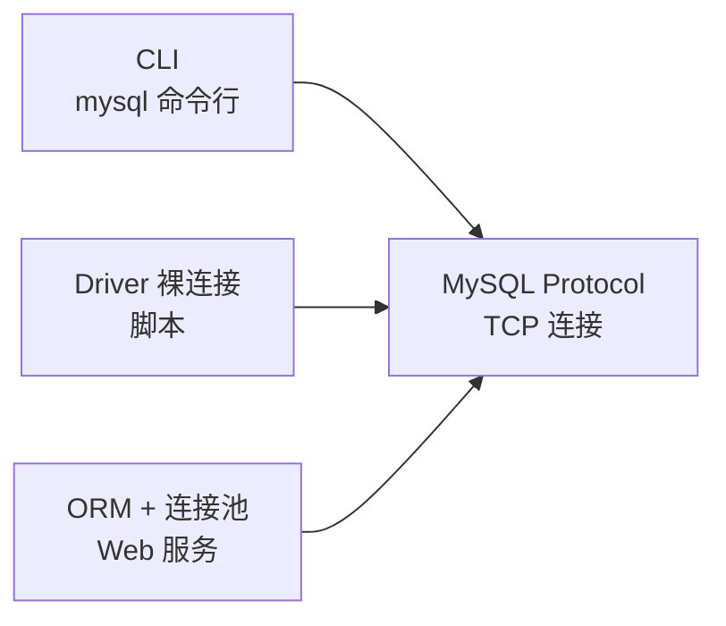
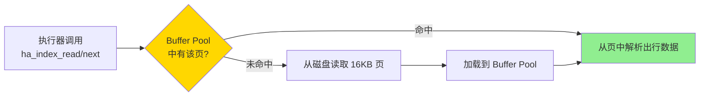
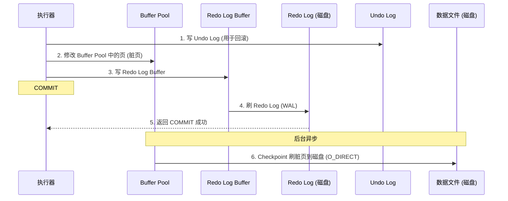
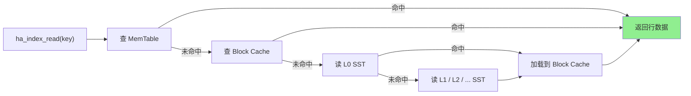
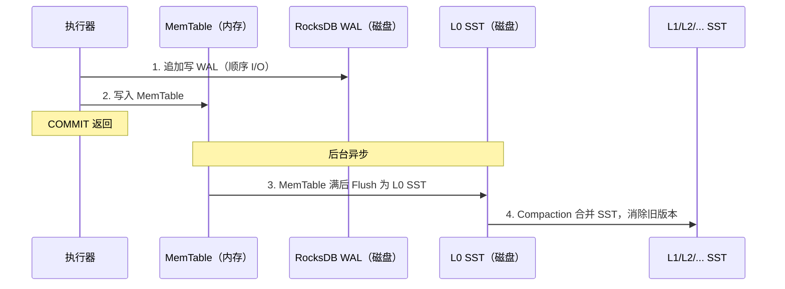

> 从单机视角梳理一条 SQL 从客户端发出、经过 MySQL Server，到存储引擎落盘的完整路径。MySQL 的存储引擎是可插拔的，最常见的两类是：以 B+ 树 + Buffer Pool 为核心的 **InnoDB**，以及以 LSM-tree 为核心的 **KV 引擎（RocksDB / MyRocks）**。二者在 Server 层之上的路径完全相同，差异全部集中在 handler API 以下。

## 范围说明

- 单机 MySQL：客户端 → MySQL Server → 存储引擎
- 存储引擎覆盖 InnoDB 和 RocksDB（MyRocks）两条路径
- 不涉及主从复制、Proxy/Agent、分库分表等分布式演进

## 粗略链路


```mermaid
graph LR
    C[Client<br/>CLI / Driver / ORM+Pool]
    S[MySQL Server<br/>连接器 / 解析器 / 优化器 / 执行器]
    H[Handler API]
    IDB[InnoDB<br/>B+ Tree / Buffer Pool / Redo Log]
    RDB[RocksDB / MyRocks<br/>LSM-tree / MemTable / SST]

    C -->|MySQL 协议| S
    S --> H
    H --> IDB
    H --> RDB
```

Client → Server 这段对两种引擎完全一样。分叉点在 Handler API：执行器调用同一套虚函数接口，引擎各自实现。后续小节先讲公共路径（客户端、Server、执行器），再分别讲两条引擎路径：

- 谁发起连接、谁管理连接（CLI / Driver / 连接池）
- Server 内部如何解析 SQL、构造 AST 和执行计划
- 执行器如何用**迭代器 / 火山模型**拉取数据
- InnoDB 读写路径：B+ 树索引 → Buffer Pool → Redo Log + 刷脏页
- KV 引擎读写路径：LSM-tree 索引 → MemTable + SST → WAL（Write Batch）

## 客户端：谁在发 SQL，谁管连接

单机场景下，客户端可以抽象成三种形态：


```mermaid
graph LR
    CLI[CLI<br/>mysql 命令行] --> NET
    DRV[Driver 裸连接<br/>脚本] --> NET
    ORM[ORM + 连接池<br/>Web 服务] --> NET

    NET[MySQL Protocol<br/>TCP 连接]
```

- **CLI (`mysql`)**：每次手动连库，整个会话复用一条 TCP 连接，退出时关闭
- **Driver 裸连接**：脚本中直接 `connect → execute → close`，一条 SQL 或几条 SQL 用一条连接
- **ORM + 连接池**：Web 服务预先建好一批连接，多个请求复用，避免频繁建连

下面从 MySQL Server 的角度，只关心：**有一条 TCP 连接已经建立好**，Server 收到了 SQL 文本。

## Server：从 SQL 文本到执行计划

> Server 层的核心工作是：把一段 SQL 文本，变成一个可执行的“算子树”，再通过迭代器模型驱动执行。

### 1. 解析：从 SQL 文本到 AST

第一步是词法 + 语法解析，把字符串变成**抽象语法树（AST）**：

```text
SELECT name FROM users WHERE age > 18
```

解析后会得到类似这样的结构（伪代码形式）：

```text
SelectStmt
  ├── Projections: [Column(name)]
  ├── From: Table(users)
  └── Where: BinaryOp(>
        ├── Left: Column(age)
        └── Right: Const(18))
```

AST 仅仅描述了“这条 SQL 想干什么”，不涉及**怎么干**（比如先扫哪个索引、是否回表）。

### 2. 逻辑计划：关系代数视角

在很多数据库实现里，解析后的 AST 会被转换成一棵更接近**关系代数**的逻辑计划树：

```text
Project[name]
  └── Filter[age > 18]
        └── TableScan[users]
```

- `TableScan[users]`：从 `users` 表读取所有行
- `Filter[age > 18]`：只保留 `age > 18` 的行
- `Project[name]`：只输出 `name` 列

这一步仍然是“逻辑上怎么算”，还没落到具体索引、Join 顺序等物理细节。

### 3. 优化：选择具体访问路径

优化器的目标是：在所有**等价的物理执行方式**里，选一个代价相对更低的。对于简单查询，典型决策包括：

- 是否使用二级索引（比如 `idx_age`）代替全表扫描
- 条件能否下推到存储引擎层（Index Condition Pushdown）
- 多表查询时的 Join 顺序、Join 算法（Nested Loop / Hash Join 等）

优化器会基于统计信息（行数、基数、索引选择度）估算不同方案的成本，比如：

```text
Plan A: 全表扫描 users (100w 行) → 过滤 age > 18
Plan B: 使用 idx_age 索引 (10w 行满足条件) → 回表取 name
```

在 MySQL 中，这些决策体现在 `EXPLAIN` 的输出上：

```sql
EXPLAIN SELECT name FROM users WHERE age > 18\G
```

执行计划可以理解为一棵**物理算子树**，每个节点对应一个具体的执行算子（比如 `IndexScan`、`Filter`、`NestedLoopJoin` 等）。

## 执行器：迭代器 / 火山模型

> 执行器负责“跑起来”那棵执行计划树，MySQL 的典型实现是**迭代器（Iterator）/ 火山模型**：所有算子都暴露 `next()` 接口，按行拉取数据。

### 1. 火山模型的基本形态

可以把执行器想象成一棵由算子节点组成的树，每个节点都实现了：

```c
// 伪代码接口
bool next(Row *row);
```

- **上层算子**通过调用子节点的 `next()` 获取一行行数据
- 每个算子内部只关心“从子节点拉一行，做一点工作，再交给上层”

以 `SELECT name FROM users WHERE age > 18` 为例，对应的执行树可以表示为：

```
Project(name)
  └── Filter(age > 18)
        └── IndexScan(users.idx_age)
```

执行过程是自顶向下的**拉模式（pull-based）**：

1. 客户端请求一批结果 → Server 顶层 `Project` 调用 `next()`
2. `Project.next()` 内部调用 `Filter.next()` 拿一行
3. `Filter.next()` 调用 `IndexScan.next()` 拿一行，判断 `age > 18` 是否满足
4. 满足则把这行传回 `Project`，否则继续向下拉

所有算子以这种“按行迭代”的方式协作，这就是所谓的**火山模型**。

### 2. MySQL 中的 Row-by-Row 执行

MySQL 的执行器在实现上并不是教科书式的纯虚函数接口，但思想一致：

- Executor 层按照执行计划，调用存储引擎提供的 Handler API：

```c
handler->ha_index_init();      // 准备索引扫描
handler->ha_index_read();      // 按条件找第一行
handler->ha_index_next();      // 取下一行
```

- 每次 `ha_index_next()` 返回一行，执行器在 Server 内存中做过滤、投影、聚合等操作
- 最后把结果编码为 MySQL 协议包，通过 TCP 逐行或成批发给客户端

## InnoDB：读路径

> InnoDB 把磁盘页缓存到 Buffer Pool 中。读路径的关键问题是：一条 `ha_index_read()` / `ha_index_next()` 调用，如何在 Buffer Pool 和磁盘之间取到行数据。

### 1. 从索引到页，再到行

当执行器通过 Handler API 发起索引读取时，InnoDB 做的事情大致是：

1. 根据索引键值，在 B+ 树上定位到对应的叶子节点
2. 叶子节点中包含了**页号 + 行偏移**
3. 根据页号去 Buffer Pool 查找该页是否在内存中

读路径可以用刚才的横向图来表示：


```mermaid
graph LR
    A[执行器调用<br/>ha_index_read/next] --> B{Buffer Pool<br/>中有该页?}
    B -->|命中| C[从页中解析出行数据]
    B -->|未命中| D[从磁盘读取 16KB 页]
    D --> E[加载到 Buffer Pool]
    E --> C

    style B fill:#FFD700
    style C fill:#90EE90
```

- 命中：直接在 Buffer Pool 中找到页，读取行
- 未命中：从磁盘读整个 16KB 页，放入 Buffer Pool，再读取行

### 2. Buffer Pool 与命中率

Buffer Pool 是 InnoDB 自己管理的缓存：

- 默认大小较小，生产中通常设置为物理内存的 60–80%
- 使用 LRU 变种算法管理页的淘汰
- 目标是尽量让“热点页”长期驻留内存

命中率可以通过状态量估算：

```sql
SHOW STATUS LIKE 'Innodb_buffer_pool%';
-- Innodb_buffer_pool_read_requests: 总读请求数
-- Innodb_buffer_pool_reads: 需要读磁盘的次数
-- 命中率 ≈ 1 - reads / read_requests
```

从单机 SQL 链路视角看，**Buffer Pool 命中率直接决定了读取阶段是亚毫秒级（内存）还是毫秒级（磁盘）**。

## InnoDB：写路径

> 写路径关心的是：一次 `INSERT/UPDATE/DELETE` 到底写了哪些地方，什么时刻可以向客户端宣布 COMMIT 成功。

### 1. 写入顺序

以一个简单事务为例：

```sql
BEGIN;
UPDATE users SET age = age + 1 WHERE id = 1;
COMMIT;
```

在 InnoDB 内部，写路径大致如下：


```mermaid
sequenceDiagram
    participant E as 执行器
    participant BP as Buffer Pool
    participant RB as Redo Log Buffer
    participant RL as Redo Log (磁盘)
    participant UL as Undo Log
    participant D as 数据文件 (磁盘)

    E->>UL: 1. 写 Undo Log (用于回滚)
    E->>BP: 2. 修改 Buffer Pool 中的页 (脏页)
    E->>RB: 3. 写 Redo Log Buffer

    Note over E: COMMIT

    RB->>RL: 4. 刷 Redo Log (WAL)
    RL-->>E: 5. 返回 COMMIT 成功

    Note over BP,D: 后台异步
    BP->>D: 6. Checkpoint 刷脏页到磁盘 (O_DIRECT)
```

关键点：

- Redo Log 先于数据文件刷盘（Write-Ahead Logging）
- 数据页修改先留在 Buffer Pool，刷盘是**异步**的 Checkpoint 行为

### 2. WAL 与崩溃恢复

Redo Log 记录的是“对某个页做了什么修改”，而不是整页内容：

- 如果 Server 崩溃但 Redo Log 已经刷盘，重启时可以根据 Redo Log **重做**这些修改
- 因为数据页最终也会刷盘，所以 Redo Log 只需保存最近一段时间的操作

单机视角下，COMMIT 返回成功的含义是：

- Redo Log（以及必要时 Binlog）已经按照配置刷到持久介质或至少 OS 缓存
- Buffer Pool 中的脏页稍后由 Checkpoint 线程异步写回

具体刷盘时机由配置控制（这里只保留直观理解，不展开参数细节）。

## KV 引擎（RocksDB / MyRocks）：读路径

> RocksDB 以 LSM-tree 组织数据，没有 Buffer Pool 的概念。读路径需要在内存中的 MemTable 和磁盘上的多层 SST 文件之间查找目标 key 的最新版本。

### 1. LSM-tree 的数据分布

RocksDB 的数据按写入时间分层存储：

```
写入 → MemTable（内存，可读写）
           ↓  Flush
       L0 SST（磁盘，多个文件，key range 可重叠）
           ↓  Compaction
       L1 SST（磁盘，key range 不重叠）
           ↓  Compaction
       L2 / L3 / ...（数据量逐层增大）
```

同一个 key 可能同时存在于 MemTable 和多层 SST 中，最新版本（最大 `sequence_number`）才是有效值。

### 2. 读路径：从新到旧逐层查找


```mermaid
graph LR
    A["ha_index_read(key)"] --> B[查 MemTable]
    B -->|命中| R[返回行数据]
    B -->|未命中| C[查 Block Cache]
    C -->|命中| R
    C -->|未命中| D[读 L0 SST]
    D -->|命中| RC[加载到 Block Cache] --> R
    D -->|未命中| E[读 L1 / L2 / ... SST]
    E --> RC

    style R fill:#90EE90
```

- **MemTable**：写入最新，优先查找；读写均在内存，延迟最低
- **Block Cache**：RocksDB 自己管理的 SST block 缓存，类似 InnoDB Buffer Pool 的角色，但粒度是 block（默认 4KB）而非整页
- **Bloom Filter**：每个 SST 文件附带，可以快速判断某个 key 是否在该文件中，避免无效 I/O
- **L0 文件数量**：L0 SST 之间 key range 可能重叠，最坏情况需要逐一检查每个 L0 文件

MyRocks 在 RocksDB 之上通过 handler API 将行数据编码为 KV：主键编码为 `(table_id | pk_columns)` → `(non-pk columns)`，二级索引编码为 `(table_id | index_columns | pk_columns)` → 空值（回主键 CF 取完整行）。

### 3. 读放大（Read Amplification）

最坏情况下一次点查需要查 MemTable + 所有层的 SST，I/O 次数远多于 InnoDB 的单次页读取。通过 Bloom Filter 和 Block Cache 可以大幅缓解，但读密集场景下 RocksDB 的延迟分布通常比 InnoDB 宽。

---

## KV 引擎（RocksDB / MyRocks）：写路径

> RocksDB 的写路径核心是 **WAL + MemTable**：写入先进 WAL（顺序写磁盘）和 MemTable（内存），COMMIT 成功即可返回，MemTable Flush 到 SST 是异步的。

### 1. 写入顺序


```mermaid
sequenceDiagram
    participant E as 执行器
    participant MT as MemTable（内存）
    participant WL as RocksDB WAL（磁盘）
    participant L0 as L0 SST（磁盘）
    participant LN as L1/L2/... SST

    E->>WL: 1. 追加写 WAL（顺序 I/O）
    E->>MT: 2. 写入 MemTable

    Note over E: COMMIT 返回

    Note over MT,L0: 后台异步
    MT->>L0: 3. MemTable 满后 Flush 为 L0 SST
    L0->>LN: 4. Compaction 合并 SST，消除旧版本
```

关键点：

- WAL 是追加顺序写，比 InnoDB Redo Log 的写入模式相似，但 RocksDB WAL 记录的是整个 `WriteBatch`（一次事务所有写操作的集合）
- MemTable 写入完成且 WAL 落盘后即可返回 COMMIT——数据在内存安全，崩溃可由 WAL 恢复
- 数据页无需像 InnoDB 那样维护脏页刷盘机制，Flush 直接产生不可变 SST 文件

### 2. 写放大（Write Amplification）

一条数据从写入到最终落在底层 SST，经历了 WAL → MemTable → L0 → L1 → … 多次写入。每次 Compaction 都会重写数据，写放大系数通常在 10–30 倍。这是 LSM-tree 换取高写吞吐量的代价，与 InnoDB 的随机写页（写放大较小但有随机 I/O）形成对比。

### 3. 崩溃恢复

重启时 RocksDB 扫描 WAL，将未 Flush 的 `WriteBatch` 重新写入 MemTable，再继续正常流程。已经 Flush 为 SST 的数据不需要重放。

---

## 小结：一条 SQL 在单机上的关键链路

- **客户端**：
  - CLI / Driver / ORM+连接池 只是发起 SQL 和管理连接的方式不同
  - 从 MySQL Server 看过去，看到的都是一条条 TCP 连接和 SQL 文本

- **Server**：
  - 解析器把 SQL 文本变成 AST
  - 优化器基于统计信息选择执行计划
  - 执行器按火山模型逐行从存储引擎拉数据，按行处理

- **InnoDB**：
  - 读路径：B+ 树索引定位页 → Buffer Pool 命中则内存返回，否则读整页（16KB）到 Buffer Pool
  - 写路径：先写 Undo Log + Redo Log，修改 Buffer Pool 脏页，异步 Checkpoint 刷盘；依赖 WAL 崩溃恢复

- **RocksDB / MyRocks**：
  - 读路径：MemTable → Block Cache → L0 SST → L1/L2/... SST，逐层查找，Bloom Filter 剪枝
  - 写路径：写 WAL + MemTable 后返回 COMMIT，异步 Flush 为 L0 SST，后台 Compaction 合并

两条路径在 Server 层以上完全共用，Handler API 是唯一分叉点：

| 维度     | InnoDB                        | RocksDB / MyRocks                 |
| -------- | ----------------------------- | --------------------------------- |
| 数据结构 | B+ 树 + 页（16KB）            | LSM-tree（MemTable + SST）        |
| 读缓存   | Buffer Pool（页级，内存大块） | Block Cache（block 级，4KB）      |
| 读放大   | 低（索引一次定位）            | 高（最坏需查所有层）              |
| 写路径   | 随机写页 + 顺序写 Redo Log    | 顺序写 WAL + MemTable，批量 Flush |
| 写放大   | 低至中等                      | 高（Compaction 多次重写）         |
| 崩溃恢复 | 重放 Redo Log                 | 重放 RocksDB WAL                  |
