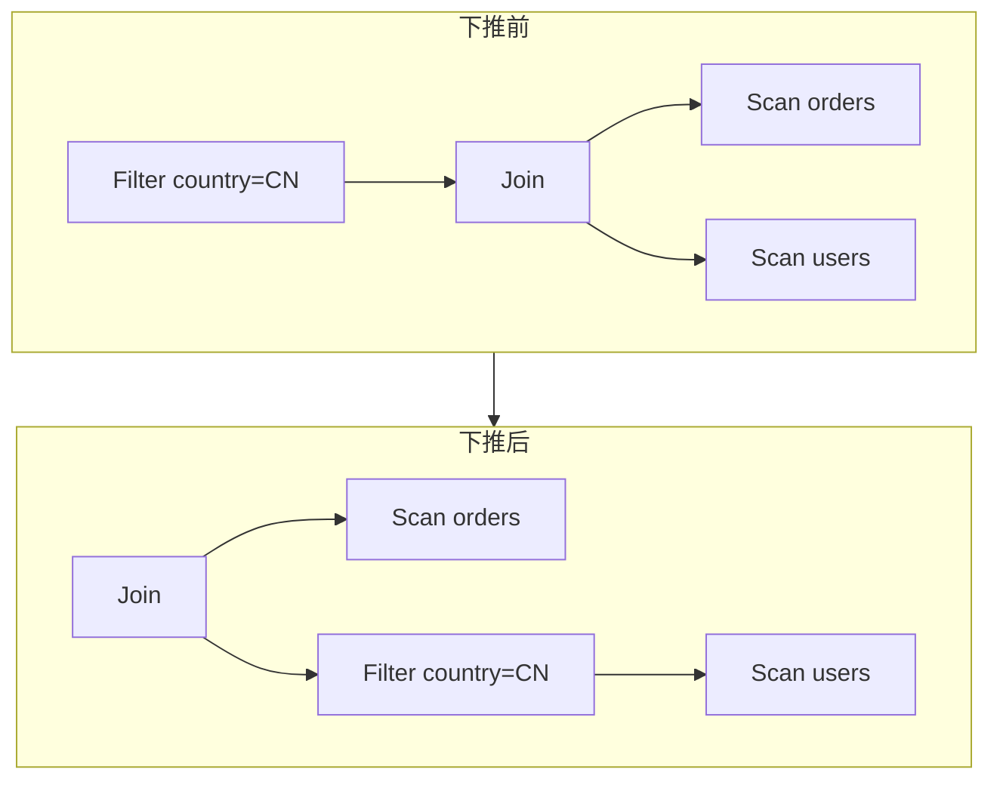

> **谓词**是值为真/假的条件表达式（如 `country = 'CN'`）。**谓词下推**是一种保持语义等价的改写：把过滤条件尽可能移向数据源头（靠近 `Scan` / 下推进 Join 下方），使中间结果更早变小。它属于规则改写（RBO）族，通常不依赖表级统计，却能为后面的代价选型省下大量搜索空间。

<!-- more -->

**系列导航**：[一·全景](/database/mysql/traditional-query-optimizer/) · [二·逻辑计划](/database/mysql/from-sql-to-logical-plan/) · **三·谓词与改写（本篇）** · [四·物理与 Join](/database/mysql/physical-plan-access-path-and-join/) · [五·代价与搜索](/database/mysql/cost-model-and-plan-search/)


## 1. 什么是谓词

> 在查询处理语境里，谓词（predicate）= **作用在行（或元组）上的布尔条件**。为真则行留下（或参与连接），为假则丢掉。

来自 SQL 的常见谓词：

```sql
WHERE u.country = 'CN'          -- 比较谓词
  AND o.amount > 100            -- 范围谓词
  AND o.status IN ('paid','shipped')  -- IN 谓词
  AND u.email IS NOT NULL       -- 空值谓词
```

也出现在 `JOIN … ON`、`HAVING`、以及半连接 / 反连接改写后的条件里。

在逻辑计划里，谓词通常挂在：

- `Filter` **节点**上：显式过滤；
- `Join` **的连接条件**上：决定两行能否匹配；
- `Scan` **的附着谓词列表**上：下推完成后的常见形态（「边读边滤」的逻辑描述）。

谓词**不是**索引，也**不是**执行算法；它只是条件。索引能否利用某个谓词，是物理选型阶段的事。

---


## 2. 「下推」在推什么

> 下推 = 在**不改变结果集**的前提下，把谓词在计划树里**往叶子方向移动**（或并入更底层算子），让无用行尽早消失。


### 2.1 一个完整例子

SQL：

```sql
SELECT o.id, u.name
FROM orders o
JOIN users u ON o.user_id = u.id
WHERE u.country = 'CN';
```

一种「尚未改写」的逻辑树（Filter 在 Join 之上）：

```text
Project[o.id, u.name]
  └── Filter[u.country = 'CN']          ← 谓词在这里
        └── Join[o.user_id = u.id]
              ├── Scan[orders]
              └── Scan[users]
```

数据流直觉（逻辑上）：先对两表做 Join，得到很大的中间结果，再丢掉 `country ≠ 'CN'` 的行。  
问题不在语义错误，而在**白做功**：大量订单行会先与非 CN 用户拼上，再被扔出去。

谓词下推之后：

```text
Project[o.id, u.name]
  └── Join[o.user_id = u.id]
        ├── Scan[orders]
        └── Filter[u.country = 'CN']    ← 谓词下推到 users 一侧
              └── Scan[users]
```

或直接写成 Scan 附着谓词：

```text
Join[o.user_id = u.id]
  ├── Scan[orders]
  └── Scan[users]  predicates: [country = 'CN']
```




- **推之前**：谓词在 Join **之上**，过滤的是 Join 输出。
- **推之后**：谓词在 `users` 的 Scan **之上**（Join **之下**），过滤的是单表行。
- **不变的是**：最终结果集；**变的是**：中间结果规模与后续物理代价。


### 2.2 为什么允许这样推

先对齐**内连接（INNER JOIN）**在说什么。

`A INNER JOIN B ON 条件`（SQL 里常写成 `JOIN`，默认就是内连接）的含义是：

> 只保留**两边都能匹配上**的行对。任一侧对不上的行，直接丢弃，不会出现在结果里。

```text
users:   (1, CN)  (2, US)
orders:  (user_id=1, …)  (user_id=3, …)

users INNER JOIN orders ON users.id = orders.user_id
→ 只有 id=1 与 user_id=1 这一对留下
→ 用户 2（无订单）、订单 user_id=3（无对应用户）都不出现
```

因此，对内连接来说，「先丢掉永远匹配不上的行」和「先 Join 再丢掉」往往是一回事：这些行本就不会进入最终结果。于是——

对**内连接**，只引用其中一侧列的过滤谓词，可以移到该侧子树而不改语义：

- `country` 只属于 `users` → 可推到 `users` 侧（先丢掉非 CN 用户，再 Join）。
- `amount > 100` 只属于 `orders` → 可推到 `orders` 侧。
- `u.id = o.user_id` 是**连接谓词**，留在 Join 上（或参与成对改写），不能当成单表 Filter 随便丢到一侧后删除连接语义。

对比**外连接**（如 `LEFT JOIN`）：左表即使右表匹配不上，也要用 NULL 补齐保留下来。若把本该作用在「Join 之后」的谓词提前推到右表（或推错侧），可能把这些「应保留的 NULL 扩展行」滤掉，**结果集变了**。所以外连接上规则引擎会区分「可推 / 不可推 / 推了要改写连接类型」；本篇例子默认都是内连接。

---


## 3. 下推之后，物理层才能吃到红利

> 规则改写本身不选索引；但它让「单表谓词」暴露在 Scan 旁，CBO 才更容易枚举 IndexRangeScan 等路径。

下推后的 `Filter(country='CN') + Scan(users)`，在物理层可能变成：

```text
IndexRangeScan(users.idx_country, country = 'CN')
```

若谓词仍停在 Join 之上，优化器仍可能识别，但中间形态更绕，部分引擎的启发式也会更弱。  
**下推的直接收益是逻辑形状；间接收益是打开更好的物理候选。** 索引怎么选见[第四篇](/database/mysql/physical-plan-access-path-and-join/)。

---


## 4. 同一族的其他规则改写

> 谓词下推是 RBO 的代表；同类规则都在做「语义不变、形状更利于执行/搜索」的变形。

| 规则 | 做什么 | 直观收益 |
|---|---|---|
| **谓词下推** | Filter 靠近 Scan / 穿过 Join（在允许时） | 中间结果更早变小 |
| **投影裁剪** | 去掉后续用不到的列 | 减少 I/O 与内存宽行 |
| **常量折叠** | `WHERE 1=1 AND a>1` → `a>1` | 少算、简化树 |
| **视图/派生表合并** | 内联可内联的子查询/视图 | 少一次物化，便于继续下推 |
| **子查询改写** | 相关子查询 → Join / Semi-Join | 从反复执行变成集合操作 |

下面展开表中的投影裁剪、视图/派生表合并、子查询改写三则（常量折叠语义直观，不单开）。

### 4.1 投影裁剪：列也是「中间结果」

> 谓词下推砍的是**行**；投影裁剪砍的是**列**。最终 `SELECT` 用不到、中间算子也不再引用的列，不必从存储一路扛到树顶。

```sql
SELECT u.name
FROM users u
JOIN orders o ON u.id = o.user_id;
```

改写前，逻辑上容易「宽」着走：`Scan(orders)` 带出表上所有列，Join 后再在顶端丢掉。  
改写后：自顶向下收集「还需要哪些列」——

```text
顶端只要 u.name
Join 还要 u.id、o.user_id（连接键）
→ users 侧保留 id, name
→ orders 侧只需 user_id，其余列可裁掉
```

```text
Project[u.name]
  └── Join[u.id = o.user_id]
        ├── Scan[users]  cols: {id, name}
        └── Scan[orders] cols: {user_id}    ← 裁剪后
```

**因为**：宽行占 I/O、内存与网络（分布式时更明显）。  
**连带收益**：`orders` 若存在只含 `user_id` 的索引，物理层更可能走覆盖/少回表；列裁不掉时，往往不得不回聚簇索引取整行。

### 4.2 视图 / 派生表合并：拆掉多余的「盒子」

> 视图和 `FROM (SELECT …)` 派生表在语义上像嵌套子计划。能**合并（merge / 内联）**时，把内层算子摊进外层，少一次独立边界，常少一次物化。

```sql
-- 派生表写法
SELECT d.name
FROM (
  SELECT id, name, country FROM users WHERE country = 'CN'
) AS d
JOIN orders o ON d.id = o.user_id;
```

**不合并**时，一种直观形态是：先把内层跑完（甚至物化成临时结果），再当一张「表」去 Join——外层谓词/投影难以穿透盒子，优化器像面对一张已冻住的中间表。

**合并后**，内层摊平，等价于：

```sql
SELECT u.name
FROM users u
JOIN orders o ON u.id = o.user_id
WHERE u.country = 'CN';
```

逻辑树上不再多一层「派生表 Scan」，`country = 'CN'` 可以直接参与下推与单表访问路径选择。

| | 合并 | 不合并（物化） |
|---|---|---|
| 树形 | 内层算子并入外层 | 内层先出结果，外层当基表 |
| 下推 | 外层谓词易穿入内层 | 常被盒子挡住 |
| 何时不得不物化 | — | 含聚合、某些窗口/`LIMIT`、或引擎规定不可合并的构造 |

**因为**：声明式 SQL 里「先写成子查询」不等于「必须先执行子查询」。合并是在恢复可优化的平坦形状。  
**代价**：并非总能合并；强行合并可能错误或反而更慢，规则会识别「可 merge / 必须 materialize」。

### 4.3 子查询改写：从「每行跑一遍」到集合操作

> 相关子查询的朴素执行是：外层每一行，带绑定值再执行一遍内层。行一多就变成嵌套循环式的反复执行。规则改写常把它变成 Join / Semi-Join 等**集合运算**，让优化器能选顺序、索引与算法。

**存在性（半连接）例子：**

```sql
SELECT u.id, u.name
FROM users u
WHERE EXISTS (
  SELECT 1 FROM orders o WHERE o.user_id = u.id AND o.amount > 100
);
```

`EXISTS` 的语义是：外层用户**是否存在**至少一笔满足条件的订单——不需要把订单列拼进结果。

可改写为 **Semi-Join（半连接）**：

```text
SemiJoin[o.user_id = u.id]
  ├── Scan[users]
  └── Filter[amount > 100] → Scan[orders]
```

与普通 Inner Join 的差别：半连接对每个 `u` **最多贡献一次**（找到匹配即可，不必为多笔订单复制多行用户）。`IN (子查询)` 在许多场景下也会落到同类半连接形态。

**标量子查询例子（示意）：**

```sql
SELECT o.id,
       (SELECT u.name FROM users u WHERE u.id = o.user_id) AS name
FROM orders o;
```

相关标量子查询若保证最多一行，常可改写成对 `users` 的 Join（外连接或内连接，视空值语义而定），从而避免「每笔订单点查一次」的固定套娃，并进入统一的 Join 搜索空间。

| 形态 | 朴素直觉 | 改写后 |
|---|---|---|
| `EXISTS` / `IN` | 外层每行跑内层 | Semi-Join（或去重后的 Join） |
| 相关标量子查询 | 外层每行求一个值 | Join（注意多行时报错语义） |
| 非相关子查询 | 内层与外层无关 | 常可先物化一次再探测 |

**因为**：集合化之后，才能谈访问路径、Join 顺序与 Hash/NLJ——否则执行模型被钉死在「相关嵌套循环」上。  
**边界**：改写必须保持「多行标量报错」「NULL 与 UNKNOWN」「NOT IN 遇 NULL」等语义；规则做不到安全变换时，会保留子查询执行器路径。

---

## 5. 规则改写的能力边界

> RBO **擅长**形状变换，**不擅长**在「全表 vs 索引」「谁先 Join 谁」之间做数据相关的判断。


|                             | 规则改写能拍板  | 需要代价 / 统计 |
| --------------------------- | -------- | --------- |
| 把 `country='CN'` 推到 users 侧 | ✓        |           |
| 选 `idx_country` 还是全表        |          | ✓         |
| 三表谁先谁后                      | 至多有粗糙启发式 | ✓ 正职      |
| 外连接上能否下推某谓词                 | ✓（按等价规则） |           |


规则的优先级本身也是启发式：规则顺序不同，中间树形可能不同，但应落在**语义等价类**里。纯 RBO 年代用「有索引就走索引」一类硬规则选物理路径，遇到数据倾斜会系统性选错——这正是 CBO 叠上来的原因（[第五篇](/database/mysql/cost-model-and-plan-search/)）。

---


## 6. 本篇对齐


| 问题      | 回答                                   |
| ------- | ------------------------------------ |
| 谓词是什么？  | 行上的布尔条件（`WHERE` / `ON` / `HAVING` 等） |
| 下推推到哪？  | 计划树的叶子方向：靠近产生该列的 `Scan`，或并入其谓词列表     |
| 下推改语义吗？ | 在规则允许的等价变换下不改；外连接等场景有不可推的边界          |
| 下推选索引吗？ | 不直接选；只把条件放到更利于物理选型的位置                |


下一篇进入物理层：表怎么被读进来，以及 **Nested Loop Join 等算法逐步怎么跑**——[物理计划：访问路径与 Join](/database/mysql/physical-plan-access-path-and-join/)。