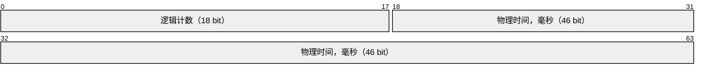
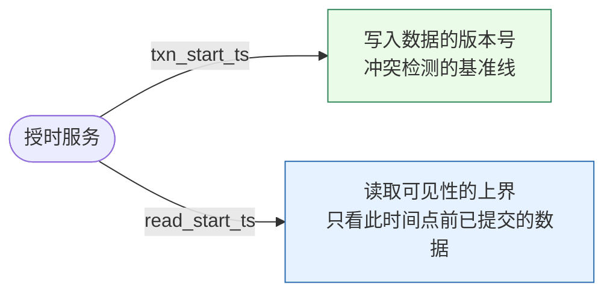
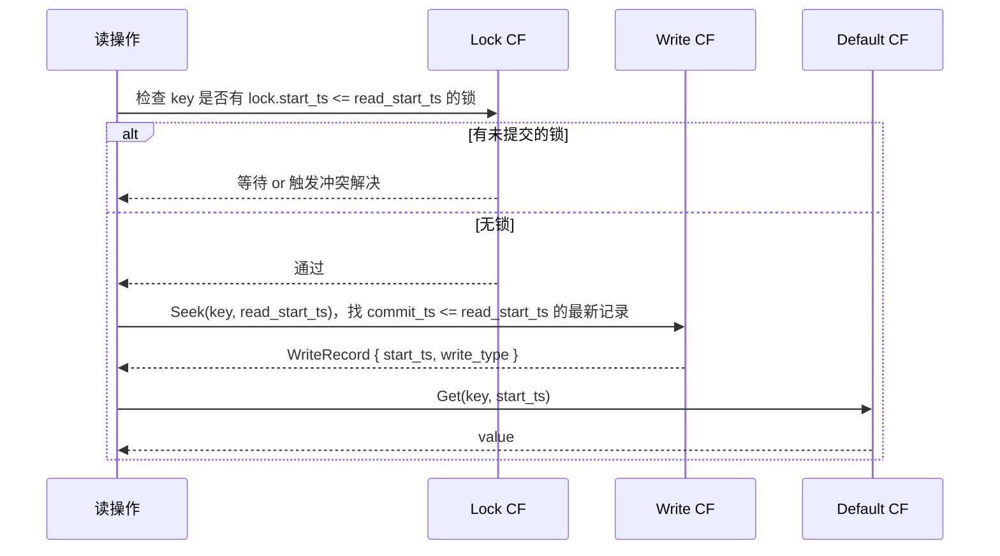
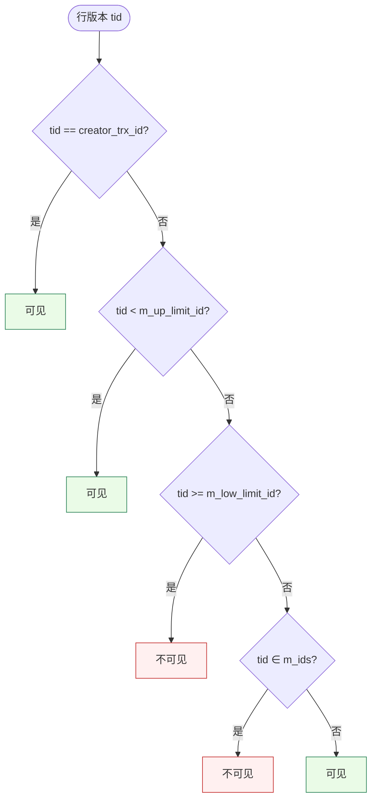
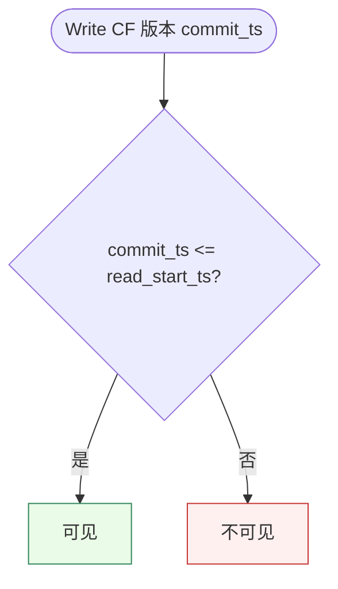

> 多版本并发控制的核心问题只有一个：给定一个读操作，它能看到哪些写？解决这个问题的通用答案是**时间戳**——每次写入打上时间戳，每次读取携带一个时间点，凡是在该时间点之前已提交的写入均可见，之后的均不可见。这套模型的关键在于"时间"由谁提供、如何分配、以及存储层如何按时间戳组织和检索数据版本。本文从授时服务出发，梳理 `txn_start_ts` / `read_start_ts` 两个核心概念，再对比 RocksDB（MyRocks / TiKV）与 InnoDB 在版本存储和可见性判定上的不同选择。

<!-- more -->

---

## 1. 时间戳从哪里来：授时服务

时间戳的有效性依赖一个前提：**全局单调递增且对所有参与者可见**。不同系统对这一前提的实现方式不同：

| 授时方式            | 代表系统                        | 单调性保证                          | 代价                             |
| ------------------- | ------------------------------- | ----------------------------------- | -------------------------------- |
| 本地计数器          | InnoDB（`trx_sys->max_trx_id`） | 单机全局锁保证                      | 仅限单机，跨节点无意义           |
| 集中式 TSO          | TiDB（PD 的 TSO）、Spanner      | 中心节点串行分配，带 batch 优化     | 多一次网络 RTT；中心节点成为瓶颈 |
| HLC（混合逻辑时钟） | CockroachDB、YugabyteDB         | 物理时钟 + 逻辑计数器，无需中心节点 | 实现复杂；依赖时钟漂移在可控范围 |
| 单调序列服务        | MyRocks（Binlog GTID 作锚点）   | 依赖外部序列                        | 与存储解耦，灵活但需额外协调     |

集中式 TSO 是分布式数据库中最常见的方案。PD（Placement Driver）为每个事务分配一个 64 位时间戳，高 46 位是物理时间（毫秒），低 18 位是逻辑计数器，单个毫秒内最多支持 `2^18 ≈ 26` 万个时间戳。



---

## 2. 两个核心时间戳：`txn_start_ts` 与 `read_start_ts`

一个事务在生命周期中至少需要两个时间戳：

**`txn_start_ts`（事务开始时间戳）**

- 事务启动时向授时服务申请，标识"我是哪个时代的事务"。
- 写入的每条数据都以 `txn_start_ts` 作为版本号打入 KV。
- 用于冲突检测：若写入目标 key 上已存在 `commit_ts > txn_start_ts` 的版本，说明有更新的事务先提交，当前事务需要中止（write-write conflict）。

**`read_start_ts`（读取时间戳 / 快照时间戳）**

- 读操作只看 `commit_ts <= read_start_ts` 的版本，更新的版本对本次读不可见。
- 在 Snapshot Isolation 下，`read_start_ts == txn_start_ts`——整个事务的读都基于同一个快照。
- 在 Read Committed 下，每条语句重新获取一个新的 `read_start_ts`。

两者的关系：



在单机 InnoDB 中，`txn_start_ts` 对应 `DB_TRX_ID`（写入版本号），`read_start_ts` 的角色由 `ReadView.m_low_limit_id` 与活跃列表共同承担。在 TiKV 中，两者是两个明确独立的字段，语义更清晰。

---

## 3. 版本存储：RocksDB 的 KV 编码

InnoDB 将版本存在 undo log（堆外链表），通过 `DB_ROLL_PTR` 串联。RocksDB 的方案不同——**版本直接编码进 key**：

```
内部 Key 格式（RocksDB MVCC）：

  [ user_key | sequence_number | type ]
     用户键       序列号（降序）    Put/Delete/Merge
```

`sequence_number` 在 RocksDB 内部单调递增，对应 MVCC 场景下的 `commit_ts`。同一个 `user_key` 的多个版本在 SST 文件中按 `sequence_number` 降序排列，因此最新版本总是排在前面。

TiKV 在 RocksDB 之上实现了 Percolator 协议，使用两个 CF（Column Family）：

```
Default CF:  { user_key | start_ts }  →  value
Lock CF:     { user_key }             →  lock_info（含 primary key、txn_start_ts）
Write CF:    { user_key | commit_ts } →  WriteRecord（含 start_ts、write_type）
```

读操作的流程：



---

## 4. 可见性判定：两套方案对比

### 4.1 InnoDB：活跃列表过滤

InnoDB 的可见性判定依赖 `ReadView` 中的活跃事务列表（`m_ids`），核心逻辑：



这套方案的特点是：**时间戳（trx_id）与提交状态解耦**——trx_id 分配在事务开始时，提交状态需要通过活跃列表来推断。活跃列表是构造 ReadView 时的一个快照，不动态更新。

### 4.2 RocksDB / TiKV：commit_ts 直接比较

RocksDB 在 Write CF 中存储的是 `commit_ts`，可见性判定退化为一次简单比较：



不需要活跃列表，也不需要"快照"对象——**commit_ts 本身就是完整的可见性信息**。这是因为 TiKV 采用两阶段提交（2PC），`commit_ts` 只在事务成功提交后才写入 Write CF；未提交的事务只有 Lock CF 中的记录，不会出现在 Write CF 里。读操作遇到 Lock CF 中的锁时，通过独立的锁解析逻辑处理，与可见性判定分离。

| 维度              | InnoDB                         | RocksDB / TiKV（Percolator）           |
| ----------------- | ------------------------------ | -------------------------------------- |
| 版本存储位置      | undo log（堆外链表）           | 编码进 key（Write CF + Default CF）    |
| 可见性判定输入    | trx_id + ReadView 活跃列表     | commit_ts 与 read_start_ts 直接比较    |
| 未提交版本的处理  | 在活跃列表中出现，判定为不可见 | 只有 Lock，Write CF 无记录             |
| 版本回收          | purge 线程回收 undo log        | Compaction 时按 GC safe point 丢弃     |
| 读操作的 I/O 模式 | 当前版本 + 按需回溯 undo 链    | Seek(user_key, read_start_ts) 一次定位 |

---

## 5. GC 与版本回收

两套方案的 GC 逻辑都遵循同一个原则：**找到系统中最小的活跃 `read_start_ts`，早于该时间戳的版本不再被任何读操作需要，可以安全回收。**

InnoDB 中，purge 线程定期扫描 undo log，以 `trx_sys->min_active_id`（近似于最小活跃 read_start_ts）作为 GC 水位线，回收早于该水位线的 undo 记录。

TiKV 中，GC Worker 定期计算 `safepoint`（由 PD 协调，取所有 TiKV 节点上最小活跃 `read_start_ts`），触发 Compaction Filter 在 LSM-tree Compaction 过程中过滤掉 `commit_ts < safepoint` 的旧版本。

两者的共同瓶颈：**长事务会阻塞 GC**。一个持有早期 `read_start_ts` 的长事务，会将 GC 水位线钉在低位，导致历史版本堆积。InnoDB 的表现是 undo log 膨胀，RocksDB 的表现是 SST 文件中旧版本 KV 增多，空间放大上升。

---

## 6. 常见误读

**M1. "`txn_start_ts` 就是读取快照的时间点。"**  
在 Snapshot Isolation 下，`read_start_ts == txn_start_ts`，二者恰好相等，容易混淆。但概念上是独立的：`txn_start_ts` 标识事务身份、用于写入版本和冲突检测；`read_start_ts` 仅决定读可见性，可以与 `txn_start_ts` 不同（如 Read Committed 下按语句重新获取）。

**M2. "RocksDB 没有 MVCC，只是一个 KV 存储。"**  
RocksDB 内部的 `sequence_number` 机制本身就是 MVCC 的基础——同一 key 的多个版本共存于 LSM-tree 中，读操作可以指定 snapshot（一个 `sequence_number` 上界）。MyRocks 和 TiKV 都是在这个基础上构建事务 MVCC，不是从零实现。

**M3. "授时服务挂掉，数据库就无法读写。"**  
集中式 TSO（如 TiDB 的 PD）确实是单点，但通常做了高可用（Raft 多副本）。更重要的是：TSO 本身不在读写热路径上——TiDB 会批量预取时间戳并本地缓存，单次事务不一定需要实时访问 TSO。

**M4. "commit_ts 总是大于 txn_start_ts。"**  
正常情况下是的，但这是协议保证的，不是物理时钟保证的。授时服务在同一毫秒内分配的多个时间戳完全可能出现 `commit_ts` 只比 `txn_start_ts` 大 1 的情况。依赖物理时钟大小来推断提交顺序是不可靠的。
