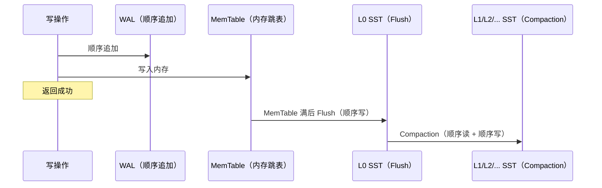

> InnoDB 是 MySQL 最成熟的存储引擎，覆盖了绝大多数 OLTP 场景。MyRocks 基于 RocksDB（LSM-tree），在 InnoDB 已经足够好用的前提下仍被 Meta、Percona 等公司引入生产，原因只有一个：**它在特定负载下能用更少的磁盘 I/O 完成同样的工作**。本文从 InnoDB 的结构性开销出发，说明 LSM-tree 如何针对性地缓解这些开销，以及 MyRocks 为此付出的代价。

<!-- more -->

---

## 1. InnoDB 的结构性开销

InnoDB 使用 B+ 树组织数据，这套结构在读多写少、随机点查的场景下非常高效。但它存在几个固有开销，与负载无关，始终存在：

### 1.1 写放大：一次逻辑写触发多次物理写

B+ 树的结构决定了写操作的路径长度。以 `INSERT` 一条记录为例，InnoDB 的工作流程：

```
1. 从根节点页开始，沿 B+ 树逐层比较 key，定位到目标叶子节点页
2. 检查目标页是否在 Buffer Pool 中，未命中则从磁盘读 16KB 整页
3. 若叶子页有空闲空间，直接插入记录，标记页为脏页（Dirty）
4. 若页已满（页分裂）：
   a. 申请新页，将原页约一半记录移到新页
   b. 更新父节点的指针页，父节点可能递归分裂
   c. 所有修改过的页都标记为脏页
5. 写 Undo Log（用于回滚和 MVCC）
6. 写 Redo Log（顺序写 WAL）
7. 返回客户端成功（此时脏页仍在内存）
8. Checkpoint 线程异步将脏页刷回磁盘（随机写 16KB）
```

一次逻辑 `INSERT` 最坏可能触发**4–5 个脏页**（叶子页分裂 + 父页更新 + 祖父页更新 + Undo + Redo），这些页在磁盘上位置随机分散，刷盘阶段产生大量随机 I/O。

对应的读操作工作流程：

```
1. 从 B+ 树根节点页（常驻 Buffer Pool）开始
2. 逐层向下比较索引键，定位到目标叶子节点页号
3. 检查目标页是否在 Buffer Pool 中
4. 命中：从页中解析出行数据，返回
5. 未命中：从磁盘读取 16KB 整页到 Buffer Pool，再从页中解析行数据
```

读的关键特征是**索引即数据**：叶子节点页直接包含行数据，一次页读取即可拿到完整记录（或主键，再回主键索引页取数据）。

### 1.2 空间放大：页填充率与碎片

InnoDB 按 16KB 固定页管理数据：

- B+ 树插入导致页分裂（page split），新页初始填充率约 50%
- 删除只标记记录为"已删除"，空间不立即回收，需要 `OPTIMIZE TABLE` 重建
- 二级索引与主键索引各自占一棵 B+ 树，存在大量重复的主键列存储

在写入模式为随机 INSERT 或高频 DELETE + INSERT 的场景下，实际磁盘占用往往是数据本身的 2–3 倍。

### 1.3 压缩效果受限

InnoDB 支持页级压缩（`ROW_FORMAT=COMPRESSED`），但：

- 压缩和解压发生在页粒度（16KB），压缩率有限
- 压缩页在 Buffer Pool 中需要同时保留压缩和解压两份拷贝（double write buffer 开销）
- 压缩后页大小不固定，导致磁盘碎片加剧

---

## 2. MyRocks 如何针对性地解决这些问题

MyRocks 将 RocksDB 作为 MySQL 存储引擎接入，核心数据结构从 B+ 树换为 LSM-tree。

### 2.1 顺序写取代随机写

LSM-tree（Log-Structured Merge Tree）的核心思想是**写只追加到内存，批量顺序刷盘**。MyRocks 的写操作工作流程：

```
1. 写 WAL（顺序追加到日志文件，用于崩溃恢复）
2. 插入 MemTable（内存中的跳表/红黑树，按 key 排序）
3. 若存在相同 key，保留版本号更大的（即更新的）记录
4. 返回客户端成功（数据还在内存，尚未入 SST）
5. MemTable 满（默认 64MB）后，冻结为 Immutable MemTable
6. 后台 Flush 线程将 Immutable MemTable 顺序写入 L0 SST 文件（不可变）
7. 当 L0 文件过多或总大小触发阈值，启动 Compaction：
   a. 选取若干 L0 文件与重叠的 L1 文件
   b. 多路归并排序，生成新的 L1 SST 文件
   c. 删除旧的 L0/L1 文件（旧版本数据被清除）
8. L1 继续向 L2、L3... 逐层 Compaction，每层数据量放大 10 倍
```

关键特征：**所有写入都是顺序 I/O**，无论是 WAL（追加日志）、Flush（顺序写新文件）还是 Compaction（顺序读多个 SST、顺序写新 SST）。B+ 树的随机写页问题被彻底消除。



对 SSD 而言，顺序写比随机写更能均匀分布擦写，延长寿命；对 HDD 则能充分利用磁道顺序带宽。

对应的读操作工作流程：

```
1. 查 MemTable（内存跳表），key 存在则返回最新版本值
2. 查 Block Cache（SST block 缓存），命中则直接返回
3. 查 L0 SST 文件（可能有多个文件，key range 重叠）
   a. 用 Bloom Filter 快速判断 key 是否在每个 L0 文件中
   b. 可能命中多个文件，需按时间戳选最新版本
4. 查 L1 / L2 / L3 ... SST（每层文件 key range 不重叠）
   a. 定位可能包含 key 的单个 SST 文件
   b. 用 Bloom Filter 快速过滤
   c. 读取对应 block（默认 4KB），解压后查找 key
5. 若所有层都未命中，返回 key 不存在
```

读的关键特征是**索引与数据分离**：MemTable 和 SST 只存储 KV 对，真正的行数据需要解码。最坏情况下需要遍历 MemTable → 所有 L0 文件 → L1 → L2 → ... 每层一次 I/O，这就是**读放大**的根源。

### 2.2 更高的空间利用率

- **无页分裂**：LSM-tree 的 SST 文件是不可变的，写入新版本只追加，不修改旧结构，因此不存在 B+ 树页分裂带来的碎片
- **Compaction 回收空间**：旧版本和删除标记在 Compaction 时被物理清除，磁盘空间自动回收，无需手动 `OPTIMIZE TABLE`
- **前缀压缩**：SST 文件内的 key 按字典序排列，相邻 key 的公共前缀只存一次，显著减少索引存储开销

Meta 的实测数据（2016 年）：将 UDB（用户数据库）从 InnoDB 迁移到 MyRocks 后，同等数据量的磁盘占用下降约 **50%**。

### 2.3 块级压缩更高效

RocksDB 以 block（默认 4KB）为单位压缩，配合 Zstandard（zstd）：

- 压缩率通常比 InnoDB 页级压缩高 20–40%
- 解压只需读取目标 block，不需要加载整页
- SST 文件中压缩块紧密排列，无碎片

---

## 3. MyRocks 付出的代价

LSM-tree 的结构性优势不是免费的，换来写优化的同时引入了新的开销：

| 维度         | InnoDB                   | MyRocks / RocksDB                         |
| ------------ | ------------------------ | ----------------------------------------- |
| 点查性能     | B+ 树一次定位，稳定      | 需查 MemTable + 多层 SST，最坏读放大高    |
| 范围扫描     | 叶子节点链表，顺序读磁盘 | 需合并多层 SST 的迭代器，开销更高         |
| 写放大       | 低至中等（随机写页）     | Compaction 导致数据多次重写，系数 10–30x  |
| 读缓存粒度   | Buffer Pool，页（16KB）  | Block Cache，block（4KB）                 |
| 事务隔离实现 | ReadView + Undo Log 链   | Percolator 协议（TiKV）或 Sequence Number |
| 运维复杂度   | 成熟，工具链完整         | Compaction 调优、空间放大监控额外学习成本 |

### 3.1 读放大

一次点查在最坏情况下需要查：MemTable → L0（多个文件）→ L1 → L2 → …，每层都是一次 I/O。Bloom Filter 可以跳过大多数不含目标 key 的 SST，但对于不存在的 key（negative lookup）仍有概率命中的假阳性开销。

对于**读多写少、随机点查为主**的负载，MyRocks 的读延迟分布通常比 InnoDB 宽，P99 抖动更大。

### 3.2 写放大反转

尽管 RocksDB 的写路径全是顺序 I/O，Compaction 会将一条数据从 L0 一路重写到底层 SST，**写放大系数通常在 10–30 倍**，高于 InnoDB 的随机写页方式。这意味着在极高写入吞吐且 SSD 寿命敏感的场景，需要仔细衡量。

---

## 4. 适合 MyRocks 的负载特征

根据上述分析，MyRocks 相比 InnoDB 有优势的场景集中在：

- **写密集型**：大量随机 INSERT / UPDATE，写 IOPS 成瓶颈
- **磁盘空间敏感**：数据量大、压缩率要求高，如历史数据归档、用户行为日志
- **删除比例高**：频繁 DELETE + 空间回收需求，Compaction 自动处理旧版本
- **主键顺序写入**：如自增主键，LSM-tree 对顺序写入几乎零放大

反之，以下场景仍优先选 InnoDB：

- 读多写少，随机点查为主
- 对读 P99 延迟有严格要求
- 需要成熟的全文索引、空间索引等特性
- 运维团队对 RocksDB 调优经验不足

---

## 5. 常见误读

**"MyRocks 只是 InnoDB 的替代品"**：二者面向不同的负载曲线，不存在全面替代关系。Meta 也只将特定业务（写密集的用户数据库）迁移到 MyRocks，其他业务继续使用 InnoDB。

**"LSM-tree 没有随机写，所以写性能一定更好"**：Compaction 的写放大会消耗后台 I/O 带宽，在 Compaction 高峰期可能影响前台写入延迟，需要合理配置 Compaction 触发策略和带宽限速。

**"MyRocks 的压缩等于 InnoDB 开启压缩"**：InnoDB 的页级压缩与 MyRocks 的块级压缩在粒度、压缩算法、缓存策略上都不同，实际压缩率和 CPU 开销差异显著。
