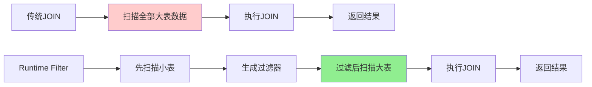
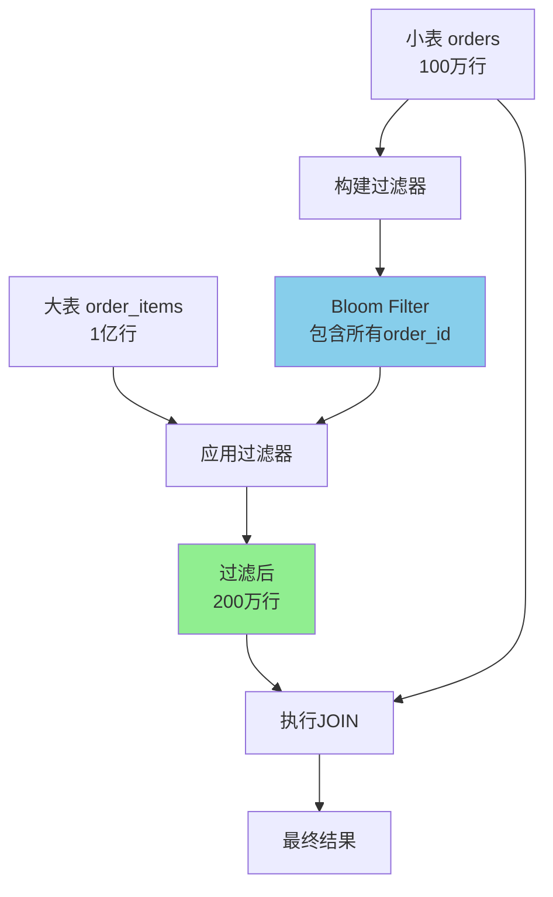
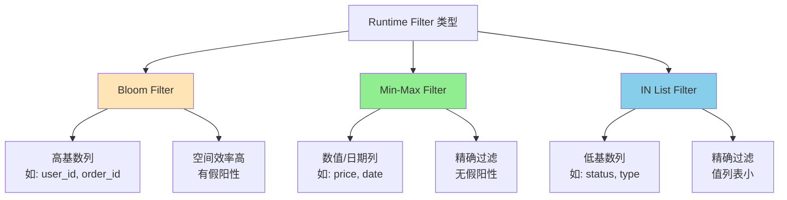
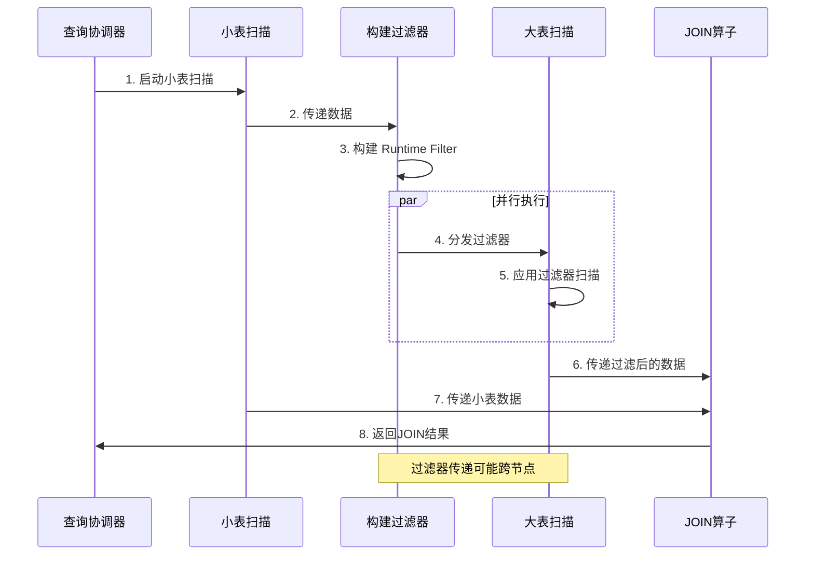
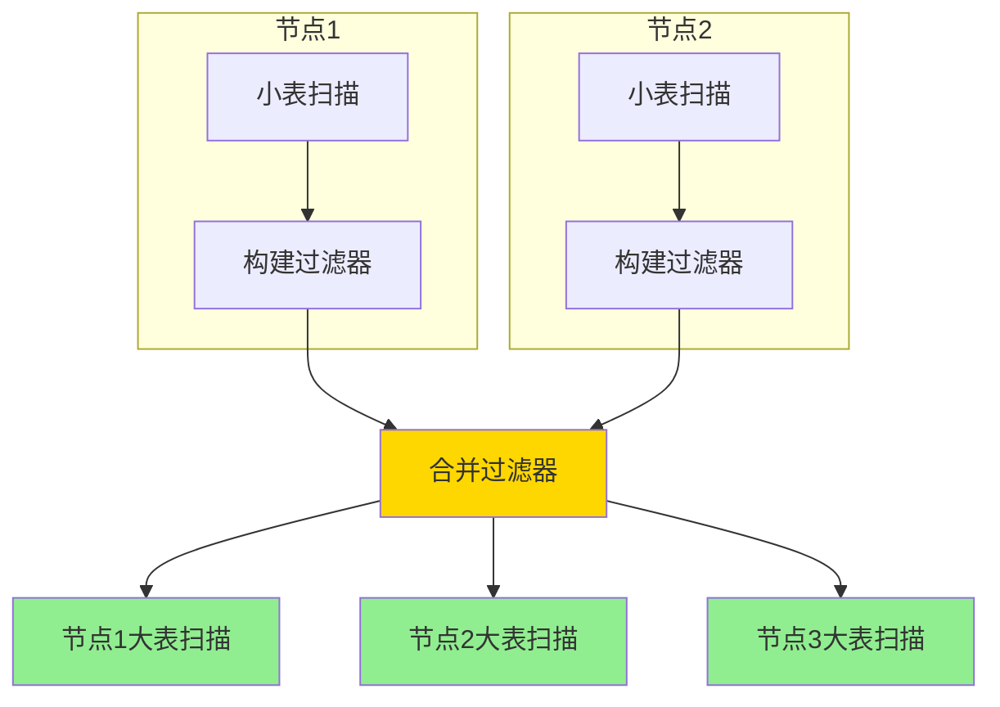
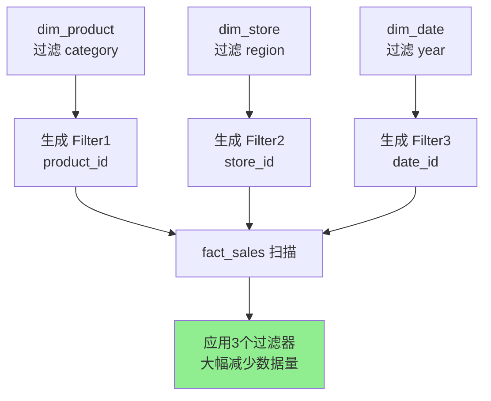

> Runtime Filter 是一种动态查询优化技术，通过在查询执行过程中生成过滤条件，提前过滤不必要的数据，显著减少数据扫描量和网络传输，提升 JOIN 查询性能。

<!-- more -->

## 概述

在大数据分析场景中，JOIN 操作往往是查询性能的瓶颈。传统的静态优化器在编译时无法准确预测数据分布，导致生成的执行计划不够高效。Runtime Filter 作为一种动态优化技术，在查询执行过程中根据实际数据生成过滤条件，将小表的过滤条件"下推"到大表扫描阶段，从而大幅减少需要处理的数据量。

这项技术在 Apache Impala、Apache Doris、ClickHouse 等现代分析型数据库中得到广泛应用，是提升 OLAP 查询性能的关键技术之一。



## 核心概念

### 什么是 Runtime Filter

Runtime Filter 是在查询执行时动态生成的过滤条件，用于在数据扫描阶段提前过滤掉不匹配的数据行。

**基本原理**：

1. 先扫描 JOIN 的小表（Build Side）
2. 根据小表的 JOIN 列值构建过滤器（如 Bloom Filter、Min-Max Filter）
3. 将过滤器传递给大表（Probe Side）的扫描算子
4. 大表扫描时应用过滤器，跳过不可能匹配的数据



### Runtime Filter 的类型

#### 1. Bloom Filter

**特点**：

- 空间效率高，可以用较小的内存表示大量数据
- 存在假阳性（False Positive），但不会有假阴性
- 适合高基数（Cardinality）的列

**工作原理**：

```
// Bloom Filter 基本操作
class BloomFilter {
    BitSet bits;
    HashFunction[] hashFunctions;

    void add(Object value) {
        for (HashFunction h : hashFunctions) {
            int pos = h.hash(value) % bits.size();
            bits.set(pos);
        }
    }

    boolean mightContain(Object value) {
        for (HashFunction h : hashFunctions) {
            int pos = h.hash(value) % bits.size();
            if (!bits.get(pos)) return false;
        }
        return true; // 可能存在
    }
}
```

#### 2. Min-Max Filter

**特点**：

- 记录列的最小值和最大值
- 无假阳性，精确过滤
- 适合数值类型和有序数据

**示例**：

```sql
-- 小表的 order_date 范围：2024-01-01 到 2024-01-31
-- Min-Max Filter: [2024-01-01, 2024-01-31]

-- 大表扫描时可以跳过：
-- order_date < 2024-01-01 或 order_date > 2024-01-31 的数据块
```

#### 3. IN List Filter

**特点**：

- 精确的值列表
- 适合低基数列（如状态码、类型等）
- 无假阳性

**示例**：

```sql
-- 小表只有 3 个 category_id: [1, 5, 9]
-- IN List Filter: category_id IN (1, 5, 9)

-- 大表扫描时直接过滤：
WHERE category_id IN (1, 5, 9)
```



## 实现原理

### 执行流程



### 过滤器生成时机

**1. Build Phase（构建阶段）**

```
当小表扫描完成后：
1. 收集所有 JOIN 列的值
2. 根据数据特征选择过滤器类型
3. 构建过滤器数据结构
4. 计算过滤器大小和预期效果
```

**2. 过滤器选择策略**

```python
def choose_filter_type(column_stats):
    distinct_count = column_stats.distinct_count
    total_count = column_stats.total_count
    data_type = column_stats.data_type

    # 低基数：使用 IN List
    if distinct_count < 100:
        return InListFilter()

    # 数值类型：优先 Min-Max
    if data_type in [INT, FLOAT, DATE]:
        return MinMaxFilter()

    # 高基数：使用 Bloom Filter
    if distinct_count > 10000:
        return BloomFilter(size=optimal_size(distinct_count))

    # 默认：Bloom Filter
    return BloomFilter()
```

### 分布式环境下的传播

在分布式数据库中，Runtime Filter 需要跨节点传播：



**传播策略**：

- **Local Filter**：在同一节点内传播，延迟低
- **Global Filter**：跨节点传播，需要网络通信
- **Broadcast**：广播到所有参与节点

## 实践案例

### 案例1: 星型模型查询优化

**场景**：电商数据仓库，事实表 `orders` 与维度表 `users` JOIN

```sql
-- 原始查询
SELECT o.order_id, o.amount, u.username
FROM orders o
JOIN users u ON o.user_id = u.user_id
WHERE u.country = 'China'
  AND u.vip_level = 'Gold';

-- 数据规模：
-- orders: 10亿行
-- users: 1000万行，满足条件的只有 10万行
```

**优化效果**：


**性能提升**：

- 扫描数据量：从 10亿行 → 500万行
- 查询时间：从 120秒 → 8秒
- 网络传输：减少 95%

### 案例2: 时间范围过滤

**场景**：日志分析，按时间范围 JOIN

```sql
-- 查询最近7天的订单详情
SELECT o.*, i.item_name
FROM orders o
JOIN order_items i ON o.order_id = i.order_id
WHERE o.order_date >= '2024-01-25'
  AND o.order_date < '2024-02-01';

-- orders: 按日期分区，每天 1000万行
-- order_items: 100亿行历史数据
```

**Runtime Filter 应用**：

```
1. 扫描 orders 表的 7 天分区
2. 生成 Min-Max Filter:
   - order_date: [2024-01-25, 2024-01-31]
   - order_id: [1000000, 1070000]
3. 应用到 order_items 扫描
4. 跳过不在范围内的数据块
```

**优化效果**：

- 跳过 99% 的历史数据块
- 查询时间从 5分钟 → 15秒

### 案例3: 多表 JOIN 优化

**场景**：复杂的多表关联查询

```sql
SELECT *
FROM fact_sales f
JOIN dim_product p ON f.product_id = p.product_id
JOIN dim_store s ON f.store_id = s.store_id
JOIN dim_date d ON f.date_id = d.date_id
WHERE p.category = 'Electronics'
  AND s.region = 'East'
  AND d.year = 2024;
```

**Runtime Filter 链**：



## 最佳实践

1. **合理设置过滤器大小**：Bloom Filter 太小会增加假阳性率，太大会增加内存和网络开销。通常根据预期数据量和可接受的假阳性率（1-5%）计算最优大小。

2. **选择合适的 JOIN 顺序**：优化器应该优先扫描小表，确保 Runtime Filter 能尽早生成并应用。使用 `STRAIGHT_JOIN` 或 hint 控制 JOIN 顺序。

3. **监控过滤效果**：通过查询 profile 观察过滤率，如果过滤率低于 10%，说明 Runtime Filter 效果不佳，可能需要调整策略。

4. **避免过度使用**：对于小表 JOIN 小表，或者过滤选择性很低的场景，Runtime Filter 的开销可能大于收益，应该禁用。

5. **配置超时时间**：设置合理的等待时间，避免因等待过滤器而延迟大表扫描。如果小表扫描时间过长，应该放弃等待直接开始大表扫描。

## 常见问题

### Q1: Runtime Filter 会增加查询延迟吗？

会有轻微延迟，因为需要等待小表扫描完成并构建过滤器。但这个延迟通常远小于过滤带来的收益。现代数据库会设置超时机制，如果小表扫描时间过长，会放弃等待直接开始大表扫描。

**权衡策略**：

- 小表扫描时间 < 1秒：等待过滤器
- 小表扫描时间 > 5秒：并行开始大表扫描
- 过滤器准备好后，动态应用到正在进行的扫描

### Q2: Bloom Filter 的假阳性会影响结果正确性吗？

不会。假阳性只会导致多扫描一些数据，但这些数据在 JOIN 阶段会被正确过滤掉。Runtime Filter 是性能优化手段，不会影响结果的正确性。

```
假阳性的影响：
- 某些不匹配的行通过了 Bloom Filter
- 这些行会被扫描并传输到 JOIN 算子
- JOIN 算子会正确判断这些行不匹配，丢弃它们
- 最终结果完全正确，只是性能略有损失
```

### Q3: 如何判断是否应该使用 Runtime Filter？

**适合使用的场景**：

- 大表 JOIN 小表（数据量差异 > 10倍）
- 小表的过滤条件选择性高（过滤后 < 10%）
- JOIN 列的基数较高
- 分布式环境下的跨节点 JOIN

**不适合使用的场景**：

- 两个表数据量相近
- 小表本身很大（> 1000万行）
- 过滤选择性很低（> 50%）
- 小表扫描时间很长

## 性能对比

| 场景          | 无 Runtime Filter | 有 Runtime Filter | 提升    |
| ------------- | ----------------- | ----------------- | ------- |
| 星型模型 JOIN | 120秒             | 8秒               | **15x** |
| 时间范围过滤  | 300秒             | 15秒              | **20x** |
| 多表关联      | 180秒             | 25秒              | **7x**  |
| 小表 JOIN     | 5秒               | 5.2秒             | **-4%** |

## 总结

Runtime Filter 是现代分析型数据库的核心优化技术，通过动态生成过滤条件显著提升 JOIN 查询性能。

核心要点：

1. **动态优化**：在查询执行时根据实际数据生成过滤器，比静态优化更精确
2. **多种类型**：Bloom Filter、Min-Max Filter、IN List Filter 各有适用场景，需根据数据特征选择
3. **分布式传播**：在分布式环境下需要高效的过滤器传播机制，平衡延迟和收益
4. **适用场景**：特别适合星型模型、大小表 JOIN、高选择性过滤等 OLAP 典型场景

合理使用 Runtime Filter 可以将查询性能提升 10-100 倍，是大数据分析系统不可或缺的优化手段。

## 参考资料

- [Apache Impala Runtime Filtering](https://impala.apache.org/docs/build/html/topics/impala_runtime_filtering.html)
- [Apache Doris Runtime Filter 设计文档](https://doris.apache.org/zh-CN/docs/dev/query-acceleration/runtime-filter)
- [ClickHouse JOIN 优化](https://clickhouse.com/docs/en/sql-reference/statements/select/join)
- [Runtime Code Generation in Cloudera Impala](https://www.cidrdb.org/cidr2014/program/p5-wanderman-milne.pdf)
