> 向量索引要解决的不是「怎么算距离」，而是**少算多少次距离仍能保住近邻**。工程上常见的方案可以按「候选从哪来」分成几族：哈希桶、空间树、聚类倒排、近邻图，以及把图/划分搬到磁盘或加速器上的系统。IVF、HNSW、DiskANN 只是各族里最常被点名的代表，不是清单的尽头。量化（PQ / RaBitQ 等）叠在打分层，另文讨论。

<!-- more -->

---

## 1. 共同前提与一张地图

> 高维近邻没有又可证明又极快又省内存的银弹；每个家族换的是不同假设。

暴力扫描复杂度 $O(Nd)$。$N$ 上百万后，瓶颈是距离次数与带宽。ANN 共享目标：用索引生成远小于 $N$ 的候选，再精排。

按机制归类比按产品名归类更稳：

| 家族 | 候选从哪来 | 代表 |
|---|---|---|
| 基线 | 全体扫描 | Flat |
| 哈希 | 落入相同 / 相邻桶 | LSH、E2LSH |
| 树 | 根到叶的若干条路径 | KD-tree、RP-tree、Annoy、FLANN |
| 划分 | 最近的若干簇 / 多倒排 | IVF、IMI |
| 图 | 沿边贪心 / 束搜索 | NSW、HNSW、NSG、Vamana |
| 外存 / 硬件 | 上述结构 + 存储或算力分层 | DiskANN、SPANN、CAGRA |

量化不是第五种「找候选」方式，而是让**已有候选上的距离更便宜**；ScaNN 一类会把「划分 + 学出来的量化打分」捆成产品，仍挂在划分/打分层。

下面按矛盾演进讲各族，代表算法展开，同族变体收束对照——避免做成名词词典。

---

## 2. 基线：Flat

> 没有索引结构时，精确 Top-K 就是全扫；它仍是评测与小库的参照系。

Faiss `IndexFlatL2` / `IndexFlatIP` 一类：向量紧排存储，SIMD 扫到底。$N$ 小、维度中等、或召回必须 100% 时合理。所有近似索引的 recall 曲线，本质上都在回答「相对 Flat 省下了多少计算、丢了多少近邻」。

---

## 3. 哈希族：用碰撞当「可能近」

> 设计让相近点以更高概率落入同桶的哈希；查桶比扫全库便宜，理论语言是概率保证。

Locality-Sensitive Hashing（LSH）为特定距离/相似度构造哈希族：相近点碰撞概率高，相远点碰撞概率低。查询对 $q$ 算若干哈希，合并对应桶内的点做精排。经典有 E2LSH（欧氏）、面向余弦的随机超平面等。

- **因为**：桶查找是 $O(1)$ 量级的过滤，且可给出概率意义下的召回论述。
- **所以**：适合需要理论钩子、或数据流式插入（桶可追加）的场景。
- **代价**：高维下要维持高召回，往往要很多表 / 很多哈希，内存与探测次数上去；实践召回–延迟曲线多数打不过调好的 IVF 或图索引。向量库主路径里 LSH 已少作默认，更多出现在去重、特殊度量、或与图混合的入口种子（如部分混合索引用哈希找初始邻居）。

---

## 4. 树族：递归切空间

> 用超平面或轴对齐切割把空间做成层次结构；查询沿树走，只打开若干叶子。

### 4.1 KD-tree 为何在高维失效

KD-tree 轮流按维划分。低维（大约 $d \lesssim 20$）点查很好；维度升高后，几乎每个查询都要访问大量叶子，「对数深度」的优势被诅咒掉。embedding 常见 $d=384\sim3072$，纯 KD 不是主选项。

### 4.2 随机投影树与 Annoy

Annoy（Spotify）等用**随机投影树**（RP-tree）森林：每次用随机超平面切一刀，建多棵树；查询在每棵树下降到叶子，合并候选再精排。索引可 mmap，部署轻，静态曲库、中等规模时很省事。

FLANN 则把多种树/线性扫描做成可自动选型的库，偏传统 CV 特征时代的工程打包。

- **因为**：森林 + 随机切能以很浅的实现换「大概率碰到近邻叶子」。
- **代价**：静态友好、动态更新别扭；高召回区通常仍弱于 HNSW；树本身也不解决十亿级内存墙。

树族今天更常作为**构图的辅助**（用树找初始近邻再炼成图），而不是单独扛线上主索引。

---

## 5. 划分族：IVF 与它的亲戚

> 先把宇宙切成簇，查询只打开最近的几个抽屉。这是向量库里最容易与量化组装的外壳。

### 5.1 IVF

建库：k-means 得到 $K$ 个质心；每个向量写入最近质心的倒排列表（也可挂 top-$\ell$ 个质心缓解边界）。列表内可以是原向量（IVF_FLAT）或残差量化码（IVF_PQ 等）。

查询：算 $q$ 到质心距离 → 取 `nprobe` 个簇 → 只扫这些列表。

| 参数 | 调大 | 调小 |
|---|---|---|
| $K$ | 单簇更小；质心比较更贵，边界更碎 | 粗桶，接近少扫几个大区 |
| `nprobe` | 召回↑ 延迟↑ | 更快，漏检↑ |

- **因为**：近邻多半落在查询附近局部，全局扫浪费。
- **所以**：用 $O(Kd)$ 的质心比较换掉对 $N$ 的线性扫。
- **代价**：漏检集中在簇边界；没有「摸到隔壁抽屉」的导航，除非加大 `nprobe`。

### 5.2 同族延伸

| 变体 | 改动 | 解决什么 |
|---|---|---|
| 多分配（replica） | 一点写入多个列表 | 边界点 |
| IMI（Inverted Multi-Index） | 两段子空间各做码本，笛卡尔积当细桶 | 极多细桶时的存储与定位 |
| IVF + 残差 | 存 $x - c$ 再量化 | 簇内更易压 |
| 分层质心 / 平衡 k-means 树 | 质心侧再做树或图 | 加快「打开哪些抽屉」 |

划分族的产品力在于：**粗筛与量化、分片、过滤都好比图索引好接**。Faiss / Milvus 里大量 `IVF_*` 组合都挂在这层外壳上。

---

## 6. 图族：沿边走到近邻

> 划分赌「同簇」；图赌「近邻在邻接里可达」。差别主要在**怎么选边、入口在哪、要不要分层**。

### 6.1 共同查询骨架

几乎所有现代近邻图都共享同一搜索核：从一个（或一组）入口出发，维护候选优先队列，反复扩展当前最好点的出边，直到没有更值得看的候选（束宽常记 `ef` / `L`）。各族论文比的是**构图**。

### 6.2 NSW → HNSW

NSW 把长边短边搅在一层：平均路径短，但尺度混杂时搜索步数不稳。

HNSW 做成跳表式多层：

- layer 0 含全体，偏短程；
- 上层是指数衰减采样的稀疏子集，边自然更「长」，专管粗导航；
- 上层近似单轨贪心下降，底层用 `ef_search` 做束搜索。

`ef_search` 可查询期调节；`M`、`ef_construction` 在建图时定连通与内存。增量插入自然，是目前**内存内默认王者**之一。

代价：边表 + 向量常驻 DRAM；硬性标量过滤会打断贪心路径（邻居全被滤掉时召回塌）；大规模删除/重建不如倒排干脆。

### 6.3 NSG / NSSG：单调连通与度约束

HNSW 不保证从固定入口能走到任意点。NSG（Navigating Spreading-out Graph）一类从 medoid 出发，在 kNN 图上按相对邻域图（RNG）规则剪枝，并补边保证以入口为根的近似导航树覆盖——用**可达性 + 出度上限**换更稳的高召回区表现。NSSG 等继续放松/加强剪枝几何。

它们与 HNSW 同属「内存图」，选型差异多在构建成本、度数、以及特定数据集上的 recall–QPS，而不是另一套查询哲学。

### 6.4 Vamana：单层、为盘上布局留余地

Vamana（DiskANN 配套）是**单层**有向图：贪心搜邻居 + $\alpha$-剪枝，显式保留方向分散的长边，用几何换 HNSW 上层提供的远程跳。最大度数 `R` 限制扩展宽度，利于控制盘上邻接块大小。内存场景下它也常作为强基线；更大意义是给磁盘系统一个「不必多层」的图。

### 6.5 图族对照

| | HNSW | NSG 系 | Vamana |
|---|---|---|---|
| 结构 | 多层 | 单层 + 导航保证 | 单层 + $\alpha$ 剪枝 |
| 入口 | 高层入口点 | 常固定 medoid | medoid |
| 强项 | 增量、生态、调参习惯 | 高召回区度更紧 | 盘上友好、实现直 |
| 共同弱点 | 内存图；过滤与更新都别扭 | 同左 | 同左 |

此外还有 KGraph、NGT、HCNNG、SPTAG（树+图）等：多数是「更好的初始邻居 / 多种子 / 切块再并图」工程变体，查询核不变。

---

## 7. 外存与大规模系统：DiskANN、SPANN

> 图和划分在十亿级都会撞上 DRAM。系统层要回答：热数据留什么、冷数据怎么读、随机 I/O 如何收束。

### 7.1 DiskANN

存储拆分，而不是「把 HNSW mmap 一下」：

| 位置 | 内容 | 作用 |
|---|---|---|
| DRAM | 全库 PQ 码 | 遍历时的廉价距离 |
| SSD | Vamana 邻接 + 全精度向量 | 边扩展与最终精排 |

流程：medoid 起 beam 走图（只用内存 PQ）→ 候选池头部读盘算精确距离 → 返回。随机读被收成精排预算，而不是每跳读原向量。十亿构建可用「分簇建子图再并边」。延迟尾部绑定 SSD；动态更新与过滤仍然难。

### 7.2 SPANN：外存上的划分思路

SPANN（Microsoft）走另一条外存路：用平衡 k-means 树等把数据切成帖子（posting）顺序落盘，点可复制到多个帖缓解边界；内存里对帖质心建 SPTAG 等索引，先快速选帖再顺序读盘。相对「整图在盘上跳」，它更接近 **IVF 精神的磁盘版**——用内存质心索引换顺序 I/O。

DiskANN 与 SPANN 代表外存的两种习惯：**盘上图导航** vs **盘上倒排/帖子 + 内存粗定位**。

### 7.3 更新与「新鲜度」

静态十亿和「边写边搜」不是同一题。FreshDiskANN、SPFresh 等在盘上图/帖结构上加增量日志、后台合并，解决的是**索引过期**，不是换一种距离公式。选型时要单独问更新速率，而不是只看静态 recall。

---

## 8. 打分层上的工业捆包：ScaNN（及同类）

> Google ScaNN 常被拿来和「一种图」并列，但它的重心是**各向异性量化 + 高效打分**，外面仍套划分/剪枝。

ScaNN 针对内积/检索质量，用 learned / anisotropic 量化让「对排序重要的方向」少丢精度，配合评分的 SIMD/TPU 友好实现；前面可以有树或 IVF 式粗筛。它说明产品线里常见的真相：**名字是索引，半身是量化与打分核**。

同类还有 Faiss 的 IVF_PQ + FastScan、Milvus 的 IVF_RABITQ 等——结构壳是划分或图，竞争力来自码与距离估计。细节见 [向量索引量化全景](/database/vector/quantization-landscape/)。

---

## 9. 硬件路径：以 CAGRA 为例

> GPU 上「图还是图」，但边扩展与距离必须按吞吐重排；CPU 最优图直接搬上去往往浪费。

CAGRA（NVIDIA cuVS 等）一类 GPU 图索引：固定度、优化布局，用并行 top-k 与合并替代 CPU 上那套指针跳转。适合批量查询、高 QPS；单条延迟、主机–设备拷贝、过滤谓词又是另一套账。CPU HNSW / DiskANN 与 GPU 图是**同一家族、不同硬件假设**，不是互相替代的同构实现。

---

## 10. 横切问题：过滤、组合、选型

### 10.1 元数据过滤

索引假设「几何近邻可达」；过滤器把它改成「还要满足谓词」。

| 策略 | 做法 | 更合拍的结构 |
|---|---|---|
| 前过滤 | 先按属性缩宇宙再 ANN | 划分/倒排、属性分区 |
| 后过滤 | ANN 多取再滤 | 图也可以，但要加大 `ef` / `nprobe` |
| 图内感知 | 遍历时跳过不合格点 | 需防「邻居全被滤光」导致断路 |
| 拆索引 | 每租户/每标签一张图或一片 IVF | 运维换召回稳定性 |

没有「开个 filter 开关就无损」的图算法；过滤是二次设计。

### 10.2 合法组合（正交拼装）

- 划分 × 量化：`IVF_PQ`、`IVF_RABITQ`
- 图 × 量化：HNSW + SQ/BQ；DiskANN 内置 PQ 粗距
- 划分 × 图：先分片/分簇，片内 HNSW 或 Vamana
- 树 × 图：用树产初始边，再炼 NSG/HNSW
- 外存 × 任一：热 PQ/质心在内存，冷边与全精度在盘

### 10.3 选型收束

| 情况 | 更自然的方向 |
|---|---|
| $N$ 小或要绝对精确 | Flat |
| 要简单、好分片、过滤多、量化流水线熟 | IVF 族 |
| 内存够、要低延迟高召回、插入为主 | HNSW（或 NSG/Vamana 内存模式） |
| 单机 DRAM 封顶、十亿级、可接受 SSD 尾延迟 | DiskANN / SPANN 一类 |
| 批量打分、GPU 已就位 | CAGRA 等 |
| 静态中小库、要 mmap 省事 | Annoy 等树族仍可用 |
| 需要概率语义或特殊流水 | LSH（清楚代价） |

---

## 11. 小结

向量索引名词很多，机制只有几类：

1. **哈希** — 用碰撞当候选；理论友好，主路径上渐少。
2. **树** — 递归切空间；高维主库让位，常作构图配件。
3. **划分（IVF…）** — 打开最近抽屉；与量化、过滤、分片最合拍。
4. **图（HNSW / NSG / Vamana…）** — 沿边导航；内存内效果强，过滤与容量是账单。
5. **系统层（DiskANN / SPANN / GPU 图…）** — 把 3/4 接到外存或加速器，改的是存储与硬件假设。

新名字出现时，先问它改的是哪一层：桶、树切分、质心、边选择、还是 RAM/SSD/GPU 边界——就能挂回这张图，而不必重新背一份清单。量化改的是候选上的距离估计，与上述结构正交。
