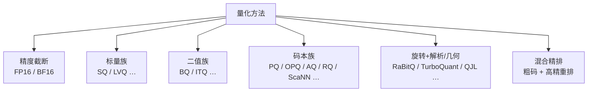
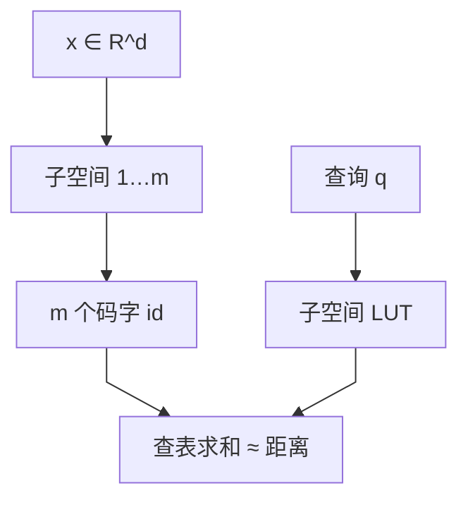
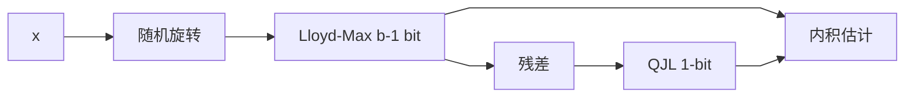

> 向量索引里的量化，本质是用更少的比特近似保留「距离 / 内积」结构，从而把内存与带宽从 FP32 量级压下来。PQ、RaBitQ、TurboQuant 只是这条线上常被点名的几个点：前面还有精度截断与标量/二值，旁边还有 OPQ / AQ / RQ / LVQ / ScaNN 等码本与损失设计，后面则是随机旋转 + 无偏估计这一支。量化与 IVF / HNSW 等索引结构正交——结构负责缩候选，量化负责让每个候选上的距离更便宜（结构见 [向量索引算法全景](/database/vector/ann-index-landscape/)）。

<!-- more -->

---

> ANN 的瓶颈常在「放不下、搬不动」。量化打在存储与打分层，不替代剪枝结构。

---

一条 FP32、$d=1536$ 的 embedding 约 $6\mathrm{KB}$；千万级就是几十 GB 纯向量，检索时还要反复搬进 cache / SIMD。目标很具体：

| 目标   | 含义                                |
| ---- | --------------------------------- |
| 压缩存储 | 32 bit/维 → 16 / 8 / 4 / 2 / 1 bit |
| 加速距离 | 查表、popcount、整数 SIMD 代替完整浮点点积      |
| 保住排序 | 误差小到 Top-K 集合大体不变                 |

和权重量化同属低比特，但向量库更关心：**对任意查询，内积/距离是否无偏、误差是否可控、能否在线写入**。

| 家族         | 每维/每块怎么离散           | 代表                     |
| ---------- | ------------------- | ---------------------- |
| 精度截断       | 更窄浮点                | FP16、BF16              |
| 标量         | 维独立网格 / 局部尺度        | SQ8、SQ4、LVQ            |
| 二值         | 符号或学出来的 bit         | BQ、ITQ                 |
| 乘积/加性码本    | 子空间或残差上的 k-means 码字 | PQ、OPQ、AQ、RQ、LSQ、ScaNN |
| 旋转 + 几何/解析 | 旋转后固定几何或 Lloyd–Max  | RaBitQ、TurboQuant、QJL  |

下面按矛盾演进铺开；PQ / RaBitQ / TurboQuant 在各自家族里写深，其余用对照收住。

---

## 2. 精度截断：FP16 / BF16

> 还没进「码本」之前，最便宜的一档是把 FP32 换成半精度。

存储与带宽近似减半，距离仍是浮点 SIMD，实现改动小。对许多 embedding，排序几乎不动；对数值范围极端或要和训练时 FP32 比特级对齐的场景，要单独验。它常被当成「量化阶梯的第 0 级」，也常作精排层存储格式。

---

## 3. 标量族：SQ 与 LVQ

> 每一维独立映射到少量档位；实现简单，压缩比适中。

### 3.1 Scalar Quantization（SQ）

对第 $j$ 维仿射缩放再取整，例如 int8：

$$
\hat{x}_j = \mathrm{round}\big((x_j - z_j)/s_j\big),\quad \hat{x}_j \in 0,\ldots,255
$$

$s_j,z_j$ 来自全局或分段的 min/max / 分位数。距离可反量化后浮点乘加，或在整数域近似。

- **因为**：很多 embedding 动态范围有限，8 bit 已够排序。
- **所以**：均匀网格换约 4× 压缩（相对 FP32）。
- **代价**：压缩比天花板低；长尾或各维尺度差大时浪费比特。Qdrant / Milvus 等常把 SQ8 当默认「先省一档内存」。

SQ4 等更狠的标量档位同一思路，召回掉得更快，多配合重排。

### 3.2 LVQ：给图索引和 SIMD 改过的标量

LVQ（Locally-adaptive Vector Quantization）一类在全局去均值后，按向量或局部统计适配尺度，并面向图遍历与现代 SIMD 布局。动机是：HNSW 边上要反复打分，标量码要既省又「算得顺」。它仍属标量族，不是乘积码本；和朴素 SQ 的差别在**尺度自适应与工程布局**，不在「切子空间」。

---

## 4. 二值族：BQ 与学出来的 bit

> 每维（或每投影）压成 1 bit；极致压缩，召回对分布敏感。

最简单形式是取符号 $b_j=\mathbf{1}[x_j\ge 0]$，用汉明 / popcount 估相似度。32× 压缩诱人，但丢掉幅度；各向异性 embedding 上召回常塌。

ITQ（Iterative Quantization）等会先学旋转再二值化，让 bit 更「信息均匀」，仍是二值族里的经典改进。生产里裸 BQ 逐渐被「同比特、但估计器更好」的 RaBitQ / TurboQuant 1-bit 路径挤压——后面两节会写清差别。

---

## 5. 码本族：PQ 及其亲戚

> 用小型码本覆盖高维的可行办法是切空间（乘积）或叠残差（加性）；这是向量库沿用最久的主力压缩线。

### 5.1 Product Quantization（PQ）

PQ（Jégou et al., 2011）：

1. $x\in\mathbb{R}^d$ 切成 $m$ 段，每段 $d/m$ 维。
2. 每段 k-means，码本大小通常 $k=256$（一字节一索引）。
3. 向量存成 $m$ 个下标（约 $m$ 字节）。

非对称距离（ADC）更常用：查询保持原精度，预计算

$$
\mathrm{LUT}[u][i]=q^{(u)}-c^{(u)}_i^2
$$

再对码做 $m$ 次查表累加。Faiss FastScan 把码重排成 SIMD 友好布局，把查表打到寄存器级吞吐。

- **因为**：整空间向量量化码本随维数爆炸；笛卡尔积让每段只需小码本。
- **所以**：压缩率与可训练性之间有工程可行点。
- **代价**：依赖数据训码本；估计常有偏、缺紧误差界；分布漂移要重训；单点路径不如纯 bitwise 干净。

### 5.2 同族增强（不只是「PQ 的三个字母变体」）

| 方法               | 机制要点                    | 解决什么                   |
| ---------------- | ----------------------- | ---------------------- |
| **OPQ**          | 学正交旋转后再切段               | 降子空间相关，提高码本利用率         |
| **LOPQ**         | 局部/分块再 OPQ              | 全局一张旋转不够时的局部适配         |
| **AQ**           | 多组全维码本**相加**表示向量        | 比乘积码本更灵活，同比特常更低失真；编码更难 |
| **RQ**           | 残差上逐级量化                 | 加性路线的常见实现形态            |
| **LSQ**          | 局部搜索加速 AQ/RQ 编码         | 减轻加性量化「编码太慢」           |
| **ScaNN 各向异性量化** | 损失按「对内积排序的影响」加权，而非纯 MSE | 检索目标是排序不是重建            |
| **JPQ / 任务向学习**  | 码本与编码器联合、带排序损失          | embedding 与码本一起为检索服务   |

ScaNN 在产品叙述里常被当成「一种索引」，半身其实是**码本损失 + 打分核**；外面仍可套树/IVF 粗筛。AQ/RQ 在极短码（32/64 bit 级）上论文优势明显，工程普及度仍低于 PQ/OPQ——编码复杂度是主因。

IVF-PQ：先减簇质心残差再 PQ，是「划分索引 × 码本量化」的标准捆包，不是新的量化哲学。

---

## 6. 旋转 + 几何 / 解析：RaBitQ、TurboQuant、QJL

> 码本族靠数据学码字；这一支靠随机旋转把坐标变成「可知分布 / 均匀几何」，再挂无偏估计。训练近乎为零，理论语言更硬。

### 6.1 共用直觉

高维下角度比单坐标稳（测度集中）。随机正交旋转（JL 型）消掉轴偏好后：

- 坐标边缘变得可描述（Beta / 近高斯）→ 可解析做 Lloyd–Max（TurboQuant）；
- 或投影到超立方体顶点 → bit 串 + 无偏内积估计（RaBitQ）；
- 或对坐标/残差做 1-bit sketch（QJL）专门服务内积无偏。

### 6.2 RaBitQ

RaBitQ（Gao & Long, SIGMOD 2024；多 bit 扩展 SIGMOD 2025）：

1. 相对数据集中心化并归一（范数可侧信道保留）。
2. 随机旋转。
3. 投影到旋转后的 $\pm 1/\sqrt{D}^D$ 顶点 → $D$-bit 串。
4. **无偏**内积估计器 + $O(1/\sqrt{D})$ 级误差界（扩展版对齐 Alon–Klartag 渐进下界）。

距离核：AND + popcount + 少量浮点校正。几乎无训码本；Milvus `IVF_RABITQ`、Faiss / VSAG 等有落地。多 bit（约 4/5/7）可在无重排时摸到约 90%/95%/99% recall 工作点（视数据而定）。

相对朴素 BQ：同是 1 bit/维，差在估计器与几何码本，不在「又少存了几个 bit」。

### 6.3 TurboQuant 与 TurboVec

TurboQuant（Zandieh et al., ICLR 2026）原动机偏 KV Cache 在线压缩，后被 TurboVec / Qdrant 拉回 ANN：

**阶段 A（MSE）**：旋转 → 坐标近独立 Beta/高斯 → 离线 Lloyd–Max 得固定 $2^b$ 档 → 每维量化打包。  
**阶段 B（内积）**：MSE 码有偏 → 用 $b-1$ bit MSE 后对残差做 **QJL 1-bit**，得到无偏低失真内积估计。

- **因为**：旋转后边缘与数据无关（在单位球假设下），码本可解析预计算。
- **所以**：适合在线追加、多租户（码本不泄露语料统计）。
- **代价**：真实 embedding 常各向异性；TurboVec 的 TQ+、Qdrant 的补偿是工程校准，不是再训一套 PQ。

### 6.4 三者对照

|      | RaBitQ            | TurboQuant         | QJL（单独看）        |
| ---- | ----------------- | ------------------ | --------------- |
| 主输出  | bit 串 + 无偏估距      | 标量档位 + 可选残差 bit    | 1-bit 内积 sketch |
| 理论重心 | 内积误差界 / 渐进最优      | MSE 与内积失真近最优       | 内积无偏            |
| 典型战场 | 持久化向量索引           | KV Cache → 向量库     | 被 TQ 等组合调用      |
| 生产例  | Milvus IVF_RABITQ | Qdrant TQ、TurboVec | 多见于组合方案         |

不必把 RaBitQ 与 TurboQuant 打成「二选一论文战」：一个偏几何 1-bit 索引码，一个偏解析标量 + 残差；矩阵里可以并存。

---

## 7. 混合精排：生产里真正的默认形态

> 单档量化很少从粗排一路扛到最终答案；常见是粗码筛、高精排。

| 形态               | 粗层               | 精层           |
| ---------------- | ---------------- | ------------ |
| IVF_PQ + re-rank | PQ ADC           | 簇内原向量或 SQ    |
| HNSW + SQ/BQ     | 边上低比特打分          | 候选 FP16/FP32 |
| DiskANN          | 内存 PQ 走图         | SSD 全精度重排    |
| RaBitQ + refine  | 1-bit / 多 bit 估距 | SQ8 / FP16   |
| TurboQuant 阶梯    | 2–4 bit 估距       | 按需更高精        |

精排预算（重排多少个）和粗码比特一样，是召回–延迟旋钮。量化论文报的「无重排 recall」和线上「粗+精」不是同一工作点。

---

## 8. 和索引怎么叠、怎么选

> 先定比特预算与能否训码本、能否重排；索引结构另选。

典型组合：`IVF × {PQ, RaBitQ, SQ}`，`HNSW × {SQ, BQ, LVQ}`，`DiskANN = Vamana × PQ`，平坦扫描 × TurboQuant（TurboVec）。

| 档位     | 方法方向                        | 训练             | 行为直觉          |
| ------ | --------------------------- | -------------- | ------------- |
| ~2×    | FP16 / BF16                 | 无              | 几乎无损的第一刀      |
| ~4×    | SQ8、LVQ                     | 轻量统计           | 默认省内存档        |
| ~8–16× | PQ/OPQ、TQ 4–2 bit、AQ/RQ（短码） | PQ 系重；TQ 无或轻校准 | 主折中区          |
| ~32×   | BQ、RaBitQ 1-bit、TQ 1-bit    | 无 / 旋转         | 裸 BQ 脆；后两者更可用 |
| 混合     | 任一粗码 + 高精重排                 | —              | 高召回生产常态       |

硬约束比「谁更新」有用：

1. **不能看全量训码本** → 排除经典 PQ/OPQ/AQ，转向 SQ / RaBitQ / TurboQuant。
2. **必须 ~32×** → RaBitQ 或带残差校正的 1-bit TQ，慎裸 BQ。
3. **不允许二阶段重排** → 多 bit RaBitQ、TQ 4-bit、SQ8，或把 PQ 码加长。
4. **优化的是内积排序而非 MSE** → 看 ScaNN 式各向异性损失 / 无偏内积估计器，不要只看重建误差。
5. **硬件** → popcount 友好选 RaBitQ；固定小码本 LUT/SIMD 选 FastScan PQ 或 TurboQuant。

---

## 9. 小结

量化名词同样很多，机制按族看更清楚：

1. **精度截断** — FP16/BF16，改动最小。
2. **标量** — SQ / LVQ，维独立网格。
3. **二值** — BQ / ITQ，狠但脆。
4. **码本** — PQ 切空间，OPQ 转空间，AQ/RQ 加性叠码，ScaNN 改损失，LSQ 救编码速度。
5. **旋转 + 几何/解析** — RaBitQ、TurboQuant、QJL，训码本近零，理论与在线场景更硬。
6. **混合精排** — 线上默认把上面某一档当粗排。

新名字出现时，问三句即可挂回地图：离散单元是维、子空间还是残差？码本看不看数据？误差声明的是 MSE 还是内积/排序？——不必把它背成又一份独立清单。