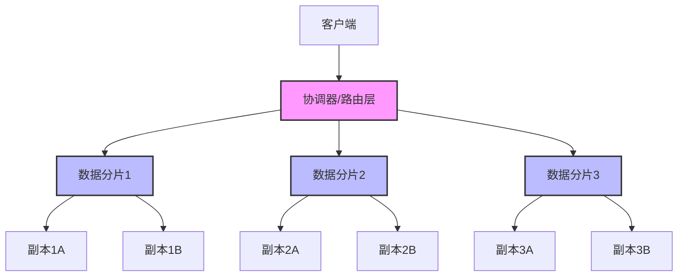
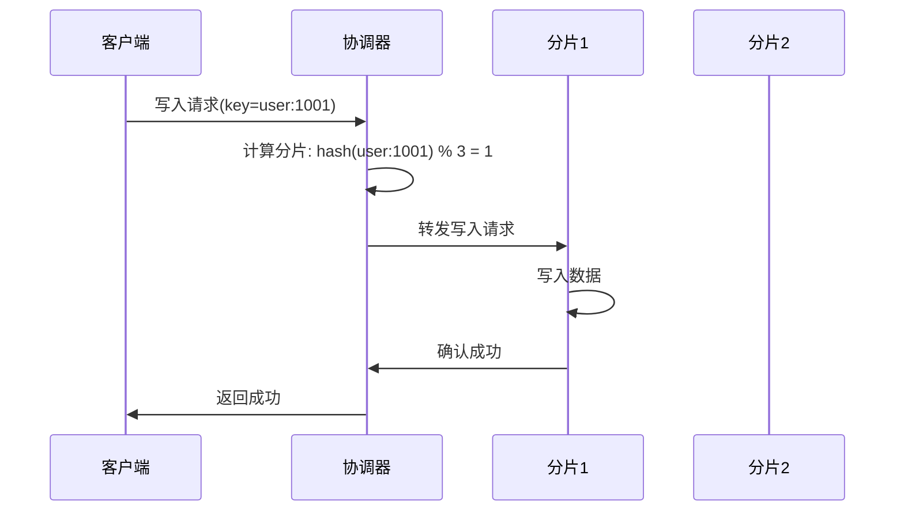
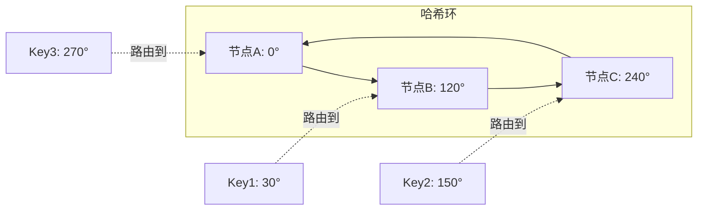
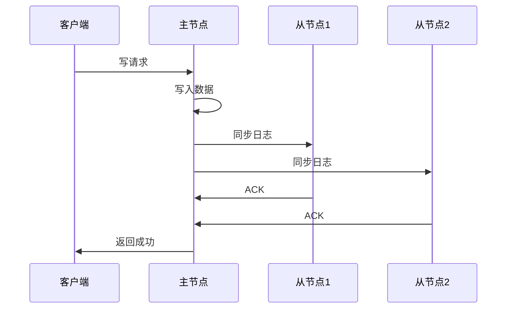
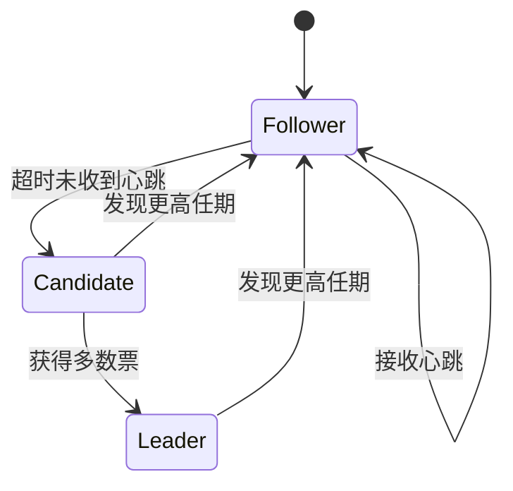
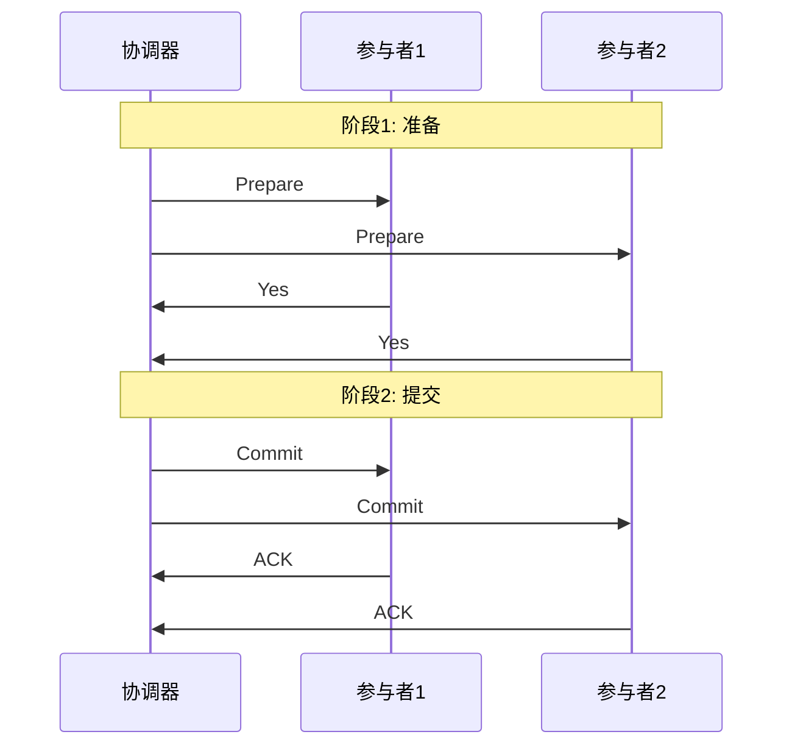
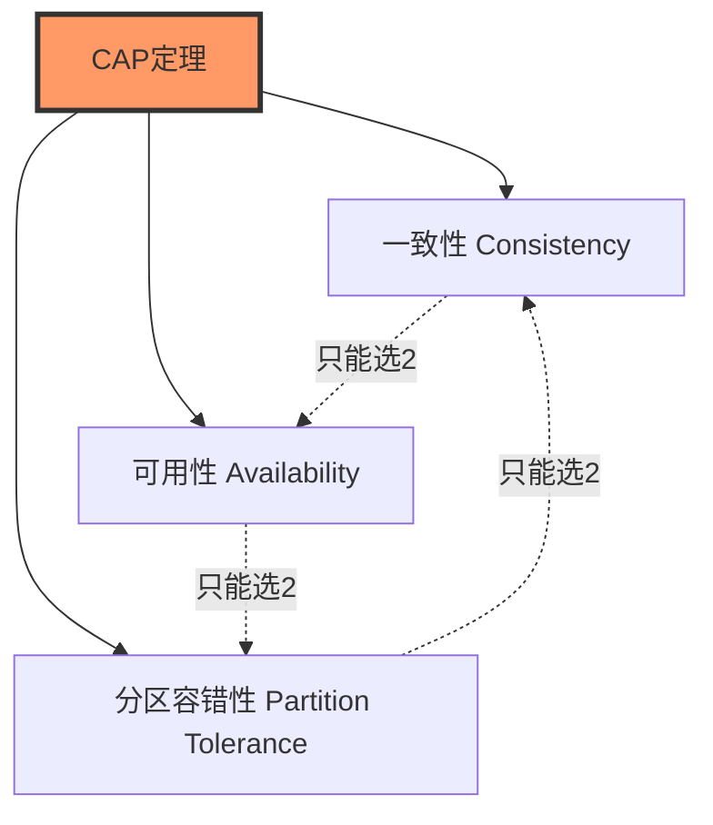
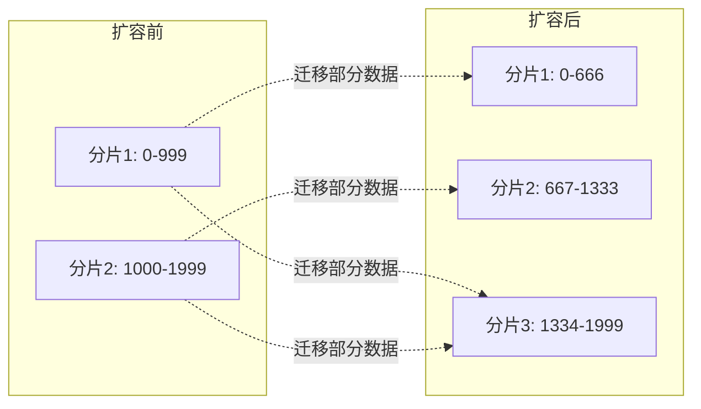

> 分布式数据库通过将数据分散存储在多个节点上，实现了高可用性、可扩展性和容错能力。本文将系统介绍分布式数据库的核心架构组件和设计原则。

<!-- more -->

## 架构概览

分布式数据库的整体架构可以分为以下几个核心层次：



## 核心组件

### 1. 协调器（Coordinator）

协调器是分布式数据库的大脑，负责：

- **请求路由**：根据分片策略将请求路由到正确的数据节点
- **事务协调**：管理跨分片的分布式事务
- **元数据管理**：维护集群拓扑、分片映射等元信息
- **负载均衡**：在多个副本之间分配读请求



### 2. 数据分片（Sharding）

数据分片是分布式数据库实现水平扩展的关键技术。

#### 分片策略

**哈希分片（Hash Sharding）**

```
shard_id = hash(key) % num_shards
```

- ✅ 优点：数据分布均匀
- ❌ 缺点：范围查询效率低，扩容需要大量数据迁移

**范围分片（Range Sharding）**

```
if key < 1000: shard_0
elif key < 2000: shard_1
else: shard_2
```

- ✅ 优点：支持高效的范围查询
- ❌ 缺点：可能出现数据倾斜（热点问题）

**一致性哈希（Consistent Hashing）**



- ✅ 优点：节点增减时只需迁移少量数据
- ✅ 优点：通过虚拟节点解决数据倾斜

### 3. 副本管理（Replication）

副本机制提供数据冗余，保证高可用性和容错能力。

#### 副本策略

**主从复制（Master-Slave）**



**多主复制（Multi-Master）**

- 允许多个节点同时接受写请求
- 需要冲突解决机制（如 CRDT、Last-Write-Wins）

#### 一致性级别

| 级别           | 描述                   | 延迟 | 一致性 |
| -------------- | ---------------------- | ---- | ------ |
| **强一致性**   | 所有副本同步完成后返回 | 高   | 强     |
| **最终一致性** | 主节点写入成功即返回   | 低   | 弱     |
| **Quorum**     | 多数副本确认后返回     | 中   | 可调   |

### 4. 一致性协议

分布式数据库需要一致性协议来保证多个节点之间的数据一致性。

#### Raft 协议



**核心机制**：

- **Leader 选举**：通过投票选出唯一的 Leader
- **日志复制**：Leader 将日志复制到 Follower
- **安全性保证**：已提交的日志不会丢失

#### 2PC/3PC（两阶段/三阶段提交）



## 关键技术挑战

### 1. CAP 定理



- **CP 系统**：牺牲可用性保证一致性（如 HBase、MongoDB）
- **AP 系统**：牺牲一致性保证可用性（如 Cassandra、DynamoDB）

### 2. 分布式事务

**ACID vs BASE**

| 特性     | ACID     | BASE       |
| -------- | -------- | ---------- |
| 一致性   | 强一致性 | 最终一致性 |
| 可用性   | 较低     | 高         |
| 性能     | 较低     | 高         |
| 适用场景 | 金融系统 | 社交网络   |

### 3. 数据迁移与再平衡

当集群扩容或缩容时，需要重新分配数据：



## 典型实现案例

### Google Spanner

- **全球分布式**：跨数据中心的强一致性
- **TrueTime API**：利用原子钟和 GPS 实现全局时钟
- **外部一致性**：提供比传统 ACID 更强的保证

### Amazon DynamoDB

- **无主架构**：所有节点地位平等
- **一致性哈希**：实现自动分片和负载均衡
- **最终一致性**：默认提供高可用性

### Apache Cassandra

- **去中心化**：无单点故障
- **可调一致性**：支持从最终一致性到强一致性的多种级别
- **列式存储**：适合写密集型场景

## 总结

分布式数据库的架构设计需要在 **一致性、可用性、性能** 之间做出权衡。核心技术包括：

1. **数据分片**：实现水平扩展
2. **副本管理**：保证高可用性
3. **一致性协议**：维护数据一致性
4. **分布式事务**：支持跨节点操作

选择合适的分布式数据库架构需要根据具体的业务场景和需求进行权衡。

## 参考资料

- [Designing Data-Intensive Applications](https://dataintensive.net/)
- [Google Spanner Paper](https://research.google/pubs/pub39966/)
- [Amazon DynamoDB Paper](https://www.allthingsdistributed.com/files/amazon-dynamo-sosp2007.pdf)
