> 一致性协议是分布式系统的基石，它确保多个节点在面对网络分区、节点故障等异常情况下，仍能对系统状态达成共识，保证数据的正确性和系统的可用性。

<!-- more -->

## 概述

在单机系统中，所有操作都在一台机器上执行，数据的一致性很容易保证。但当系统扩展到多台机器时，就会面临诸多挑战：网络延迟、消息丢失、节点故障、时钟不同步等。一致性协议正是为了解决这些分布式环境下的固有问题而诞生的。

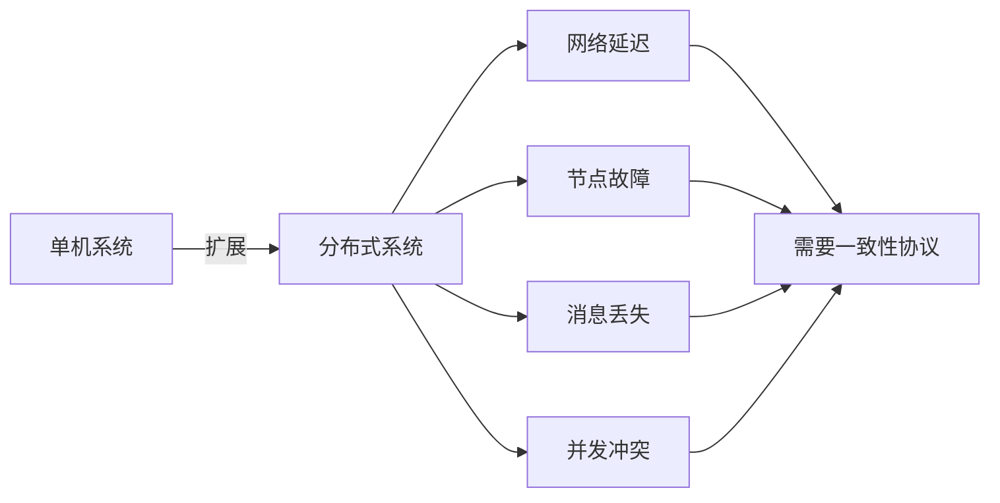

## 分布式系统面临的核心挑战

### 1. 网络不可靠

网络通信存在三种基本问题：

- **延迟**：消息传输需要时间，且延迟不可预测
- **丢包**：消息可能在传输过程中丢失
- **乱序**：消息到达的顺序可能与发送顺序不同

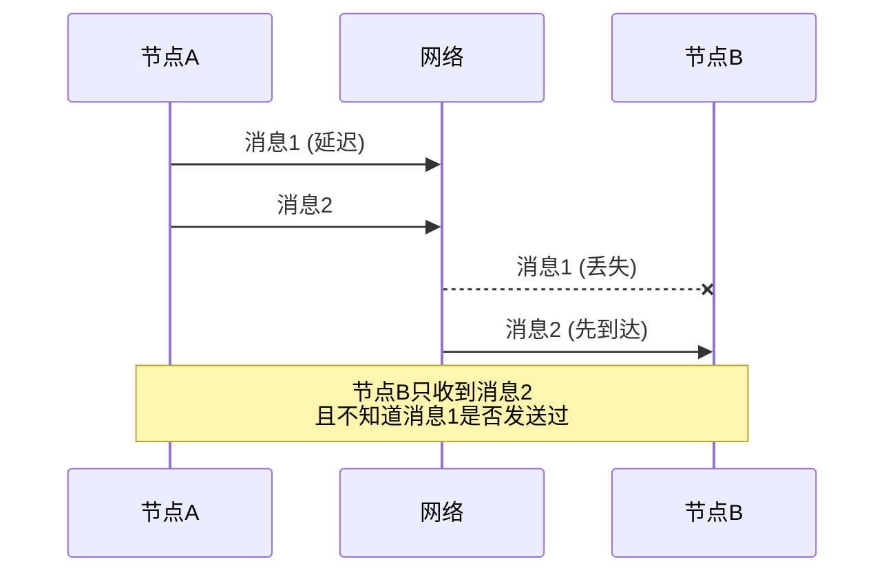

### 2. 节点故障

分布式系统中的节点可能出现多种故障：

- **崩溃故障（Crash Fault）**：节点停止工作，不再响应
- **遗漏故障（Omission Fault）**：节点运行但丢失部分消息
- **拜占庭故障（Byzantine Fault）**：节点行为异常，可能发送错误或恶意消息

> **注**：拜占庭故障源自"拜占庭将军问题"，描述的是分布式系统中最复杂的故障类型。在这种故障下，节点可能表现出任意行为：发送相互矛盾的信息、伪造消息、串通作恶等。这种故障在区块链等去中心化系统中尤为重要，因为系统中可能存在恶意节点。相比之下，崩溃故障和遗漏故障都属于"诚实但可能失败"的节点行为，处理起来相对简单。

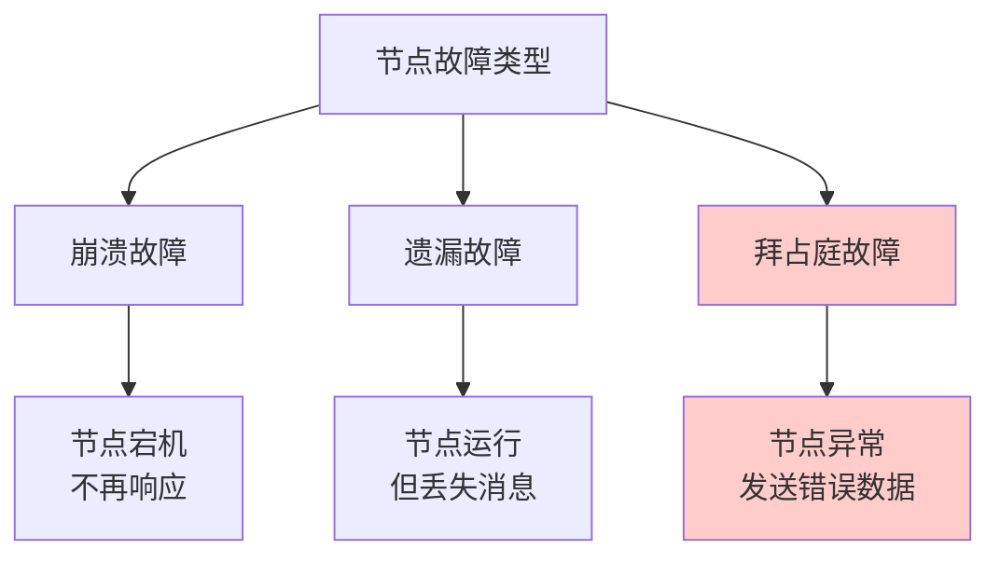

### 3. 时钟不同步

分布式系统中的每个节点都有自己的时钟，这些时钟之间存在偏差：

- 无法准确判断事件的先后顺序
- 难以实现全局一致的超时机制
- 时间戳不能作为可靠的排序依据

### 4. 并发操作冲突

多个节点可能同时修改同一份数据，导致冲突：

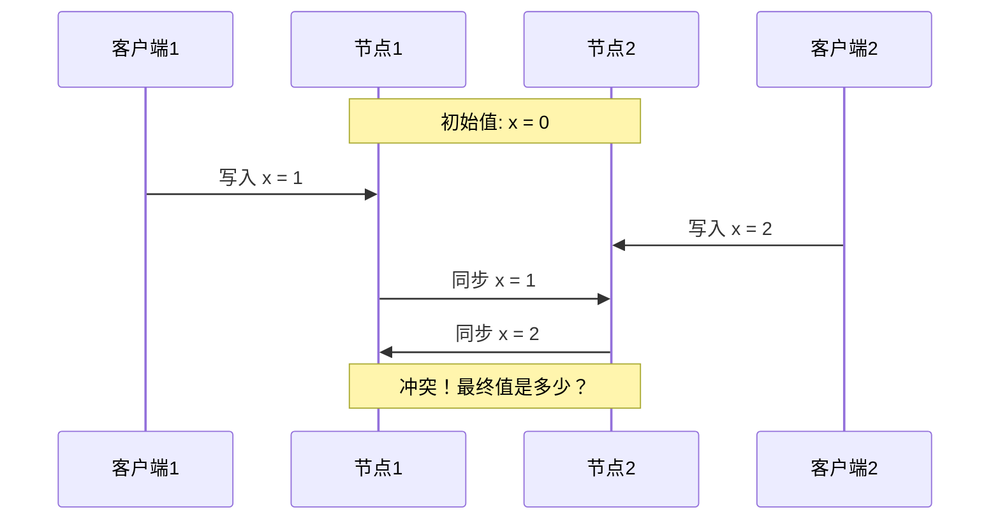

## 一致性协议解决的问题

### 1. 保证数据一致性

一致性协议确保所有节点对数据的状态达成一致，即使在网络分区或节点故障的情况下。

**示例场景**：银行转账系统

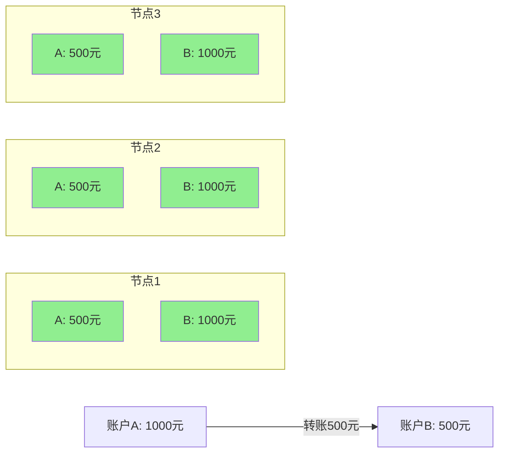

> **关键点**：所有节点必须对转账结果达成一致，不能出现节点1认为转账成功，而节点2认为转账失败的情况。

### 2. 实现容错能力

通过副本机制和一致性协议，系统可以容忍部分节点故障而继续运行。

**容错公式**：

- 对于崩溃故障：需要 `2f + 1` 个节点才能容忍 `f` 个故障
- 对于拜占庭故障：需要 `3f + 1` 个节点才能容忍 `f` 个故障

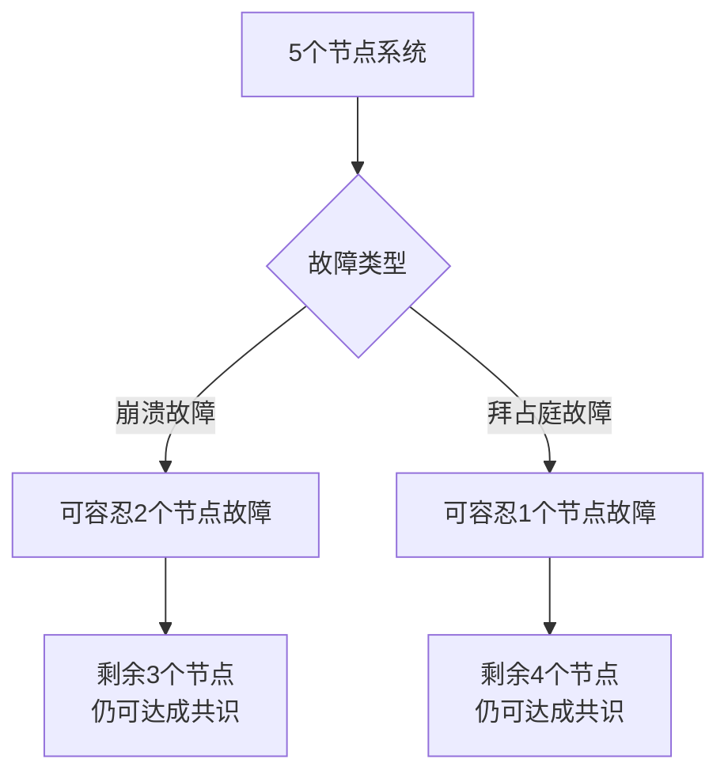

### 3. 提供顺序保证

一致性协议确保所有节点以相同的顺序执行操作，这对于状态机复制至关重要。

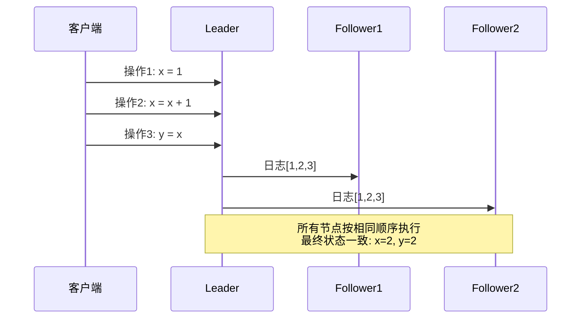

### 4. 解决脑裂问题

网络分区可能导致系统分裂成多个子集群，每个子集群都认为自己是主集群。一致性协议通过多数派机制避免脑裂。

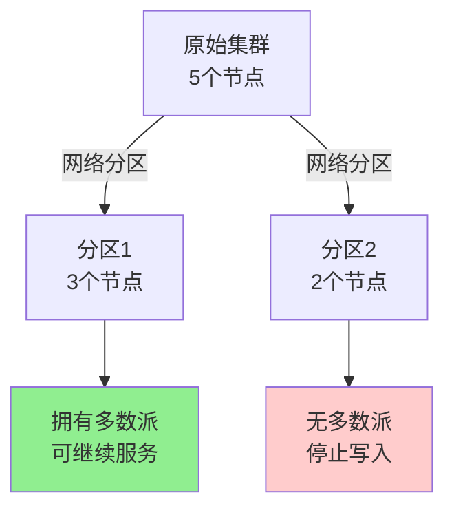

## 实际应用场景

### 场景1: 分布式数据库

**问题**：多个数据库副本如何保持一致？

**解决方案**：使用 Raft 或 Paxos 协议

```
// 分布式数据库写入流程
1. 客户端向 Leader 发起写请求
2. Leader 将操作写入本地日志
3. Leader 将日志复制到多数派 Follower
4. 多数派确认后，Leader 提交并返回成功
5. 所有节点最终应用该操作
```

### 场景2: 分布式锁

**问题**：如何在分布式环境下实现互斥访问？

**解决方案**：基于一致性协议实现分布式锁服务（如 etcd、ZooKeeper）

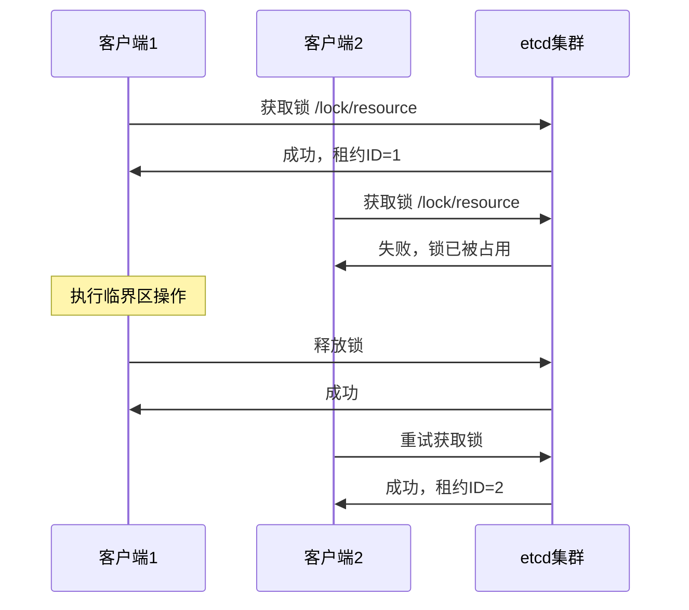

### 场景3: 配置管理

**问题**：如何确保所有服务节点获取到一致的配置？

**解决方案**：使用一致性协议保证配置更新的原子性和顺序性

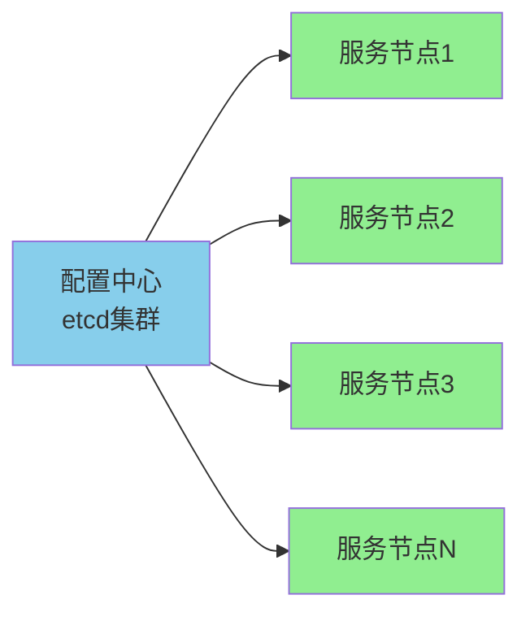

### 场景4: 主节点选举

**问题**：当主节点故障时，如何选出新的主节点？

**解决方案**：通过一致性协议进行 Leader Election

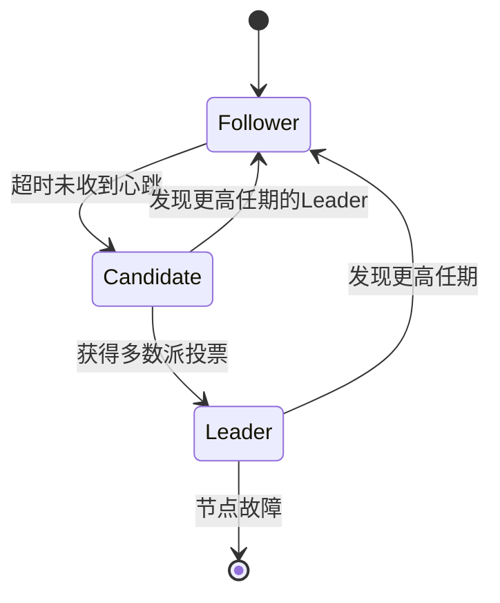

## 常见一致性协议对比

| 协议       | 容错类型   | 性能 | 复杂度 | 典型应用        |
| ---------- | ---------- | ---- | ------ | --------------- |
| **Paxos**  | 崩溃故障   | 中等 | 高     | Chubby, Spanner |
| **Raft**   | 崩溃故障   | 中等 | 中等   | etcd, Consul    |
| **ZAB**    | 崩溃故障   | 中等 | 中等   | ZooKeeper       |
| **PBFT**   | 拜占庭故障 | 低   | 很高   | 区块链          |
| **Gossip** | 崩溃故障   | 高   | 低     | Cassandra       |

## 权衡与取舍

### CAP 定理

分布式系统无法同时满足以下三个特性：

- **C (Consistency)**：一致性 - 所有节点看到相同的数据
- **A (Availability)**：可用性 - 系统持续提供服务
- **P (Partition Tolerance)**：分区容错性 - 系统在网络分区时仍能工作

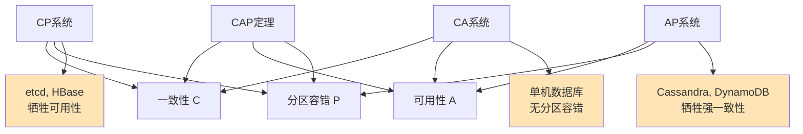

### 性能 vs 一致性

- **强一致性**：性能较低，但数据绝对正确
- **最终一致性**：性能较高，但存在短暂的数据不一致窗口
- **因果一致性**：折中方案，保证因果关系的操作有序

## 总结

一致性协议是分布式系统不可或缺的组成部分，它解决了以下核心问题：

核心要点：

1. **数据一致性**：确保所有节点对系统状态达成共识，避免数据冲突和不一致
2. **容错能力**：通过副本和共识机制，使系统能够容忍节点故障和网络分区
3. **顺序保证**：保证操作的全局顺序，实现状态机复制和可预测的系统行为
4. **脑裂防护**：通过多数派机制避免网络分区导致的系统分裂问题

选择合适的一致性协议需要根据具体场景权衡：

- 需要容忍的故障类型（崩溃 vs 拜占庭）
- 性能要求（吞吐量、延迟）
- 一致性强度（强一致 vs 最终一致）
- 实现复杂度和运维成本

## 参考资料

- [Raft 论文：In Search of an Understandable Consensus Algorithm](https://raft.github.io/raft.pdf)
- [Paxos Made Simple - Leslie Lamport](https://lamport.azurewebsites.net/pubs/paxos-simple.pdf)
- [CAP Theorem - Eric Brewer](https://www.infoq.com/articles/cap-twelve-years-later-how-the-rules-have-changed/)
- [Designing Data-Intensive Applications - Martin Kleppmann](https://dataintensive.net/)
