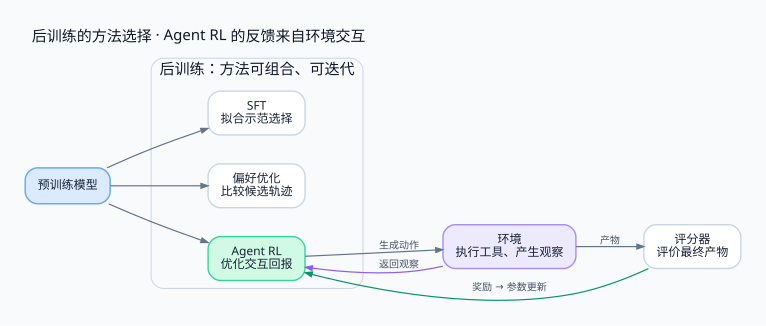

> 先把问题说清：后训练是一类训练流程，RL 是其中可选的优化方法；Agent RL 用环境交互的结果，改变模型下一次做选择的概率。

<!-- more -->

**系列导航**

1. **为什么需要 Agent RL（本文）**
2. [从工具调用到可训练轨迹](/machine-learning/agent-rl/trajectory/)
3. [从 PPO 到 GRPO](/machine-learning/agent-rl/policy-optimization/)
4. [长轨迹上的信用分配](/machine-learning/agent-rl/credit-assignment/)
5. [GPU 训练与 CPU 环境如何协同](/machine-learning/agent-rl/training-system/)
6. [安全隔离与 Harness 解耦](/machine-learning/agent-rl/isolation/)
7. [跑通一个可验证的训练闭环](/machine-learning/agent-rl/minimal-experiment/)

DPO 不放入主线编号；如果想先补充“偏好优化”和 Agent RL 的区别，可选读 [番外：DPO 到底补充了什么](/machine-learning/agent-rl/dpo-background/)。

---

## 1. 会回答、会调用工具，为什么仍然完不成任务

给模型一个有 bug 的仓库，它能解释二分查找，也能生成合法的 `read_file` 和 `edit` 调用，却仍可能交不出一个正确补丁。它可能找错文件、只修好一半边界、忽略失败日志，或者在没有验证时宣布完成。

这里的困难横跨多个选择。先读哪个文件会影响后续能看到什么；一次修改会改变下一次测试的结果；测试失败以后，是继续定位、回退还是停止，又决定了最终产物。

对话里的局部合理性与任务的最终成功之间，有一段需要环境来检验的距离。Agent 把模型放进“观察—决策—执行—再观察”的循环。Agent RL 则进一步追问：**能否用这些决策造成的结果，改进模型以后做决策的方式？**

但先不要把所有失败都归给模型。上下文没有提供正确仓库、工具参数过于复杂、测试依赖随机失效，都可能让很好的策略也做不好任务。工程上通常先检查三层：

| 层次 | 应先确认什么 | 主要改进方式 |
|---|---|---|
| 信息与接口 | 所需文件、工具、权限是否可用 | 检索、上下文组织、工具与提示词设计 |
| 基础行为 | 能否理解任务、合法调用工具、完成基本步骤 | 示范数据、SFT、模型选择 |
| 连续决策 | 在自己的行动导致的新状态中，能否恢复并完成任务 | 搜索、推理预算，以及合适的 Agent RL |

这些办法可以组合。只有把瓶颈定位到需要学习的行为，才能解释一次训练为什么值得做。

## 2. 后训练与 RL 不在同一个分类层次

预训练通常从大规模数据中学习预测下一个 token。给定前文，模型调整参数，让实际出现的后续 token 获得更高概率。语言结构、知识关联和部分推理能力都在这个过程中形成。

后训练通常指在预训练模型基础上，为指令遵循、偏好、特定能力或行为约束继续组织的训练流程。**后训练是流程范畴，强化学习是一类优化方法。**

| 方法 | 数据或反馈 | 一次更新主要在优化什么 |
|---|---|---|
| SFT，监督微调 | 示范回答或完整行动轨迹 | 示范中目标 token 的条件似然 |
| DPO 等偏好优化 | 同一输入下的偏好对 | 相对偏好与参考策略约束 |
| 基于奖励的 RL | 策略采样后的回报 | 策略的期望回报，通常附带约束 |

三者都可能用于后训练。常见流程是先让模型掌握基本接口，再用结果反馈改善任务表现，但不存在必须遵守的单一路线；数据生成、SFT 和 RL 也可以迭代。

另外三个词描述的是不同维度：

- **RLHF** 强调来自人类的反馈，以及使用这些反馈进行对齐的方法。
- **RLVR** 强调可以由程序验证的奖励，例如答案核对、编译与测试。
- **Agent RL** 强调策略在多步环境交互中接受训练。

一个代码 Agent 可以同时使用可验证测试和人类偏好。不能把这些词排列成互相取代的技术代际。



## 3. SFT 已经能教会工具使用，RL 又增加了什么

假设示范是：读文件、修改边界、运行测试、根据失败日志再修一次、提交。SFT 可以学习这整条过程，包括失败后的恢复。它绝非只能教格式，也不要求所有示范都一次成功。

其典型目标是：

```text
L_SFT(θ) = - Σt m_t log πθ(y_t | x, y_<t)
```

`m_t` 表示哪些位置参与监督，例如助手生成的位置。目标告诉模型：“在这个上下文中，提高示范选择的概率。”成功轨迹筛选、数据配比和 token 权重都能改变学习效果，但通常不在这一步重新运行工具。

部署时，模型会做出示范没有做过的选择。它可能读了另一个文件、改了另一处代码，随后进入新的环境状态。如果训练数据没有覆盖这种分支，单靠复现既有示范就可能不够。

在线 Agent RL 让当前策略自己采样这些分支，执行工具，得到结果，再更新策略。它把“当前模型容易走到哪里、在那里做得怎样”接回数据生成过程。

这不意味着 RL 总比 SFT 强。如果基础模型几乎从不完成任务，稀疏的终局奖励可能全是零；如果评分器把错误行为判成成功，RL 会放大评分漏洞；如果环境特别昂贵，收集示范或筛选成功样本可能更划算。

因此，考虑 RL 至少要回答：奖励是否可信？策略能否探索出有差别的结果？环境是否可重复运行？收益是否值得采样与训练成本？

## 4. RL 到底在训练什么

本系列讨论以语言模型为策略的 Agent。模型读到交互历史 `h_t`，生成下一个 token；多个 token 组成工具名称、参数或最终回答。最核心的训练对象是这套策略的参数 `θ`。

```text
J(θ) = E_{x ~ D, τ ~ (πθ, E)} [R(τ)]
```

`D` 是任务分布，`E` 是环境，`τ` 是交互轨迹，`R` 是回报。优化这个期望，希望模型以后采到高回报轨迹的概率变大。

策略梯度的基本结构是：

```text
∇θ J ≈ E[ Σt A_t ∇θ log πθ(a_t | h_t) ]
```

`A_t` 是优势，可以先理解为“这次选择相对基线有多好”。正优势施加提高相应选择概率的优化压力，负优势施加相反压力。实际更新还受到参数共享、其他样本、正则项和裁剪影响，不保证每个样本的概率都单独按直觉移动。

在行为层面，这可能改善搜索顺序、工具参数、测试时机、失败恢复与停止判断。训练并不直接把一棵人工决策树写进模型；变化通过生成分布体现。

| 组件 | 在策略训练中如何处理 |
|---|---|
| 策略 LLM | 更新全部参数，或 LoRA 等适配器参数 |
| 价值模型 / critic | 使用它的算法通常另外训练，用于估计回报 |
| 参考策略 | 通常冻结，用于约束策略漂移 |
| 奖励模型 | 可在独立阶段训练；策略更新时通常保持固定 |
| harness、工具、验证器 | 通常是外部程序，不由策略梯度更新 |

这里的 harness 指组织模型调用、工具执行与消息历史的运行程序。工具沙箱则是代码实际执行的隔离环境；二者可以由不同进程或服务承担。

## 5. shell 和测试器不可微，梯度从哪里来

模型生成 `edit`，工具改文件，测试器返回结果。这条调用链经过操作系统和离散程序，不能像神经网络层那样直接反向传播。

策略梯度不要求穿过这条链。它需要的是两件事：模型当时以多大概率作出了这些选择，以及选择之后得到了多高的回报。奖励作为优化信号，乘到模型自己的对数概率梯度上。

因此，**环境决定发生了什么，模型的概率计算决定参数如何更新。** 不需要让 `pytest` 或文件系统支持求导。

工具输出虽然作为上下文影响后续生成，却不是策略采样出来的动作。计算策略损失时，需要区分模型生成 token 与外部观察 token。第二篇会把这条边界落实到轨迹数据格式。

## 6. 运行中的学习，与训练中的学习

一次执行中，模型读到失败日志，再决定回退。这种行为看起来像“刚刚学会了什么”，但通常只是上下文改变了；参数没有更新。外部记忆库、检索结果与仓库文件的变化，也不等于发生了 RL。

标准离线部署中，策略在一次任务内保持固定。训练侧收集许多任务，计算损失并更新权重，再发布新版本。在线学习系统可以更紧密地交替，但仍需要指出参数更新究竟在哪里发生。

这个区别影响工程设计：harness 负责把 Agent 跑起来，trainer 负责改变策略。它们可以复用模型接口，不必把优化器逻辑塞进工具容器。

## 7. 贯穿全系列的任务与阅读路线

接下来使用一个代码修复任务：二分查找的两个分支分别错误地写成 `low = mid`、`high = mid`。Agent 可以读代码、修改与执行开发测试；提交后，独立验证器判断最终补丁。

这个任务足够小，可以逐步检查轨迹；也包含现实代码 Agent 的关键结构：状态会被修改、观察不完整、测试可能只覆盖一部分行为、最终成功依赖多个选择。

第二篇定义这样的轨迹怎样进入训练；第三篇计算一次 PPO / GRPO 更新；第四篇讨论终局奖励如何影响早期动作。第五、六篇把它放进 GPU/CPU 系统与安全边界。第七篇运行一个缩小后的训练实验，并区分链路验证与真实模型能力评估。

## 参考资料

- [Sutton & Barto, Reinforcement Learning: An Introduction](http://incompleteideas.net/book/the-book-2nd.html)：回报、价值函数与策略梯度的基础框架。
- [InstructGPT](https://arxiv.org/abs/2203.02155)：SFT、奖励模型与 PPO 的后训练流程实例。
- [ReAct](https://arxiv.org/abs/2210.03629)：推理与行动交替的 Agent 形式；有这种形式并不自动意味着进行了 RL。
- [DPO](https://arxiv.org/abs/2305.18290)：从偏好数据直接优化策略的另一条路线。


---

下一篇：[Agent RL（二）：从工具调用到可训练轨迹](/machine-learning/agent-rl/trajectory/)

配图源文件：[Graphviz DOT](./assets/01-post-training.dot)。
