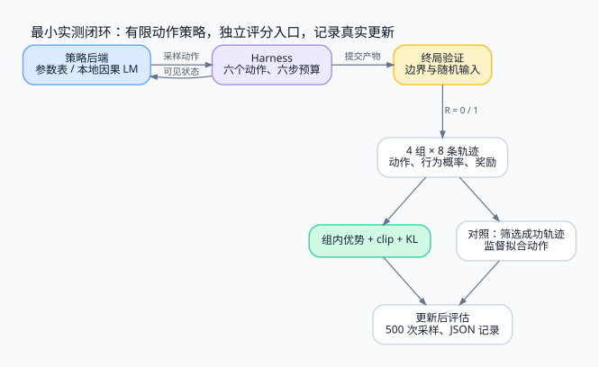

> 用六个工具动作跑通采样、终局评分、组内优势、裁剪更新与评估。先验证真实参数更新，再接本地语言模型；实验结果同时对照成功轨迹 SFT，并明确它不能证明什么。

<!-- more -->

**系列导航**

1. [为什么需要 Agent RL](/machine-learning/agent-rl/why-agent-rl/)
2. [从工具调用到可训练轨迹](/machine-learning/agent-rl/trajectory/)
3. [从 PPO 到 GRPO](/machine-learning/agent-rl/policy-optimization/)
4. [长轨迹上的信用分配](/machine-learning/agent-rl/credit-assignment/)
5. [GPU 训练与 CPU 环境如何协同](/machine-learning/agent-rl/training-system/)
6. [安全隔离与 Harness 解耦](/machine-learning/agent-rl/isolation/)
7. **跑通一个可验证的训练闭环（本文）**

---

## 1. 先明确这次实验的尺度

前六篇定义了训练对象、轨迹、算法和工程边界。现在把最小闭环真正运行起来，而不是再写一段省略了环境和优化器的伪代码。

配套代码位于 [GitHub 上的 mini 目录](https://github.com/Zqzqsb/Blog/tree/master/MachineLearning/AgentRL/mini)，提供两个策略后端：

| 后端 | 更新什么 | 本文验证到哪里 |
|---|---|---|
| `table` | 一个可训练的离散策略参数表 | CPU 上完成训练、三组随机种子与 SFT 对照 |
| `hf` | 本地 Hugging Face 因果语言模型的参数 | 使用临时创建的微型随机 GPT-2 完成离线接口与训练循环检查 |

主实验没有训练预训练 LLM，也没有部署 GPU 集群。表格策略用于让计算、环境与评估全部可检查；随机微型语言模型用于验证接入代码。二者都不能充当真实代码 Agent 能力提升的证据。

工具环境只允许六个预定义动作，不执行任意生成代码。这里演示职责解耦，不提供第六篇所讨论的容器安全边界。



## 2. 环境缩小了什么，保留了什么

任务仍是修复二分查找的 `low` 和 `high` 更新。为避免引入通用编辑器和任意代码执行，环境把这两处代码表示为有限变体，并提供：

```text
read       读取当前代码状态
fix_low    将 low 更新设为 mid + 1
fix_high   将 high 更新设为 mid - 1
undo_low   将 low 更新改回 mid
test       执行公开 smoke test
finish     提交当前产物
```

每次工具调用最多推进一步，单条轨迹有六步预算。环境在每步都公开当前两行代码，所以这个缩小版本是充分可观察的；表格策略使用当前代码变体与步数索引参数。它拥有人工设计的状态表示与修复动作，任务难度远低于从仓库中定位并生成补丁。

公开 smoke test 只检查 `[1, 3, 5]` 中查找 `3`。错误实现也会通过，刻意说明“公开测试通过”并不等于任务完成。终局验证另外检查空数组、边界、缺失目标与随机数组；候选算法有迭代上限，避免错误边界导致实验挂起。

预算内 `finish` 且终局检查通过记 1；其余正常结束记 0，包括用满六步仍未提交。这是本实验显式选择的任务契约。

## 3. 代码怎样分开环境与训练

| 文件 | 内容 |
|---|---|
| [environment.py](https://github.com/Zqzqsb/Blog/blob/master/MachineLearning/AgentRL/mini/environment.py) | 固定候选算法、harness 与独立调用的验证函数 |
| [train.py](https://github.com/Zqzqsb/Blog/blob/master/MachineLearning/AgentRL/mini/train.py) | 策略后端、采样、优势、更新、评估和 JSON 记录 |
| [test_demo.py](https://github.com/Zqzqsb/Blog/blob/master/MachineLearning/AgentRL/mini/test_demo.py) | 环境、评分、概率重放与梯度行为测试 |
| [smoke_hf.py](https://github.com/Zqzqsb/Blog/blob/master/MachineLearning/AgentRL/mini/smoke_hf.py) | 无需下载模型的本地语言模型接口检查 |
| [results](https://github.com/Zqzqsb/Blog/tree/master/MachineLearning/AgentRL/mini/results) | 实际运行的配置、运行时版本、逐步指标与评估 |

结果文件名相同会覆盖；个人实验建议使用 `local-` 前缀。示例不保存可部署 checkpoint，重新运行会从初始策略开始。

`Harness.step()` 只接受工具动作并返回观察。它不知道 group、策略版本、优势或优化步数。训练器在回合结束后取得产物，再调用验证器，把奖励写入训练记录。

这些对象在同一 Python 进程中运行，只构成代码职责边界，无法抵抗任意代码读取内存。把它扩展为通用 shell Agent 时，应按第五、六篇拆成可信控制层、工具沙箱与独立评分层。

## 4. 运行 CPU 实验

从博客工作区执行，环境需要 Python 与 PyTorch：

```bash
cd MachineLearning/AgentRL/mini
python3 -m unittest -v test_demo.py
python3 train.py --seed 7 --output results/local-grpo-7.json
python3 train.py --method rs-sft --seed 7 --output results/local-sft-7.json
```

仓库中保留的主实验使用 Python 3.12.4、PyTorch 2.12.0+cu130，实际运行设备为 CPU，`torch.set_num_threads(1)`。精确运行时信息也写进每份 JSON。不同 PyTorch 构建或平台不保证逐位复现。

默认设置如下：

```text
策略：24 个可见状态索引 × 6 个动作，初始 logits 全为 0
训练轮数：100
每轮：4 组 × 每组 8 条轨迹，共 32 条
每批优化：2 次
学习率：0.08，Adam
clip：0.2
参考策略 KL 系数：0.02
每次评估：500 条轨迹，使用固定的评估采样种子
单条轨迹动作上限：6
```

24 个状态索引来自 6 个动作前步数与 4 种代码组合。两种方法各收集 3200 条训练轨迹，但工具调用总数、保留样本数与反向传播工作量仍可能不同。

## 5. 一次更新究竟做了什么

采样阶段关闭梯度，按当前动作分布采样，记录每次选择的状态、动作与行为 logprob。所有组采完后才更新，因此一批中的策略版本固定。

组内优势使用总体标准差；全同奖励组的优势置零。对一条轨迹先平均各个动作位置的损失，再对轨迹平均。核心计算对应：

```python
ratio = exp(current_logp - old_logp)
objective = min(ratio * advantage,
                clip(ratio, 1 - epsilon, 1 + epsilon) * advantage)
loss = -objective + beta * kl
```

这里是有限工具动作上的组内裁剪策略梯度，借用 GRPO 的优势与目标结构。**不是自由生成 LLM 上逐 token 的完整 GRPO 实现。** 这个区别也适用于后面的 `hf` 后端。

因为只有六个动作，可以直接计算：

```text
KL(πθ || πref) = Σa πθ(a|h) [log πθ(a|h) - log πref(a|h)]
```

参考策略从初始模型复制并冻结。同一批轨迹重复更新时，行为 logprob 不变；当前 logprob 重新计算。即使一组已经全对，KL 项仍可能产生梯度。

## 6. 实测结果：这个任务没有证明 RL 优于 SFT

在同一环境中，分别运行组内裁剪更新与迭代式成功轨迹 SFT。SFT 每轮也采样 32 条，只保留成功轨迹，对动作的负对数似然进行两次更新；没有使用 RL 版本的 KL 惩罚。未采到成功轨迹时跳过该轮 SFT 更新。

| 随机种子 | 初始成功率 | 组内裁剪更新后 | 成功轨迹 SFT 后 |
|---|---:|---:|---:|
| 7 | 5.8%（29/500） | 99.6%（498/500） | 99.8%（499/500） |
| 19 | 6.4%（32/500） | 100%（500/500） | 99.2%（496/500） |
| 42 | 5.8%（29/500） | 99.6%（498/500） | 100%（500/500） |

原始记录：[GRPO 7](https://github.com/Zqzqsb/Blog/blob/master/MachineLearning/AgentRL/mini/results/seed-7.json)、[19](https://github.com/Zqzqsb/Blog/blob/master/MachineLearning/AgentRL/mini/results/seed-19.json)、[42](https://github.com/Zqzqsb/Blog/blob/master/MachineLearning/AgentRL/mini/results/seed-42.json)；[SFT 7](https://github.com/Zqzqsb/Blog/blob/master/MachineLearning/AgentRL/mini/results/rs-sft-7.json)、[19](https://github.com/Zqzqsb/Blog/blob/master/MachineLearning/AgentRL/mini/results/rs-sft-19.json)、[42](https://github.com/Zqzqsb/Blog/blob/master/MachineLearning/AgentRL/mini/results/rs-sft-42.json)。

两种方法都学会了这个小任务。每组评估只有 500 次，小幅百分比差异不支持优劣结论；两者的正则与实际梯度计算量也并未完全匹配。

以种子 7 为例，RL 版本训练后平均执行 4.164 个动作，SFT 为 3.042 个动作。RL 版本没有显式的动作成本，且 KL 约束使其保留更多初始随机行为；不能单凭此数值把差异归结为算法的普遍性质。

这里的“评估”仍然是相同修复任务上的新采样，验证器使用与训练不同的随机输入。它检查了更新后的任务成功率，不是未见仓库、未见 bug 的泛化测试。随着动作只剩几个固定选项，成功接近上限并不令人意外。

## 7. 接入本地语言模型时，策略定义发生了什么

`hf` 后端加载本地因果语言模型，默认不允许自动下载或远程自定义代码。它将环境历史写成 prompt，然后对六个候选动作字符串分别求条件对数概率：

```text
sθ(a, h) = Σj log pθ(candidate_token_j | prompt, candidate_<j)
πθ(a | h) = softmax_a sθ(a, h)
```

候选包含动作名称及 EOS。求和仅覆盖候选 token 的预测位置，prompt 不作为目标标签；但模型仍然通过对 prompt 的处理产生动作概率。

随后从这个六分类分布采样，使用动作级 logprob 计算比率与 KL。由于对候选重新归一化，这个策略不同于让 LLM 自由生成文本，也不是简单把原始动作字符串概率直接当成归一化动作概率。候选长度偏好同样由这个定义决定。

使用自己的本地 checkpoint 可以执行：

```bash
python3 train.py --backend hf --model /absolute/path/to/local-model \
  --device cuda --iterations 2 --groups 1 --group-size 8 \
  --epochs 1 --eval-episodes 8 --lr 1e-6 \
  --output results/local-hf.json
```

这是小规模接入命令，不是已验证的 GPU 配置。实现采用全参数训练并复制冻结参考模型，还需要优化器状态和激活内存；不能据此承诺某个参数规模单卡可运行。长 prompt 也需要检查模型上下文上限。先使用能放进本机的小模型，再考虑 LoRA、批处理和分布式训练。

如果只有 CPU、没有本地预训练权重，可以运行：

```bash
python3 smoke_hf.py
```

脚本临时创建一个随机初始化的微型 GPT-2 和 tokenizer，检查本地加载、动作分布归一化、反向传播及一轮训练，再删除临时模型。这个检查已经运行通过，结果在 [hf-smoke.json](https://github.com/Zqzqsb/Blog/blob/master/MachineLearning/AgentRL/mini/results/hf-smoke.json)。它证明接口能跑通，不衡量语言理解或修 bug 能力。

## 8. 测试覆盖了哪些容易出错的边界

单元测试检查：只修一处不能通过私有验证；公开测试通过不能替代私有评分；不同环境互不污染；预算耗尽与终止后调用符合契约；优势数值与第三篇计算一致；全同奖励组不会产生 NaN。

梯度测试还检查 clip 在正负优势下的不对称行为、采样 logprob 能否用原策略重算、一次更新是否改变策略而不改变参考模型，以及 SFT 是否忽略纯失败样本。

这类测试验证的是训练链路正确性。奖励上涨本身不能替代它们，因为一个有 bug 的训练器也可能在简单任务上产生漂亮曲线。

顺带说明实验边界：本示例中 harness 与验证器在代码职责上分离，但处于同一进程，既不是容器隔离，也不是可以安全执行任意不可信代码的环境；JSON 记录中的训练与评估是同一个修复任务，评估只是换了验证输入。

## 9. 从最小闭环走向真实 Agent RL

首先替换动作空间：允许模型生成真实工具名称和参数，保留逐段 token 与采样概率，并对外部观察做 loss mask。重新检查训练和推理的模板、上下文截断与采样分布是否一致。

随后替换环境：从有限代码变体改成真实仓库，使用第五、六篇的环境池、隔离执行与可信验证。网络重试、进程失败和资源预算都需要进入数据契约。

最后替换评估：按仓库或任务家族划分训练与评估，控制近重复补丁泄漏；对比固定模型的推理基线、成功轨迹 SFT 和 RL；报告训练成本、推理预算、任务成功率与波动。只有这一步才能回答训练是否带来了值得付费的真实能力提升。

本系列的实验完成了“参数确实被结果更新”的验证。GPU 集群吞吐、任意代码安全与真实 LLM 泛化是另外三项需要独立实现和测量的工程工作，不能从这张成功率表中推导出来。

## 参考资料

- [PyTorch Autograd](https://pytorch.org/docs/stable/autograd.html)：自动求导与梯度计算。
- [Transformers：本地模型加载](https://huggingface.co/docs/transformers/main/en/models)：模型配置与加载接口，具体行为依版本而定。
- [DeepSeekMath](https://arxiv.org/abs/2402.03300)：本例组内优势和裁剪目标的来源；本文有限动作实现有意缩小了问题。


---

上一篇：[Agent RL（六）：安全隔离与 Harness 解耦](/machine-learning/agent-rl/isolation/)

配图源文件：[Graphviz DOT](https://github.com/Zqzqsb/Blog/blob/master/MachineLearning/AgentRL/assets/07-experiment.dot)。
