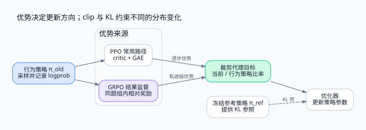

> PPO 和 GRPO 都需要知道一次选择相对基线有多好。前者通常训练 critic，后者用同题采样组估计相对优势；clip、KL、长度归一化分别控制不同的问题。

<!-- more -->

**系列导航**

1. [为什么需要 Agent RL](/machine-learning/agent-rl/why-agent-rl/)
2. [从工具调用到可训练轨迹](/machine-learning/agent-rl/trajectory/)
3. **从 PPO 到 GRPO（本文）**
4. [长轨迹上的信用分配](/machine-learning/agent-rl/credit-assignment/)
5. [GPU 训练与 CPU 环境如何协同](/machine-learning/agent-rl/training-system/)
6. [安全隔离与 Harness 解耦](/machine-learning/agent-rl/isolation/)
7. [跑通一个可验证的训练闭环](/machine-learning/agent-rl/minimal-experiment/)

---

## 1. 奖励已经有了，为什么还需要优势

第二篇收集到轨迹、生成概率和终局奖励。现在固定同一道二分查找任务，使用策略 `π_old` 独立采样八次：

```text
轨迹       τ1 τ2 τ3 τ4 τ5 τ6 τ7 τ8
私有奖励    1  1  0  0  0  1  0  0
```

最直接的策略梯度，用回报乘以生成动作的对数概率梯度。成功轨迹的生成选择被鼓励，零回报轨迹没有直接的奖励梯度。但“得到 1 分”还没有说明这件事相对当前策略有多好：一道题原本几乎必过与几乎不会做，需要的改善不同。

通常用回报减去基线得到优势：

```text
A_t = G_t - b(h_t)
```

`G_t` 是从当前位置往后累计的回报。合适的、不依赖当前采样动作的基线可以降低策略梯度估计方差。实际算法还会使用估计、标准化与其他近似，不能把所有优势构造都不加条件地称为无偏。

PPO 通常由价值模型提供状态相关的基线；GRPO 的结果监督版本利用同一道题的采样组构造轨迹级相对信号。这是两者首先要区分的地方。

## 2. 先分清当前策略、行为策略和参考策略

| 符号 | 用途 | 何时变化 |
|---|---|---|
| `πθ` | 正在计算梯度的当前策略 | 每次优化更新后 |
| `π_old` | 产生当前训练样本的行为策略 | 下一批采样或行为版本切换时 |
| `π_ref` | 为约束分布漂移提供参照 | 常在一段训练期间冻结 |

行为策略和参考策略可能在第一步恰好相同，但职责不同。优化同一批样本多次时，当前策略已经变化，`old_logprob` 仍然必须对应采样时的模型。

对某个已采到的生成 token，写出条件概率比：

```text
ρ_t(θ) = πθ(a_t | h_t) / π_old(a_t | h_t)
       = exp(log πθ(a_t | h_t) - old_logprob_t)
```

这里默认采样与记录的分布定义一致。推理服务的温度、截断采样等变换，不能在这个分母里凭空消失。

## 3. PPO：优势估计与裁剪目标

PPO 常用价值模型 `V(h_t)` 估计未来回报，再利用 GAE 计算优势。critic 的拟合损失与策略损失通常共同训练，价值头也可以共享骨干或采用独立模型；资源成本取决于实现，不能统一算成“必然再训练一个等大的 LLM”。

PPO 的裁剪代理目标是最大化：

```text
L_clip = E_t[min(ρ_t A_t, clip(ρ_t, 1-ε, 1+ε) A_t)]
```

取 `ε = 0.2`，看两个方向：

| 优势 | 比率 | 裁剪项的作用 |
|---|---|---|
| `A > 0` | `ρ > 1.2` | 不再奖励继续提高这个概率比 |
| `A > 0` | `ρ < 0.8` | 仍推动它向正确方向恢复 |
| `A < 0` | `ρ < 0.8` | 不再奖励继续降低这个概率比 |
| `A < 0` | `ρ > 1.2` | 仍对错误方向施加梯度 |

**clip 裁剪的是优化激励，不是把真实概率比率锁在区间内。** 参数共享、其他 token 的梯度、多次更新和额外损失仍可能让比率越界。它也不构成对参数步长或 KL 的硬约束。

实践中还要看实际 KL、概率比率分布、梯度范数及更新次数，必要时减少更新或提前停止。仅凭“用了 PPO clip”不能保证训练稳定。



## 4. GRPO：把八条结果转成两个优势值

以 DeepSeekMath 的结果监督形式为例，GRPO 不训练 critic，而是在同题组内计算：

```text
mean = 3 / 8 = 0.375
std  = sqrt(Σi (r_i - mean)^2 / 8) ≈ 0.484123
A_i  = (r_i - mean) / (std + ε_num)
```

这里的 `ε_num` 只是防止除零的数值项，不是 PPO 裁剪参数。忽略这个很小的数后：

```text
通过轨迹：A =  (1 - 0.375) / 0.484123 ≈  1.290994
失败轨迹：A =  (0 - 0.375) / 0.484123 ≈ -0.774597
```

采用总体标准差才能得到以上数字；若实现采用样本标准差，数值会不同。结果监督将 `A_i` 广播到轨迹 i 中所有参与策略损失的生成位置，工具观察不在其中。

如果八条全对或全错，减均值后的分子都是零。带数值保护的实现可令整组优势为零；不做保护则可能得到 NaN。此时任务奖励对应的策略梯度消失，但若仍保留 KL 或其他辅助项，**总梯度不一定为零**。

这也说明“无 critic”不等于免费。需要为每道题采样多条轨迹，用环境和推理计算换取组内比较。

## 5. KL 在约束哪一次漂移

经典 RLHF 常把相对参考模型的 KL 惩罚放进奖励，再让价值模型拟合相应回报。一些 GRPO 目标直接把 KL 放进策略损失。必须阅读实际目标，不能仅由算法名称推断实现。

一个简化的 GRPO 最大化目标写成：

```text
J = (1/G) Σi (1/L_i) Σt∈generated(i)
      [min(ρ_i,t A_i, clip(ρ_i,t, 1-ε, 1+ε) A_i) - β K_i,t]
```

`L_i` 是参与训练的生成 token 数。KL 参照的是 `π_ref`，clip 的比率参照的是 `π_old`：前者约束长期偏离起点，后者控制复用这一批样本时的局部更新激励。

GRPO 常见的非负 KL 估计形式为：

```text
k(a) = π_ref(a|h) / πθ(a|h)
       - log[π_ref(a|h) / πθ(a|h)] - 1
```

在分布具有所需共同支撑、且 `a` 从 `πθ` 采样时，它的期望对应 `KL(πθ || π_ref)`。复用 `π_old` 样本后，不能无条件继续宣称对当前策略 KL 无偏；需要区分实际采样测度，以及实现是否做了相应校正。

第七篇使用一个只有六个动作的策略，可以直接求完整离散分布的 KL，避开这个采样估计问题。大词表 LLM 的实现则需要明确估计与计算成本。

## 6. 长度归一化实际在给谁分配权重

假设两条轨迹都失败，优势相同，一条生成 4 个 token，另一条生成 12 个 token。

先对每条轨迹的 token 平均，再对轨迹平均时，两条轨迹的总外层权重一样，长轨迹里的单个 token 权重更小。

如果对整个训练 batch 的有效 token 求平均，则较长轨迹包含更多项；在每项梯度其他条件相同的比较下，它的总权重与长度成正比。具体代码要检查归一化范围到底是单组、整个 batch，还是分布式全局 batch。局部平均后再平均，在 token 数不同的 worker 上也可能改变目标。

因此，“都使用 GRPO”不能说明它们在优化完全相同的损失。长度归一化、标准差归一化、KL、截断处理都能改变训练压力。

## 7. DAPO 改了哪些实际问题

DAPO 针对长推理训练提出了多项调整，不能机械地把其结果等同于代码 Agent 环境中的效果。

**Clip-Higher。** 将上下界分开，例如下界参数 0.2、上界参数 0.28，给正优势选择的概率上升留下更大空间。这仍是代理目标的裁剪，不是对真实比率的硬保证。

**动态采样。** 去掉组内奖励完全相同的题目，继续采样以收集有区分度的组。对昂贵的工具环境，这可能花掉大量交互预算；实现还需要设置尝试上限，监控有效组比例，而不是无限补采样。

**Token 级损失聚合。** 改变按轨迹平均带来的长度权重，使用有效 token 聚合。工程实现必须保证跨 microbatch、跨设备的分母一致。

**超长输出处理。** 论文讨论了截断样本的噪声过滤与软长度惩罚。把“没有在预算内完成”如何纳入目标，需要结合任务定义：有些任务预算就是成功条件，有些截断来自系统限制，两者不应混淆。

DAPO 还移除了其训练设置中的 KL 惩罚。这是具体任务与实验的选择，不代表所有 Agent RL 都应去掉参考策略约束。

## 8. DPO 与成功轨迹 SFT 放在哪里

如果对 DPO 还不熟，可以先读可选番外 [DPO 到底补充了什么](/machine-learning/agent-rl/dpo-background/)。它只补充概念定位，不是本篇和后续 Agent RL 文章的前置条件。

成功轨迹 SFT 先筛出高分轨迹，再拟合它们的生成 token。失败轨迹主要用于过滤，没有作为负优势进入同一种策略梯度目标。

DPO 则消费同一输入下的偏好对：获胜轨迹与失败轨迹。更新相对参考策略的对数概率差，不需要 PPO 的行为策略比率或 GRPO 的组标准差。其单次偏好更新本身不必重新执行环境。

在线或迭代 DPO 可以在轮次之间重新采样与标注。因此更准确的比较需要同时说清：数据怎样生成，单次更新用什么目标，失败样本怎样参与，以及环境预算花在哪里。

到这里，训练器已经能提高高优势轨迹的概率。但一条成功轨迹可能包含不必要的绕路，甚至真正的错误操作。给它所有生成位置相同的优势，并没有回答哪一步值得奖励。下一篇进入这个时间维问题。

## 参考资料

- [PPO](https://arxiv.org/abs/1707.06347)：裁剪代理目标及其限制。
- [DeepSeekMath](https://arxiv.org/abs/2402.03300)：GRPO、结果监督与过程监督的定义。
- [DAPO](https://arxiv.org/abs/2503.14476)：动态采样、非对称裁剪、token 聚合与超长输出处理。
- [Approximating KL Divergence](http://joschu.net/blog/kl-approx.html)：常见 KL 估计的期望与方差性质。
- [DPO](https://arxiv.org/abs/2305.18290)：偏好对上的策略优化目标。


---

上一篇：[Agent RL（二）：从工具调用到可训练轨迹](/machine-learning/agent-rl/trajectory/)

下一篇：[Agent RL（四）：长轨迹上的信用分配](/machine-learning/agent-rl/credit-assignment/)

配图源文件：[Graphviz DOT](./assets/03-optimization.dot)。
