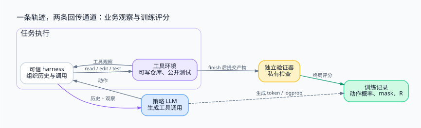

> 把模型、harness、可写环境与评分器拆开，才能准确回答：哪些是动作，哪些是观察，哪些 token 参与训练，以及一次失败究竟来自策略还是基础设施。

<!-- more -->

**系列导航**

1. [为什么需要 Agent RL](/machine-learning/agent-rl/why-agent-rl/)
2. **从工具调用到可训练轨迹（本文）**
3. [从 PPO 到 GRPO](/machine-learning/agent-rl/policy-optimization/)
4. [长轨迹上的信用分配](/machine-learning/agent-rl/credit-assignment/)
5. [GPU 训练与 CPU 环境如何协同](/machine-learning/agent-rl/training-system/)
6. [安全隔离与 Harness 解耦](/machine-learning/agent-rl/isolation/)
7. [跑通一个可验证的训练闭环](/machine-learning/agent-rl/minimal-experiment/)

---

## 1. 先给任务一个可执行的定义

第一篇解释了为什么按任务结果训练。现在固定任务，避免后面的“状态”“奖励”“成功”各指不同对象。

下面的二分查找有两个边界错误：

```python
def search(a, target):
    low, high = 0, len(a) - 1
    while low <= high:
        mid = (low + high) // 2
        if a[mid] == target:
            return mid
        if a[mid] < target:
            low = mid       # 应为 mid + 1
        else:
            high = mid      # 应为 mid - 1
    return -1
```

契约是：输入已排序且元素不重复，找到返回下标，未找到返回 `-1`。例如对 `[1, 3, 5]` 查找 `3`，错误程序也会通过；查找 `6` 时，错误的 `low` 更新可能使循环停滞；只修好 `low` 后，查找 `0` 仍可能卡在另一个边界。

开发环境给测试进程设置超时或迭代保护。日志如实报告“超过预算”，不能凭空写成一个实际上不会出现的失败断言。

Agent 使用 `read_file`、`edit`、`run_tests` 和 `finish`。其中 `run_tests` 运行公开开发测试；`finish` 提交补丁，触发独立的私有验证。**开发测试通过是观察，私有验证结果才是本例的终局奖励。**

## 2. 一条轨迹里发生了什么

```text
1. read_file("search.py")
   ← 看见两个错误更新分支
2. edit("low = mid", "low = mid + 1")
   ← patch applied
3. run_tests()
   ← 查找 6 已通过；查找 0 超过迭代预算
4. edit("high = mid", "high = mid - 1")
   ← patch applied
5. run_tests()
   ← 公开开发测试通过
6. finish()
   → 提交补丁给独立验证器
   → 私有验证通过，训练侧记录 R = 1
```

第 2 步只是未完成的局部修复，不应因为后面仍有测试失败就称其为“使状态退步的错误动作”。如果要研究真正的退步，可以另外构造把已正确的 `low = mid + 1` 改回 `low = mid` 的轨迹。

harness 负责接收模型动作并调用工具；文件系统和进程承载环境状态；验证器检查提交的产物；训练器消费轨迹及其评分。把这些都混称“模型的上下文”，会丢掉最关键的边界。



## 3. 状态不等于模型看到的文本

可以用 MDP 描述完整环境：状态 `s_t`、动作 `a_t`、转移 `P(s_{t+1}|s_t,a_t)` 和奖励。实际 Agent 通常只看见部分状态，更适合用部分可观察过程理解。

| 对象 | 本例的内容 | 是否全部进入上下文 |
|---|---|---|
| 状态 | 仓库、后台进程、文件权限、测试环境 | 否 |
| 观察 | 文件内容、工具结果、日志与公开退出状态 | 按接口返回 |
| 历史 `h_t` | 初始任务及此前消息、动作、观察 | 受上下文窗口和整理策略限制 |
| 动作 | 模型生成的工具选择与参数、最终提交 | 是 |
| 私有评分 | 终局验证结果、可选的过程分数 | 本例只进入训练侧 |

文件被改写后，模型不会自动得到新文件的全部内容。`edit` 返回 `patch applied`，只说明工具声称操作已完成；再读文件或执行测试，才获得新的证据。

上下文压缩也会改变策略能看到的信息。若采样时删掉了旧日志，而训练重放时又把全部日志拼回去，计算的就不是同一个条件分布。这不是无关紧要的数据预处理。

## 4. token 动作与工具动作怎样同时成立

语言模型按 token 生成。环境通常等到一条工具调用及其参数完成后才执行，因此两种时间尺度共存：

```text
模型时间： tool_name → argument token → argument token → 调用结束
环境时间：                           执行一次 edit → 返回观察
```

可以把一条完整调用作为宏观动作。其条件概率来自组成调用的生成 token 概率之积。训练实现也可以直接对生成 token 计算损失，但必须保留工具边界，才能把观察、终止与过程奖励对齐。

若以完整环境轨迹书写概率：

```text
pθ(τ | x) = p(s0 | x) · ∏k πθ(a_k | h_k) P(s_{k+1}, o_{k+1} | s_k, a_k)
```

在环境转移不依赖策略参数 θ 的通常假设下，对 θ 求对数梯度，环境项消失，留下策略生成项。不能因此把“完整轨迹概率”直接等同于“所有消息 token 的概率”。工具观察不是模型采样的文本。

## 5. 奖励有两个独立的分类维度

先问奖励在什么时候出现：只看终局的结果奖励，还是中间步骤也有过程奖励。再问奖励由谁产生：程序验证，还是模型 / 人类判断。

|  | 结果奖励 | 过程奖励 |
|---|---|---|
| 程序验证 | 私有测试是否通过 | 某类错误是否被消除、状态检查是否改善 |
| 模型或人工判断 | 最终产物质量 | 某一步检索、规划或操作是否合理 |

本例先使用最简单的终局定义：正常提交且私有检查通过记 1，正常提交但检查失败记 0。预算耗尽如何处理必须另写契约；本系列最小实验选择记 0。节点宕机、镜像拉取失败等基础设施故障则单独标记，不应默默当成能力失败。

奖励也可以包含成本，但这改变了任务目标：

```text
R(τ) = success(τ) - λ · tool_cost(τ)
```

λ 过大时，模型可能学会少检查、提前结束。一个可以自动计算的数字，不自动等于正确的业务目标。

## 6. 训练侧必须保留哪些数据

只有最后的聊天文本与一个分数，通常不足以可靠重放训练。建议将模型可见数据与训练元数据分开：

```json
{
  "task_id": "binary-search-001",
  "rollout_id": "r-003",
  "attempt_id": "a-001",
  "policy_version": "v-012",
  "environment_version": "image-and-repo-digest",
  "segments": [
    {
      "input_ids": [101, 202],
      "generated_ids": [303, 404],
      "old_logprobs": [-0.7, -0.4],
      "tool_call_id": "c-001"
    }
  ],
  "termination": "finished",
  "reward": 1.0
}
```

这些 token ID 仅为格式示意。实际记录还需要 tokenizer 与聊天模板版本、采样配置、工具参数和结果、产物摘要、时间戳以及评分器版本。

`old_logprobs` 必须与优化目标定义的行为策略一致。temperature、top-k / top-p、约束解码都会改变实际采样分布；如果分母使用原始模型 softmax，而样本来自另一个经过变换的分布，就需要明确算法采用何种近似或校正。最容易验证的起点是固定采样规则，避免在不同服务里静默改变它。

拼接训练序列时，loss mask 只选择参与策略优化的生成位置。提示词、工具观察、padding 不应被误当成模型动作。注意自回归预测有一位偏移：位置 `t-1` 的 logits 预测位置 `t` 的 token。

## 7. 重试、独立采样与结束原因

GRPO 会对同一道题采样多条轨迹。每条轨迹必须从同一任务定义和独立的可写环境开始。一条轨迹修过的文件，不能被下一条继承；共享编译缓存也不能泄漏补丁或答案。

同一次工具调用的网络重试，则是另一个问题。它应携带稳定的调用标识，避免一次 `edit` 被执行两遍。对于进程已修改文件、却还未持久化调用结果就崩溃的情况，单靠去重表仍不够：需要检查状态，或废弃环境后从干净快照重跑。

结束记录至少区分：

| 原因 | 能否直接作为任务奖励 |
|---|---|
| 正常提交 | 可以按产物评分 |
| 达到任务规定的动作 / 时间预算 | 按明确的任务契约处理 |
| 无效调用 | 按协议记录，决定是否允许恢复 |
| 基础设施故障 | 标记无效或重试，避免污染策略信号 |
| 外部取消 | 独立处理，不伪造正常失败 |

这些字段并不是算法公式之外的杂务。它们决定公式究竟在优化模型行为，还是在拟合系统故障。

## 参考资料

- [ReAct](https://arxiv.org/abs/2210.03629)：行动与环境观察交替的轨迹结构。
- [SWE-bench](https://arxiv.org/abs/2310.06770)：以代码仓库、补丁和测试组织任务的实例。
- [Gymnasium：处理时间截断](https://gymnasium.farama.org/tutorials/gymnasium_basics/handling_time_limits/)：termination 与 truncation 对学习信号的影响；具体 Agent 任务还需自行定义预算契约。


---

上一篇：[Agent RL（一）：为什么需要 Agent RL](/machine-learning/agent-rl/why-agent-rl/)

下一篇：[Agent RL（三）：从 PPO 到 GRPO](/machine-learning/agent-rl/policy-optimization/)

配图源文件：[Graphviz DOT](https://github.com/Zqzqsb/Blog/blob/master/MachineLearning/AgentRL/assets/02-trajectory.dot)。
