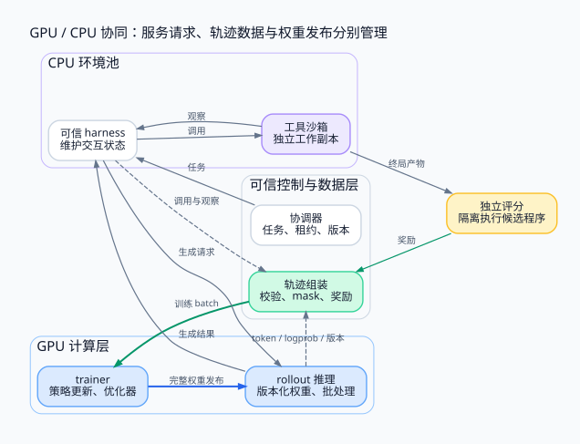

> 训练 GPU、推理 GPU 与 CPU 工具环境处理不同工作。系统设计的核心是把模型通信、权重发布、工具请求和训练数据管道分别管理，再用策略版本把它们接成一致的闭环。

<!-- more -->

**系列导航**

1. [为什么需要 Agent RL](/machine-learning/agent-rl/why-agent-rl/)
2. [从工具调用到可训练轨迹](/machine-learning/agent-rl/trajectory/)
3. [从 PPO 到 GRPO](/machine-learning/agent-rl/policy-optimization/)
4. [长轨迹上的信用分配](/machine-learning/agent-rl/credit-assignment/)
5. **GPU 训练与 CPU 环境如何协同（本文）**
6. [安全隔离与 Harness 解耦](/machine-learning/agent-rl/isolation/)
7. [跑通一个可验证的训练闭环](/machine-learning/agent-rl/minimal-experiment/)

---

## 1. 一条 Agent 轨迹为什么让 GPU 等 CPU

传统文本生成可以连续解码到结束。代码 Agent 生成一条测试命令后，往往需要等待 CPU 创建进程、读取文件、编译并执行测试，才能得到下一轮上下文。

如果让一个训练进程同步等每条工具调用，昂贵的 GPU 就可能被环境长尾拖住。但直接把所有任务异步扔出去，又会产生过期轨迹、资源耗尽、重复执行和权重版本混乱。

因此应先拆清工作，再讨论怎样并发。以下采用一个参考架构：GPU 上部署 trainer 与 rollout 推理服务，CPU 上部署可信 harness worker 和独立工具沙箱，评分服务独立管理。逻辑上分开不等于物理上必须使用三套集群；小规模可以共享机器或分时使用 GPU。



## 2. 六个组件各持有什么

| 组件 | 职责与持有的数据 |
|---|---|
| 任务协调器 | 任务队列、预算、租约、重试、rollout / attempt 标识 |
| rollout 推理服务 | 某个版本的模型权重、生成批处理与 KV cache |
| 可信 harness worker | 消息历史、工具调用状态机、模型接口适配 |
| 工具沙箱 | 单条轨迹的可写工作区与不可信进程 |
| 评分服务 | 私有检查定义、产物验收、受控的验证执行 |
| trainer 与数据管道 | 轨迹校验、优势与损失、优化器状态、权重发布 |

工具不一定只用 CPU；浏览器、图形任务或机器学习工具也可能需要 GPU。本文的 CPU / GPU 分工是代码修复场景的常用起点，不是 Agent 的理论限制。

可信 harness 与工具沙箱也不宜简单等同成一个容器。运行任意 shell 的沙箱，不应顺带持有推理服务的长期凭证。第六篇会专门解释这条边界。

## 3. 第一类通信：训练 GPU 之间

模型训练内部根据并行方式产生不同通信：

- 数据并行通常涉及梯度的 all-reduce，或与分片优化器结合的 reduce-scatter / all-gather。
- 张量并行在模型层内交换部分计算结果，对延迟与带宽较敏感。
- 流水线并行在阶段之间传递激活及其反向梯度。
- 参数与优化器分片需要按实现收集、释放或交换分片。

NCCL、NVLink、InfiniBand / RoCE 等出现在这一层。拓扑和并行组应与通信模式匹配：把频繁通信的分片放在哪些 GPU 上，比简单增加节点数量更有意义。

推理服务也可能使用张量并行，但它的通信组与 trainer 不一定相同。**CPU 工具集群无需加入梯度集合通信，才能调用一个 GPU 推理服务。**

## 4. 第二类通信：trainer 向 rollout 发布权重

trainer 的参数会变化，rollout 需要明确使用哪个版本采样。权重传输可以通过 checkpoint、直接设备通信或其他机制实现，关键是版本与可见性的契约。

一个容易验证的初始协议是：

```text
1. trainer 完成版本 v 的更新，生成带摘要的权重清单
2. rollout 加载到备用实例或停止接收新任务后加载
3. rollout 校验完整性，确认 tokenizer / 模型配置兼容
4. 服务报告 READY(v)
5. 协调器开始把新轨迹绑定到 v
6. 旧版本轨迹完成后，释放旧实例
```

同一组参数不能一边覆盖一边用于生成。否则“policy_version=v”只是标签，实际采样却可能混合多个版本。原子发布指完整模型在逻辑上同时变得可用，不要求底层字节在同一时刻传输。

最简单的设计让整条轨迹固定一个策略版本。保留多个版本会增加显存压力，也可以在更新前等待旧轨迹结束，代价是同步停顿。

若允许一条轨迹中途换版本，就要记录每个生成片段的真实行为分布，并重新审视算法对这种轨迹的假设；不能只在最后写一个最新版本号。

## 5. 第三类通信：harness 与推理服务

这通常是 HTTP、gRPC 或其他服务 RPC。harness 提交上下文，推理服务返回生成结果；工具执行在 CPU 侧继续进行。

训练侧常需要生成 token ID、对应 logprob 和实际权重版本。但这些数据不应因此进入模型可见的消息：

```text
模型可见：任务、历史助手动作、工具观察
harness 使用：结构化工具调用、结束原因
训练侧旁路：token IDs、behavior logprobs、权重版本、采样配置
```

可以让推理代理为每次调用分配 `request_id`，把返回结果交给 harness，同时把元数据写到轨迹收集器。这样 harness 的业务接口不需要理解 GRPO 的 group、优势或优化步数。

服务需要区分排队超时、生成超时、客户端取消与真正的模型结束。工具返回很长时，要明确截断规则；生成端与训练端必须使用相同的上下文重建规则。

连续批处理有助于让等待工具的轨迹腾出生成容量。但 KV cache 如何保留、丢弃或迁移，受推理引擎和内存预算约束。大量长上下文会占满显存，不能只按并发请求数量规划容量。

## 6. 第四类通信：轨迹、奖励与训练 batch

大文本日志与补丁可进入对象存储，队列消息传递索引与状态。每条事件至少能关联到：

```text
task_id → rollout_id → attempt_id → tool_call_id / request_id
                              ↘ policy_version
                              ↘ environment_version
                              ↘ verifier_version
```

训练数据组装器等待轨迹结束与评分到齐，检查记录完整性，再决定是否进入 batch。不能将两次重试的前半段、后半段拼成一条看似成功的轨迹。

一个明确的状态机可以是：

```text
PENDING → LEASED → RUNNING → ARTIFACT_READY → SCORED → ACCEPTED
                      ↘ INFRA_FAILED / CANCELLED
```

租约超时后允许重领任务，但要使用新的 attempt 标识；旧 worker 的迟到结果应按规则拒收。队列的至少一次投递并不等于工具副作用恰好执行一次。

`edit` 与外部 API 调用尤其要谨慎。可重复的文件替换可以校验前置摘要；不可确认状态的执行中断，可能需要销毁环境并重启整条轨迹。业务工具若支持幂等键，应沿调用链传递。

## 7. 先做同步，再明确异步放宽了什么

同步版本先固定一批策略采样，等待评分，更新若干步，再发布新模型。它容易检查行为概率与数据来源，但会等待最慢的环境。

异步版本让采样与更新重叠，提高资源利用率，同时引入样本陈旧。接收规则可以包含策略版本差、墙钟年龄、概率比率分布与训练目标要求。

例如配置 `max_policy_lag = 2` 只是一个待验证的工程选择，不是普遍安全阈值。即使版本只差一步，大更新也可能产生很大分布变化；相反，多次很小的更新未必立刻不可用。

PPO / GRPO 的局部概率比率不保证修复所有 off-policy 问题。应先限制陈旧度，监控有效梯度与评估结果，再逐步放宽并发，避免以吞吐提升掩盖学习质量下降。

## 8. 容量规划需要看等待在哪里

在稳定负载的近似下，Little 定律给出：

```text
在途任务数 ≈ 任务到达率 × 平均停留时间
```

假设工具请求每秒到达 20 次，平均占用沙箱 5 秒，那么仅覆盖平均服务需求就需要约 100 个在途槽位；真实配置还要考虑尾延迟、突发与资源差异。这是估算示例，不是实测集群指标。

增加环境并发后，如果瓶颈转移到推理端，再增加 CPU 只会让队列变长。若 GPU 忙于低价值或全同奖励的组，高利用率也不一定带来有效学习。

建议同时观察：

| 层面 | 指标 |
|---|---|
| 推理 | prefill / decode 吞吐、排队时延、KV 占用 |
| 环境 | 工具耗时分位数、启动成本、失败与超时率 |
| 数据 | 完整轨迹率、有效组比例、版本陈旧度、丢弃率 |
| 训练 | 优化步耗时、KL、梯度、概率比率与评估成功率 |
| 成本 | 每个验收轨迹、每个有效组、每个评估成功任务的资源开销 |

## 9. 上集群前先做哪些故障演练

主动让 worker 在工具执行后、结果写入前退出，确认系统不会悄悄重复副作用。延迟一条评分结果，检查它能否错误关联到别的 attempt。发布损坏的权重清单，确认 rollout 不会报告就绪。让一个环境无限等待，确认租约、取消和进程清理能收敛。

这些演练比先画一个巨大部署图更能证明系统契约成立。第七篇从单进程闭环开始，展示哪些条件已经验证；集群部署则沿本篇的接口扩展，而不能把单机实验当成分布式验证。

## 参考资料

- [NVIDIA NCCL 文档](https://docs.nvidia.com/deeplearning/nccl/user-guide/docs/)：GPU 集合通信与环境配置。
- [vLLM / PagedAttention](https://arxiv.org/abs/2309.06180)：推理服务的内存管理与批处理背景。
- [verl / HybridFlow](https://arxiv.org/abs/2409.19256)：大模型 RL 的计算与执行组织实例。具体配置应以所用版本文档为准。
- [Ray 架构与任务模型](https://docs.ray.io/en/latest/ray-core/walkthrough.html)：可用于协调任务与 actor 的一种选择，不是本文协议的必要依赖。


---

上一篇：[Agent RL（四）：长轨迹上的信用分配](/machine-learning/agent-rl/credit-assignment/)

下一篇：[Agent RL（六）：安全隔离与 Harness 解耦](/machine-learning/agent-rl/isolation/)

配图源文件：[Graphviz DOT](./assets/05-cluster.dot)。
