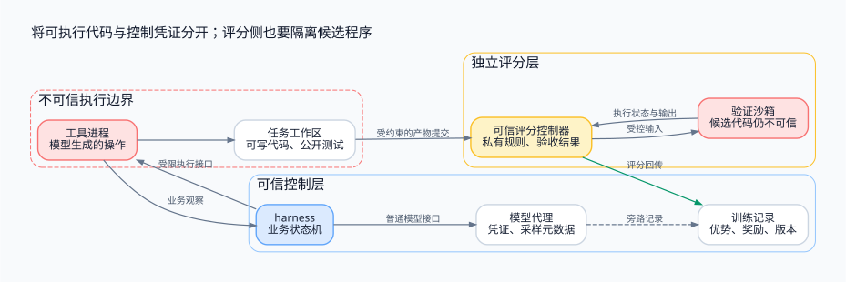

> 训练透明性需要拆成接口解耦与信息隔离。把任意代码执行、可信控制逻辑和私有评分放在明确的边界两侧，才能讨论同一个 harness 如何服务训练、评估和部署。

<!-- more -->

**系列导航**

1. [为什么需要 Agent RL](/machine-learning/agent-rl/why-agent-rl/)
2. [从工具调用到可训练轨迹](/machine-learning/agent-rl/trajectory/)
3. [从 PPO 到 GRPO](/machine-learning/agent-rl/policy-optimization/)
4. [长轨迹上的信用分配](/machine-learning/agent-rl/credit-assignment/)
5. [GPU 训练与 CPU 环境如何协同](/machine-learning/agent-rl/training-system/)
6. **安全隔离与 Harness 解耦（本文）**
7. [跑通一个可验证的训练闭环](/machine-learning/agent-rl/minimal-experiment/)

---

## 1. “不感知自己在训练”包含三个不同目标

一个运行在 CPU 容器里的 harness，可能只需要像平时一样调用模型、执行工具、组织观察。训练系统在外面记录轨迹并更新模型。这是有价值的工程目标，但表述要精确。

| 目标 | 可以怎样实现与验证 |
|---|---|
| harness 代码不依赖训练算法 | 相同业务接口接不同模型后端；训练元数据通过适配层管理 |
| 模型看不到非必要训练信息 | 控制提示词、工具输出、文件、环境变量、进程与网络的可见范围 |
| 模型绝对无法判断自己在训练 | 不能由上述措施保证；任务分布、延迟与环境特征仍可能提供线索 |

因此本文所说的训练透明性，是前两项可检查的设计目标，不是对模型内部认知的承诺。训练、评估与部署尽量复用接口，可以减少分布差异；若环境本来不同，应记录差异并评估影响。

## 2. 先明确谁是不可信的

代码 Agent 会生成补丁、shell 命令与工具参数。执行这些内容的进程可能读取环境、发起网络请求、消耗资源、修改文件或尝试干扰评分。即使没有恶意，错误代码也可能造成这些结果。

需要保护的资产包括其他任务、宿主机、训练控制面、推理服务凭证、私有测试与评分逻辑。参考设计划出三层：

1. 可信控制层：协调器、推理代理、轨迹收集器、harness 的控制部分。
2. 不可信执行层：每条轨迹的工具沙箱、可写仓库与候选程序。
3. 独立评分层：可信评分控制器，以及同样隔离的候选代码验证进程。

评分层会运行待测代码，因此也必须区分可信控制器和不可信执行进程。“这是评测容器”不是信任里面所有代码的理由。



## 3. 把 harness 控制部分与 shell 沙箱分开

如果一个容器既运行持有长期 API 密钥的 harness，又允许模型任意执行 shell，环境变量、配置文件、同用户进程信息或本地端口就可能暴露控制数据。

更清楚的设计是：harness 在可信 worker 中维护状态机；它通过受限执行接口把工具调用发送到任务沙箱。沙箱只持有当前任务需要的数据，没有 trainer、对象存储管理端或推理控制面的长期凭证。

沙箱需要访问外部服务时，可以通过可信代理提供短期、限作用域能力。代理校验任务身份、目标地址与预算，而不是把全局凭证传入工具参数。

这同时改善训练透明性：沙箱无需读取 checkpoint 路径、group id 或训练日志；harness 的业务逻辑也无需知道一次轨迹会用于 SFT、GRPO 还是仅做评估。

## 4. 同一个 harness 如何接训练与服务

可以把接口保持在业务层：

```python
class ModelClient:
    def generate(self, messages, tools, limits):
        """返回助手消息或结构化工具调用。"""

class ToolRuntime:
    def execute(self, call_id, tool_name, arguments):
        """返回工具观察，不返回优化器或奖励字段。"""
```

在训练模式下，模型代理额外写入采样 token、行为 logprob 与版本；工具事件通过可信收集器记录；产物交给验证服务，分数回到训练数据管道。部署时可换成普通模型后端，harness 仍执行同一套逻辑。

这里不是依靠一个 prompt 要求模型“忽略训练字段”。字段本来就不该出现在模型可见消息中。需要记录的关联标识可以放在传输或记录层，但也应避免被调试日志原样回显进工具输出。

公开测试结果通常属于合理的任务观察。私有评分是否反馈给 Agent，则是显式环境设计：一旦每次编辑都能查询私有分数，就已经提供了额外信息，且可能被反复试探。

## 5. 一个容器配置片段能保证什么

下面是 Linux / Kubernetes 工具 worker 的部分限制示例，省略了镜像、卷与调度配置，不能单独作为完整部署清单：

```yaml
spec:
  automountServiceAccountToken: false
  securityContext:
    runAsNonRoot: true
    runAsUser: 10001
    runAsGroup: 10001
    seccompProfile:
      type: RuntimeDefault
  containers:
    - name: tool-worker
      securityContext:
        allowPrivilegeEscalation: false
        readOnlyRootFilesystem: true
        capabilities:
          drop: ["ALL"]
      resources:
        requests:
          cpu: "1"
          memory: "1Gi"
        limits:
          cpu: "2"
          memory: "2Gi"
          ephemeral-storage: "4Gi"
```

任务工作区与临时目录需要单独的受限可写卷。还应限制进程数、执行时长和输出量，并确保终止工具时能清理整个进程组或 cgroup，而不只是启动它的父进程。

网络限制需要独立策略及实际支持它的网络实现；上述 `securityContext` 不会自动阻止出站访问。DNS、云元数据地址、集群内部服务、宿主机接口和代理旁路都应在实际沙箱中验证。

普通容器共享宿主内核，边界强度受内核与运行时影响。对更强的不可信代码威胁模型，可以采用 gVisor、microVM 等隔离机制，代价包括兼容性、启动与运行成本。必须说明选择依据，不能把任何一个组件名当成绝对安全证明。

## 6. 隐藏测试只读，为什么仍不够

只读只阻止修改。若模型能读取隐藏测试，便可以针对答案投机；若待测代码能替换测试入口、注入依赖或伪造日志，验证器本身只读也不能保证奖励可信。

一个更明确的终局验证流程是：

```text
导出补丁
  → 验证路径、大小与文件类型
  → 从可信基线创建干净工作区
  → 按规则应用补丁
  → 在独立沙箱中运行候选程序
  → 由可信控制器采集结果并评分
```

补丁检查要考虑绝对路径、`..`、符号链接和对测试入口的修改，而不只是字符串前缀。依赖锁定、启动命令和验证框架也需要来自可信配置。

可信控制器不能只解析候选程序打印的 `PASS`。应检查协议状态、真实退出信息以及测试断言。即便如此，同进程运行的候选代码仍可能干扰测试框架；条件允许时，可以把输入生成与结果判定留在外部监督进程，通过窄接口运行被测函数。

测试用例一旦传给程序执行，就可能被程序观察，不能承诺其输入在执行期间永远保密。关键是避免预先泄漏测试定义与答案、限制可见信息，并防止候选程序改写裁判。有限测试仍然只是正确性的近似，还需要独立任务与新输入评估。

## 7. 训练信息会从哪些地方泄漏

除了提示词，常见路径还有：

| 路径 | 示例 | 检查方向 |
|---|---|---|
| 文件与挂载 | `/checkpoints/step-1200`、训练配置 | 沙箱只挂载任务所需内容 |
| 环境变量 | `GRPO_GROUP_ID`、服务密钥 | 使用显式变量白名单 |
| 错误与日志 | 堆栈带出训练器地址或本地目录 | 面向模型的错误结构化，内部细节另存 |
| 进程与网络 | 可访问 trainer 端口、云元数据 | 隔离命名空间、限制出站并实测 |
| 共享缓存 | 前一个任务的补丁与答案 | 缓存内容分级，任务状态独立清理 |
| 行为差异 | 训练时工具更少、超时更短 | 记录差异，使用一致接口进行评估 |

减少偶然线索与避免凭证泄漏是具体目标。不要为了“让模型不知道”而伪造任务事实，或隐藏它完成正常工作所需的真实工具反馈。

## 8. 把边界写成可以失败的验收用例

安全与解耦需要用测试检验，而不仅是配置审查。至少应尝试：

- 在前一条轨迹写标记，后一条轨迹读不到；重试也不继承未声明的状态。
- 沙箱无法读取私有测试、训练配置与服务凭证，无法访问被禁止的控制端点。
- 修改公开测试、输出伪造成功日志、提交路径越界补丁，都不能直接获得成功奖励。
- 让候选程序死循环、创建大量子进程或产生大量日志，限制和回收能够生效。
- 将同一个任务通过训练适配器和服务适配器运行，比较模型可见请求和工具语义，说明预期差异。
- 使评分服务中断，系统将其标为验证故障，而不是给策略伪造 0 分。

第七篇的最小实验只在单进程中演示职责分离，不提供此处的安全隔离。将它扩展成执行任意代码的系统前，必须实现并验证这些边界。

## 参考资料

- [Kubernetes Security Context](https://kubernetes.io/docs/tasks/configure-pod-container/security-context/)：权限、用户身份与文件系统相关配置。
- [Kubernetes Network Policies](https://kubernetes.io/docs/concepts/services-networking/network-policies/)：网络策略的行为与适用条件。
- [gVisor 安全模型](https://gvisor.dev/docs/architecture_guide/security/)：用户态内核方案的边界与限制。
- [Firecracker](https://firecracker-microvm.github.io/)：microVM 隔离的一种实现。


---

上一篇：[Agent RL（五）：GPU 训练与 CPU 环境如何协同](/machine-learning/agent-rl/training-system/)

下一篇：[Agent RL（七）：跑通一个可验证的训练闭环](/machine-learning/agent-rl/minimal-experiment/)

配图源文件：[Graphviz DOT](https://github.com/Zqzqsb/Blog/blob/master/MachineLearning/AgentRL/assets/06-isolation.dot)。
