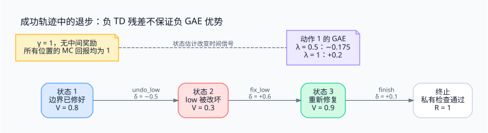

> 终局成功不能证明每一步都好。结果监督、价值基线和过程奖励提供不同的信息；任何细粒度信号都需要说明它来自哪里、何时可靠，以及会诱导什么行为。

<!-- more -->

**系列导航**

1. [为什么需要 Agent RL](/machine-learning/agent-rl/why-agent-rl/)
2. [从工具调用到可训练轨迹](/machine-learning/agent-rl/trajectory/)
3. [从 PPO 到 GRPO](/machine-learning/agent-rl/policy-optimization/)
4. **长轨迹上的信用分配（本文）**
5. [GPU 训练与 CPU 环境如何协同](/machine-learning/agent-rl/training-system/)
6. [安全隔离与 Harness 解耦](/machine-learning/agent-rl/isolation/)
7. [跑通一个可验证的训练闭环](/machine-learning/agent-rl/minimal-experiment/)

---

## 1. 成功轨迹里可以有真正的退步

第二篇的局部修复并不一定是坏动作。为了讨论信用分配，考虑一个更明确的例子：两个边界已经修好，Agent 因为误读日志又回退了正确修改，之后重新修复，最后提交成功。

```text
早期前缀：读代码，修正 low，修正 high
动作 1：undo_low，把 low = mid + 1 改回 low = mid
动作 2：fix_low，再次恢复 low = mid + 1
动作 3：finish，私有验证通过
终局奖励：1
```

与直接提交相比，`undo_low` 引入了真实缺陷和额外工作。第三篇的结果监督 GRPO 仍会给整条成功轨迹一个正优势；在这一个样本中，回退动作也受到提高概率的压力。

这不说明终局策略梯度整体上无效。对大量轨迹取期望后，真正降低成功率的选择可能与更低回报相关，从而被抑制。困难在于长轨迹、稀疏反馈和有限采样下，需要多少证据才能发现这种相关性。

## 2. 终局奖励为什么沿时间变成同一个数

定义从动作 t 开始的回报：

```text
G_t = Σ_{k=t}^T γ^(k-t) r_k
```

只有最后一步奖励为 1，中间奖励为 0，且 `γ = 1` 时：

```text
G_1 = G_2 = ... = G_T = 1
```

这三个条件缺一不可。引入折扣、工具成本、过程分数，或者把 KL 惩罚放进逐步奖励，回报就可能不再相同。

结果监督 GRPO 的优势进一步只依赖整条轨迹的奖励及同题组统计，所以同一轨迹的生成位置共享一个数。它有跨轨迹比较，却没有单独评价“刚才那一步是否让局面变坏”的状态基线。



## 3. 价值函数增加的是对未来的估计

价值函数估计从当前信息出发、继续按某个策略行动时的期望回报：

```text
Vπ(h_t) = Eπ[G_t | h_t]
A_t^MC = G_t - V(h_t)
```

Agent 处于部分可观察环境时，critic 常以历史或其表示作为输入；它不一定拥有完整仓库状态。给 critic 额外的环境信息也是一种设计选择，需要说明这种信息在训练阶段如何取得。

即使同一条成功轨迹的 `G_t` 都等于 1，不同位置的 `V(h_t)` 不同，优势幅度也会不同。但在奖励只有 0/1、价值估计位于 `[0,1]` 的情况下，`1 - V(h_t)` 不会变成负数。

因此，“有 critic”不能直接推出“这条成功轨迹中的坏动作一定被惩罚”。还要看使用何种优势估计，以及估计是否可靠。

## 4. 用一个数值例子理解 TD 与 GAE

设上面的三个动作之前，critic 分别给出如下估计；终止状态价值为 0：

| 动作 | 当前价值 | 动作后价值 | 即时奖励 |
|---|---:|---:|---:|
| `undo_low` | 0.8 | 0.3 | 0 |
| `fix_low` | 0.3 | 0.9 | 0 |
| `finish` | 0.9 | 0 | 1 |

这些数字用于演算，不是声称训练好的 critic 必然给出这些值。取 `γ = 1`，TD 残差为：

```text
δ_t = r_t + γ V(h_{t+1}) - V(h_t)

δ_1 = 0 + 0.3 - 0.8 = -0.5
δ_2 = 0 + 0.9 - 0.3 =  0.6
δ_3 = 1 + 0   - 0.9 =  0.1
```

GAE 将后续残差按 `γλ` 加权累加：

```text
A_t^GAE = δ_t + γλ δ_{t+1} + (γλ)^2 δ_{t+2} + ...
```

对第一个动作：

```text
λ = 0：A_1 = -0.5
λ = 0.5：A_1 = -0.5 + 0.5×0.6 + 0.25×0.1 = -0.175
λ = 1：A_1 = -0.5 + 0.6 + 0.1 = 0.2 = 1 - 0.8
```

负的局部 TD 残差没有保证最终 GAE 也为负。较小 λ 更依赖局部价值估计，较大 λ 更多使用实际后续回报。critic 不准时，局部信号可能带来偏差；最终成功的偶然性又会增加长回报估计的方差。

此外，本文按工具边界解释 TD，LLM 实现可能按 token 定义 critic 与时间步。两者需要明确映射，不能把工具步骤优势直接复制成所谓唯一正确的 token 级公式。

## 5. 过程奖励改变的是目标本身

另一条路线是不训练 critic，直接在中间步骤给奖励。例如规定 `undo_low` 产生 `-0.2`，最后提交成功产生 `1`，其他奖励为零：

```text
G_1 = -0.2 + 1 = 0.8
G_2 = G_3 = 1
```

这样确实区分了位置，但回退动作的回报仍然为正；在没有基线的 REINFORCE 示例中，它仍可能被鼓励，只是幅度更小。之前的所有动作也会承受这项负奖励，过程分数并不会自动定位唯一责任动作。

更根本的问题是，谁知道 `undo_low` 错了？在这个小例子里可以检查固定代码模式；在大型仓库中，“修改是否朝正确方向前进”本身就是难题。

可用信号包括编译检查、类型错误变化、经过验证的子目标，以及模型过程评分。它们各有盲点：编译通过不代表功能正确，修改指定文件不代表修复了 bug，裁判模型也可能偏爱看起来完整的解释。

## 6. 为什么“测试失败就扣分”可能适得其反

执行测试能暴露缺陷。若每次出现失败日志都扣分，策略可能减少测试、只运行容易通过的子集，或者在尚未验证时提交。训练奖励改善了，实际可靠性却可能下降。

比较两条轨迹：

```text
A：修改 → 测试失败 → 定位问题 → 再修 → 通过
B：修改 → 不测试 → 直接提交
```

如果 A 因为主动发现问题而持续受罚，奖励就把可观测性与任务失败混在了一起。应明确想惩罚的是最终缺陷、资源浪费，还是实际有害的状态变化。

在满足标准 MDP 假设等条件时，势函数塑形：

```text
r'_t = r_t + γ Φ(s_{t+1}) - Φ(s_t)
```

可以在适当终止条件下保留最优策略，同时提供更密集的信号。有限回合中需处理终止势函数，且如何构造有用的 `Φ` 仍是核心困难。随便给一个“看起来进步了”的分数，不自动拥有这个性质。

## 7. 还可以通过分支采样获得什么信息

对同一个中间状态保存快照，然后尝试不同动作，继续采样到结束，可以比较这些动作的后续回报。这比仅比较整条轨迹更接近局部动作价值。

代价是环境必须可恢复，随机性需要控制，且每个前缀会产生更多 rollout。浏览器会话、外部 API、后台进程和时间敏感数据，未必能像本地仓库一样可靠回放。

也可以将任务拆成具有真实验收条件的子目标，或先用示范训练恢复行为。这些手段增加了可学习信息；只增大 group size 则主要增加同题完整轨迹的样本量，并不会凭空产生步骤标签。

## 8. 信用分配与样本陈旧是两个问题

异步系统可能用旧权重采到一条长轨迹，等它回来时 trainer 已经更新数次。概率比率与裁剪处理的是行为分布和当前策略之间的差异；优势解决的是动作值得怎样更新。

精确的 token 比率并不能自动纠正所有历史状态分布偏移。部分可观察环境、混合策略版本、样本筛选和严重陈旧，都需要额外考虑。更不能期待增加更新次数，就让一个轨迹级常数突然具有时间分辨率。

选择方法时应先问：缺少的是采样数量，可信的步骤反馈，还是对未来回报的估计？答案不同，需要的工程投入也不同。

## 参考资料

- [GAE](https://arxiv.org/abs/1506.02438)：TD 残差的加权累加与偏差、方差权衡。
- [DeepSeekMath](https://arxiv.org/abs/2402.03300)：结果监督与过程监督的不同优势构造。
- [Policy invariance under reward transformations](https://www.cs.utexas.edu/~pstone/Papers/Reading/NgHaradaRussell99.pdf)：势函数奖励塑形的条件与性质。
- [Concrete Problems in AI Safety](https://arxiv.org/abs/1606.06565)：奖励投机等问题的系统性讨论。


---

上一篇：[Agent RL（三）：从 PPO 到 GRPO](/machine-learning/agent-rl/policy-optimization/)

下一篇：[Agent RL（五）：GPU 训练与 CPU 环境如何协同](/machine-learning/agent-rl/training-system/)

配图源文件：[Graphviz DOT](./assets/04-credit.dot)。
