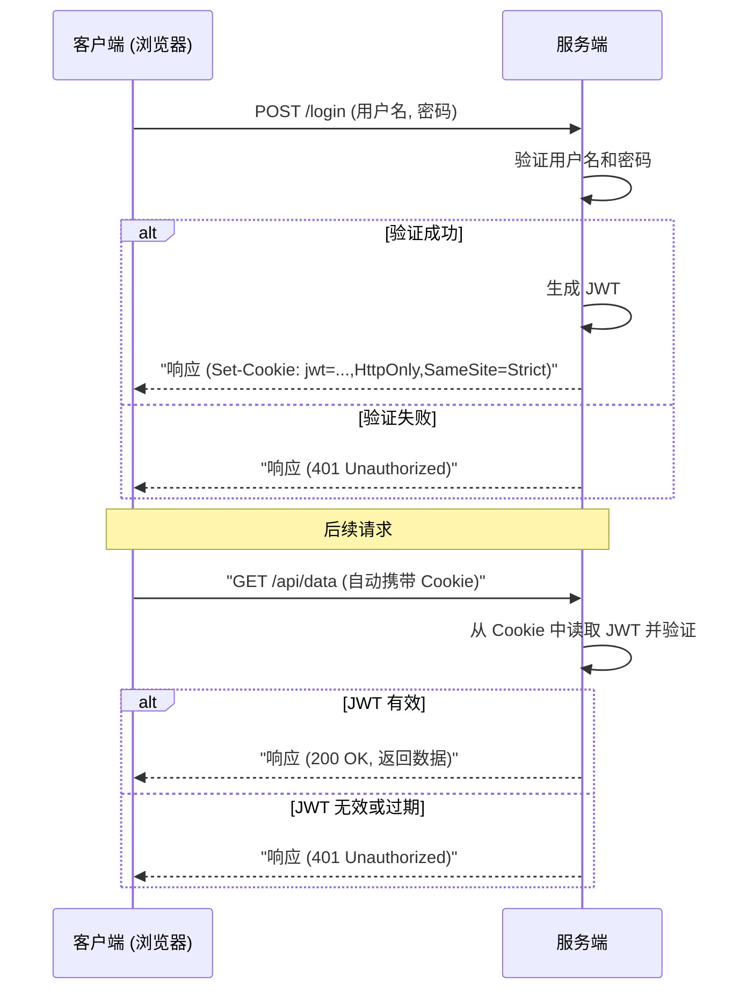

`JWT`实现了服务器侧的无状态，一种用于在网络应用场景中安全地传输声明的开放标准（RFC 7519）。它可以用于身份验证、授权信息传递或信息加密传输等场景。

<!-- more -->

## 基本结构

一个典型的 JWT 字符串用“`.`”分隔成三部分：

```
header.payload.signature
```

### **Header**：描述 JWT 的元数据，通常包含两部分信息：

1. 算法（`alg`）：签名或加密的算法，如 `HS256`（HMAC-SHA256）或 `RS256`（RSA-SHA256）。
2. 类型（`typ`）：通常为 `"JWT"`。

### **Payload**：实际的“声明”或“负载”数据，包含一系列键值对，例如用户ID、发行时间、过期时间等。

- **常见的标准字段**（RFC 7519 定义了部分字段）：
    - `iss` (Issuer): 签发者
    - `sub` (Subject): 面向的用户
    - `aud` (Audience): 接收方
    - `exp` (Expiration Time): 过期时间
    - `nbf` (Not Before): 在此时间之前不可用
    - `iat` (Issued At): 签发时间
    - `jti` (JWT ID): 唯一标识
- 也可以添加自定义字段（如 `user_id`, `role` 等）。

### **signature**：用于保证数据完整性，并验证 **Header** 和 **Payload** 未被篡改。

- 首先将 `header` 和 `payload` 分别进行 Base64URL 编码，然后按以下方式生成签名：

```
signature = HMAC-SHA256(base64UrlEncode(header) + "." + base64UrlEncode(payload), secret_key )
```

如果使用的是对称加密算法，如 HS256，就需要客户端和服务端使用同一个 `secret_key`。  
如果是非对称算法（如 RSA），会使用**私钥**进行签名、用**公钥**验证签名。

将这三部分用“`.`”拼接在一起，就构成了一个完整的 JWT 字符串，例如：

```
eyJhbGciOiJIUzI1NiIsInR5cCI6IkpXVCJ9
.eyJ1c2VyX2lkIjoxMjMsInJvbGUiOiJhZG1pbiIsImlhdCI6MTY3MDIxMTgxMiwiZXhwIjoxNjcwMjE1NDEyfQ
.4mfAAg77YRqHz9u7f1oyWR-Ar4qnGoxc6Moav8-jkCM
```

对应的明文解码示例如下：

**Header**
```json
{
  "alg": "HS256",
  "typ": "JWT"
}
```

**Payload**
```json
{
  "user_id": 123,
  "role": "admin",
  "iat": 1670211812,
  "exp": 1670215412
}
```

### 总结

`jwt`的信息部分是明文传输的，包含一个对于信息的校验码。

## 使用场景

###  身份验证

- 用户登录成功后，服务端生成一个带有用户信息（如 user_id, role 等）的 Token，返回给客户端。
- 客户端在后续请求中，通常把 Token 放在 `Authorization: Bearer <token>` 头里发送给服务端。
- 服务端通过验证签名和检查 `exp`（过期时间）等字段来确定 Token 是否有效，并解析出用户身份。

### 信息传输

- 有时 JWT 可用于安全地传递某些信息（比如在微服务之间），确保对方能验证数据真实性。
- 但要注意**JWT 一般不可随意存放敏感数据**，因为在没有额外加密情况下，任何人都可以解码（Base64URL 解码）看到 `payload` 内容；JWT 主要保证**完整性**，而非**机密性**。

### 分布式系统或无状态认证

- 使用 JWT，可以在服务端不保存会话状态（无需 Session），每次客户端都带上 Token，服务端只要验证 Token 是否正确并未过期即可。
- 减少了服务端维护 Session 的负担，适合分布式部署或微服务架构。

## 劣势

- **难以主动失效**
    
    - JWT 签发后，一般在到期前都是有效的，如果用户想要注销或服务器需要强制失效 Token，需要额外的策略，比如维护一个“黑名单”或在发行时引入可回收机制。
    
- **Payload 明文可读**
    
    - 标准 JWT 如果不做加密，任何人都可 Base64 解码查看 Payload，因此**不要**把敏感信息（如密码、银行信息等）直接放在 Token 里。
    
- **Token 一旦泄露**
    
    - 如果 Token 在未过期之前被攻击者获取，且没有办法主动失效，就会导致被盗用。

## 前端存储

Web 前端通常把 Token 存在 `LocalStorage` 或 `HttpOnly Cookie` 中。两者各有优劣，但**推荐使用 `HttpOnly Cookie`**，因为它能更好地防御 XSS 攻击。

### LocalStorage

-   **优点**:
    -   通过 JavaScript (`localStorage.setItem()`, `localStorage.getItem()`) 轻松访问和管理。
    -   容量较大（通常为 5-10MB）。
-   **缺点**:
    -   **容易受到 XSS (跨站脚本) 攻击**。如果网站存在 XSS 漏洞，攻击者可以执行恶意脚本，读取并窃取 `LocalStorage` 中的所有数据，包括 JWT。这是其最致命的弱点。
    -   每次请求都需要手动将 Token 添加到请求头（例如 `Authorization: Bearer <token>`）。

### HttpOnly Cookie

-   **优点**:
    -   **更安全**。设置了 `HttpOnly` 标志的 Cookie 不能通过 JavaScript 访问，可以有效防止 XSS 攻击窃取 Token。
    -   浏览器会自动将 Cookie 附加到所有对同源服务器的请求中，无需手动处理。
-   **缺点**:
    -   **可能受到 CSRF (跨站请求伪造) 攻击**。因为浏览器会自动发送 Cookie，攻击者可以诱导用户在其他网站上点击一个链接，向你的应用发送恶意请求。可以通过设置 `SameSite` 属性（如 `Strict` 或 `Lax`）来有效缓解 CSRF 攻击。
    -   默认不能跨域使用（除非进行复杂的 CORS 配置）。

### 使用拦截器自动携带 Token (LocalStorage 方案)

当您选择将 JWT 存储在 `LocalStorage` 时，浏览器不会像处理 Cookie 那样自动在每个请求中携带它。因此，您需要在前端代码中手动将其附加到每个需要认证的 API 请求上。为了避免在每个请求函数中重复编写相同的代码，最佳实践是使用 HTTP 客户端库（如 `axios`）的 **请求拦截器 (Request Interceptor)**。

拦截器会在每个请求被发送到服务器之前“拦截”它，让您有机会修改请求配置，例如添加 `Authorization` 请求头。

下面是一个使用 `axios` 设置请求拦截器的示例：

```javascript
import axios from 'axios';

// 1. 创建一个 axios 实例
const apiClient = axios.create({
  baseURL: 'https://api.example.com', // 你的 API 基础 URL
});

// 2. 设置请求拦截器
apiClient.interceptors.request.use(
  config => {
    // 从 LocalStorage 中获取 token
    const token = localStorage.getItem('jwt_token');

    // 如果 token 存在，则将其添加到请求头中
    if (token) {
      config.headers.Authorization = `Bearer ${token}`;
    }

    return config; // 返回修改后的配置
  },
  error => {
    // 处理请求错误
    return Promise.reject(error);
  }
);

// 3. 使用配置好的 axios 实例发起请求
// 现在所有通过 apiClient 发起的请求都会自动携带 Authorization 头
export const fetchUserData = () => {
  return apiClient.get('/user');
};

export const updateProfile = (data) => {
  return apiClient.post('/profile', data);
};
```

通过这种方式，您只需在项目入口处配置一次拦截器，所有后续的 API 请求就都能自动完成 Token 的携带，极大地简化了代码并提高了可维护性。

### 总结与交互图

综合来看，`HttpOnly Cookie` 结合 `SameSite` 属性是存储 JWT 的最佳实践。下面是使用 `HttpOnly Cookie` 进行身份验证的前后端交互流程图：



## 中间件实现

- 以 `golang-jwt/v5` 来说明 `jwt` 工具的核心方法。

```go
package utils

import (
	"errors"
	"time"

	"github.com/golang-jwt/jwt/v5"
	"github.com/google/uuid"
)

// Claims 结构定义了 JWT 的载荷（Payload），包含了自定义的数据和标准的注册声明。
type Claims struct {
	UserID uuid.UUID `json:"user_id"` // 自定义声明：用户ID
	Email  string    `json:"email"`   // 自定义声明：用户邮箱
	jwt.RegisteredClaims             // 嵌入标准声明，如 iss (issuer), exp (expiration time), sub (subject) 等
}

// GenerateToken 生成一个新的 JWT。
// userID: 用户唯一标识
// email: 用户邮箱
// secret: 用于签名的密钥
// expireHours: Token 的有效时间（小时）
func GenerateToken(userID uuid.UUID, email string, secret string, expireHours int) (string, error) {
	// 创建 Claims，包含自定义数据和过期时间
	claims := Claims{
		UserID: userID,
		Email:  email,
		RegisteredClaims: jwt.RegisteredClaims{
			// 设置过期时间
			ExpiresAt: jwt.NewNumericDate(time.Now().Add(time.Hour * time.Duration(expireHours))),
			// 设置签发时间
			IssuedAt:  jwt.NewNumericDate(time.Now()),
		},
	}

	// 使用指定的签名方法（HS256）和 Claims 创建一个新的 Token 实例
	token := jwt.NewWithClaims(jwt.SigningMethodHS256, claims)

	// 使用提供的密钥对 Token 进行签名，生成最终的 Token 字符串
	return token.SignedString([]byte(secret))
}

// ParseToken 解析并验证一个 JWT 字符串。
// tokenString: 待解析的 JWT
// secret: 用于验证签名的密钥
func ParseToken(tokenString string, secret string) (*Claims, error) {
	// 解析 Token。它需要三个参数：
	// 1. token 字符串
	// 2. 一个空的 Claims 结构体实例，用于填充解析出的数据
	// 3. 一个 Keyfunc 回调函数，用于提供验证签名的密钥
	token, err := jwt.ParseWithClaims(tokenString, &Claims{}, func(token *jwt.Token) (interface{}, error) {
		// 在回调函数中，返回用于签名的密钥
		// 在实际应用中，这里可能需要根据 token 的 header（例如 `alg` 字段）来选择不同的密钥
		return []byte(secret), nil
	})

	// 处理解析过程中可能发生的错误（例如，token格式错误、签名无效等）
	if err != nil {
		return nil, err
	}

	// 验证 Token 是否有效，并从 Token 中提取 Claims
	if claims, ok := token.Claims.(*Claims); ok && token.Valid {
		// 如果 token.Claims 能成功转换为 *Claims 类型，并且 token.Valid 为 true，则表示 Token 有效
		return claims, nil
	}

	// 如果 Token 无效，则返回错误
	return nil, errors.New("invalid token")
}
```
