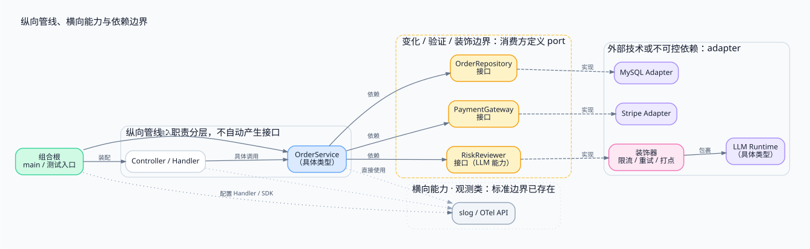

> 分层架构常被默认理解为「层与层之间都该用接口隔开」：controller、service、adapter 每层配一对 interface + impl。这篇从两个实践中的真实困惑出发——接口限制了 adapter 的能力演进、单 adapter 下改动扩散——重新审视接口的位置：**接口标记的是需要隔离、替换或控制变化的依赖边界，而不是层次结构**。数据库、第三方 API、时钟和随机数是常见边界；同一进程内的模块如果有独立替换、维护或测试隔离的需要，也可以使用接口。

<!-- more -->

本文讨论 Go 应用内部的依赖设计，重点是业务代码与技术实现之间的关系；公共 SDK、插件框架和库作者设计公开 API 时，还需要单独考虑版本兼容与扩展策略。

---

## 1. 两个来自实践的困惑

> 痛点不是「接口没用」，而是接口被放在了不需要它的位置上。

一个常见的 Go 后端分层是 `controller → service → adapter`：handler 负责协议解析，service 承载业务逻辑，adapter 包装数据库、缓存、第三方 API。按照「分层就该解耦」的直觉，每层之间都会放一个接口，service 依赖 `OrderRepository` 接口，handler 依赖 `OrderService` 接口。

这套写法在实际维护中会撞上两个具体问题。

**痛点一：把接口误当成 adapter 的完整能力目录。** service 出于自己的需要，定义了一个窄接口：

```go
type Notifier interface {
    Notify(userID, msg string) error
}
```

而 adapter（比如一个邮件客户端）的能力会自然增长：模板、附件、批量发送、返回 messageID 用于追踪。但接口只暴露了 `Notify` 一个方法。这里不一定是接口成了天花板：一个 port 本来就只应该表达当前消费者需要的契约。真正的问题是，如果业务确实需要新能力，却试图让原来的接口代表 adapter 的全部能力。

**痛点二：单实现且没有替换需求时，改动被放大。** 项目里只有一种通知方式时，改一处发邮件的逻辑，直接使用具体类型通常更简单；如果再加一层接口，就要承担定义、构造和阅读跳转的成本。此时接口带来的替换能力没有真实消费者，成本却已经发生。

这两个痛点指向同一个误解：**把「分层」当成了抽接口的理由**。分层是职责划分，接口是依赖管理，两件事的重叠没有直觉中那么大。

## 2. 接口在解决什么问题：依赖方向

> 先有依赖方向的问题，才有 port 和 adapter；不是先有这对名词，再往项目里套。

### 2.1 不用接口时，问题出在哪

订单服务要发通知，最直接的写法是业务代码里直接调用具体实现：

```go
func (s *OrderService) PlaceOrder(o Order) error {
    // ... 业务逻辑
    return smtp.Send(o.UserID, "订单已创建") // 依赖具体技术
}
```

问题不在于「用了 SMTP」，而在于依赖的指向：`OrderService` 的编译时依赖落在了具体技术上。换通知渠道、在测试里拦截调用，都要修改业务代码——业务逻辑被技术细节绑住了。

### 2.2 依赖倒置：接口出现在边界上

依赖倒置的处理方式是在业务一侧声明「我需要什么」，让具体实现反过来满足这个声明：

```go
// service 包：声明需要的能力
type Notifier interface {
    Notify(userID, msg string) error
}

// adapter 包：实现它
type EmailAdapter struct{ /* smtp 配置 */ }

func (e *EmailAdapter) Notify(userID, msg string) error { /* ... */ }
```

这就是六边形架构里的一对词：**Port 是边界上的抽象，描述系统需要什么；Adapter 是外部技术的包装，负责怎么给**。它们不是独立的设计目标，而是「业务不依赖具体技术」这个约束的自然产物。

按方向分，port 有两类：

| 类型 | 含义 | 例子 |
|---|---|---|
| 出站 port | 系统需要外部什么能力 | `Notifier`、`PaymentGateway`、`OrderRepository` |
| 入站 port | 外部怎么调用系统 | `PlaceOrderUseCase` |

本文讨论的主要是出站方向——绝大多数「该不该抽接口」的纠结发生在这里。

### 2.3 依赖注入管的是装配，不是方向

Port/Adapter 与依赖注入经常成对出现，但解决的是两个问题：

| | Port / Adapter | 依赖注入 |
|---|---|---|
| 解决的问题 | 依赖谁、依赖指向哪 | 对象怎么拿到它的依赖 |
| 关注点 | 架构边界 | 装配方式 |
| 层面 | 设计层面 | 实现 / 运行层面 |

业务类型只声明接口字段，谁来填这个字段，是依赖注入的事——手工 `new` 也好，容器扫描也好。没有 DI，port 照样成立；没有 port，DI 只是把具体类塞进去，解耦效果有限。两者正交，组合使用效果最好。

### 2.4 具体类不会被消灭，只会被隔离

装配代码 `new OrderService(new EmailAdapter())` 里出现了具体类，这看起来像「还是依赖了具体实现」。关键在于**出现具体类的位置**：业务类型的源码里没有 `EmailAdapter`，改实现不需要碰业务代码；具体类集中在组合根（composition root）或少数组装模块——例如 `main`、CLI 入口和测试入口。它们负责选择实现，不承载业务逻辑。

依赖倒置的目标从来不是消灭具体类——对象总得有人创建——而是把「知道具体实现」的范围压缩到组装层这一处。这也是「外部传入实现」相对「内部直接 new」的全部收益来源：创建和选择实现的权力移出业务类型之后，替换实现、测试拦截、共享实例才成为可能。

## 3. 边界与层是两回事

> 分层回答「代码放在哪」，接口回答「依赖谁」。接口的位置由依赖关系决定，不由层次结构决定。

「层」是职责划分：controller 管协议，service 管业务，adapter 管技术对接。层之间的调用关系本身不会自动产生接口需求；但同一进程内的包边界、团队边界或插件边界，也可能带来独立替换和测试隔离的需要。

「边界」是变化、所有权或控制能力发生差异的地方：数据库会换、第三方 API 会变会挂、时钟和随机数在测试里必须可控。**跨出这类边界是抽接口的强信号，但不是唯一条件，也不是自动命令。**



- controller → service 之间没有接口，handler 直接依赖具体的 `*OrderService`：同一进程内、单一实现、无替换需求。
- service → adapter 之间有接口：这里跨出了「业务 ↔ 外部技术」的边界，接口隔离的是外部实现的变化。
- 组合根在图的最上方，负责同时装配 service 和两个具体 adapter；测试或其他启动方式也可以有自己的组合根。

按这个标准，一张实用的判断表：

| 依赖位置 | 是否抽接口 | 原因 |
|---|---|---|
| controller → service | 通常不抽 | 同一应用、单一实现、无独立替换需求 |
| service → repository | 候选 | 测试隔离、存储替换或包所有权边界 |
| service → 第三方 API | 候选 | 测试隔离、外部变化或失败控制 |
| service → clock / random | 候选 | 测试需要控制非确定性 |
| service → 领域对象 | 不抽 | 纯内存，无替换概念 |
| adapter → 具体驱动库 | 不抽 | 已经在实现里，再包一层没有意义 |

核心原则一行：**跨出变化或控制边界时优先评估接口；分层本身既不是充分条件，也不是必要条件。**

## 4. 两个痛点的再解释

> 痛点不是模式本身错了，而是接口放错了位置、定义错了方向。

用「边界，不是分层」回看第 1 节的两个痛点，成因都能定位出来。

**痛点一的根源是把一个消费者的 port 当成了实现的完整目录。** 解法不是把接口做大——「接口越大，抽象越弱」——而是让接口定义在消费方、只包含消费方真正需要的最小集。adapter 的额外能力留在具体类型上；如果业务确实需要其中一项能力，就在消费方定义一个新的窄接口，而不是让业务直接依赖 `EmailAdapter`：

```go
type TemplateNotifier interface {
    NotifyTemplate(userID, template string) error
}
```

同一个 adapter 可以满足多个消费者接口，业务代码仍然只依赖自己声明的能力。

**痛点二（单实现改动扩散）的根源是抽象没有对应的变化轴。** 接口的主要收益来自替换、隔离和控制变化。没有这些需求时，间接层的成本（多一处定义、多一层跳转、改动扩散）可能超过收益；这时可以删掉接口，回到具体类型。

## 5. Go 的解法：接口后置，定义在消费方

> Go 的隐式实现允许「先写具体类型，需要时再抽接口」，把抽象的决策推迟到有真实需求的那一刻。

### 5.1 隐式实现改变了抽象的成本结构

Java 里接口与实现的关系需要显式声明（`implements`），先写实现再补接口要动实现的源码。Go 的接口是隐式满足的：只要方法签名匹配，任何类型自动满足任何接口，实现方完全不知道接口存在。

```go
// 先有具体类型
type EmailSender struct{ /* smtp 配置 */ }

func (e *EmailSender) Notify(userID, msg string) error { /* ... */ }

// 后有接口：EmailSender 一行不改，自动满足
type Notifier interface {
    Notify(userID, msg string) error
}
```

这带来了与其他语言不同的最优路径：**抽象可以后置**。先写具体类型，等测试需要拦截、或第二个实现真的出现时，再在消费方定义接口，实现零改动。

### 5.2 三条配套惯例

```go
// 惯例一：接口定义在消费方（order 包内），只含自己需要的
package order

type Notifier interface {
    Notify(userID, msg string) error
}

// 惯例二：额外能力留在具体类型上，不进接口
func (e *EmailSender) NotifyWithTemplate(userID, tpl string) error { /* ... */ }
func (e *EmailSender) NotifyBatch(msgs []Msg) error        { /* ... */ }

// 惯例三：接口尽量小——一个方法的接口优于五个方法的接口
```

- 接口跟着消费者走，消费者需要什么就声明什么；新消费者可以声明更小的接口，同一实现满足多个接口。
- adapter 不被接口封顶：能力增长发生在具体类型上，不影响既有接口。
- 小接口天然规避了「大接口绑架双方」的问题。

### 5.3 一条被需求推动的演进路径

```go
// 阶段 1：只有一个实现，直接用具体类型
type Service struct {
    sender *EmailSender
}

// 阶段 2：测试需要拦截，在 order 包内抽接口
type Notifier interface {
    Notify(userID, msg string) error
}
// EmailSender 自动满足，无需改动

// 阶段 3：第二个实现真的出现了，在组合根选择
var notifier Notifier = &EmailSender{}
if cfg.UseSMS {
    notifier = &SmsSender{}
}
svc := NewService(notifier)
```

三个阶段里，抽象每一步都是被具体需求（测试替换、多实现）触发的，而不是预先设计的。完整的组装关系是：controller 依赖具体的 `*order.Service`，service 依赖自己包内定义的接口，adapter 实现接口，`main` 负责把具体 adapter 注入进来。在这个示例中，接口出现在 service → adapter 这一依赖上；其他项目也可能在进程内模块之间设置真实的替换边界。

## 6. 什么时候值得抽接口

> 判断接口是否值得评估，要看有没有真实的变化轴，以及隔离收益是否超过复杂度。有三个问题可以问。

1. 它有具体的替换场景吗——现在有，或有明确而非想象中的将来需求？
2. 测试时需要隔离它吗——外部服务、时钟、随机数通常更需要控制；数据库则要结合测试策略判断？
3. 它跨越了变化、所有权或控制边界吗——依赖的是进程外或由另一团队维护的东西？

三个都是「否」，通常不抽；有一个「是」，它只是接口候选，还要比较隔离收益与维护成本。

对应的反面形态是过度设计：只有一个实现却配了 `UserService` + `UserServiceImpl` 的接口对，内部纯函数之间的调用也隔一层抽象。这种写法的成本是真实的（多一层间接、阅读跳转、改动扩散），收益是假想的（「将来可能换」在多数项目里不会发生）。业界的反思——Java 社区对 interface 爆炸的批评、YAGNI、「宁可重复，也别过早抽象」——针对的都是同一件事：把手段（接口）当成了目的（好架构）。

Port / Adapter 是解决依赖方向问题的工具，不是项目的默认配置。有依赖方向的问题才需要它；没有问题时，它本身就是问题。

## 7. 小结

- 分层是职责划分，接口是依赖管理；「分了层」不是抽接口的理由，变化、替换和控制边界才是判断依据。
- 外部依赖通常是接口候选；进程内的模块如果有独立替换、维护或测试隔离需求，也可以抽接口。
- 具体类不会被消灭，只会被集中隔离：组合根或少数组装模块知道具体实现，业务源码只认识自己需要的接口。
- 在 Go 里，隐式实现让抽象可以后置：先写具体类型，测试或第二实现出现时再在消费方定义小接口，实现零改动。
- 判断接口去留的标准是有没有真实的变化轴，以及接口收益是否超过维护成本；三者皆无时，接口通常就是负资产。

一句话：**接口标记的是需要隔离或替换的边界，不是层标记；分层不自动要求接口，跨边界也仍需衡量成本。**

## 参考资料

- [Go Proverbs (Rob Pike)](https://go-proverbs.github.io/)："The bigger the interface, the weaker the abstraction." 等一组关于接口粒度的谚语。
- [Go Wiki: Code Review Comments](https://go.dev/wiki/CodeReviewComments)：官方评审建议中关于接口的部分，对应「accept interfaces, return structs」的社区惯例。
- [Alistair Cockburn, Hexagonal Architecture](https://alistair.cockburn.us/hexagonal-architecture/)：Port / Adapter 的原始定义——端口是边界的抽象，适配器在边界外。
- [Mark Seemann, Composition Root](https://blog.ploeh.com/2011/07/28/CompositionRoot/)：组合根概念——装配应集中在应用唯一入口处。
- [Robert C. Martin, The Dependency Inversion Principle](https://staff.cs.utu.fi/~jouns/mit/introductionDIP.htm)：依赖倒置原则的原始论述。

配图源文件：[Graphviz DOT](https://github.com/Zqzqsb/Blog/blob/master/Programming/Go/assets/interface-boundary.dot)。
