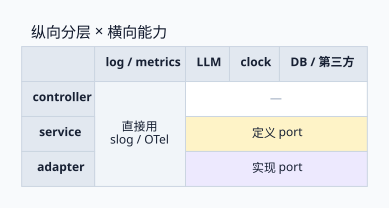

> 代码越来越多由 agent 生成之后，「写代码」不再是架构需要节省的主要成本；定位代码、验证行为、评审 diff、控制改动范围变得更贵。这篇从这个成本变化出发，把项目看成**纵向管线**（controller → service → adapter）与**横向能力**（log、metrics、LLM、agent）交织的矩阵，比较几种常见接口做法各自带来什么，再给出一条相对稳的路径：**分层决定代码放在哪，接口只标记需要隔离、替换、验证或装饰的依赖边界。**

<!-- more -->

本文讨论 Go 应用内部的依赖设计，重点是业务代码与技术实现之间的关系；公共 SDK、插件框架和库作者设计公开 API 时，还需要单独考虑版本兼容与扩展策略。

---

## 1. 代码便宜之后，什么变贵了

> 架构的评价标准跟着成本结构走。写代码变便宜，读、验、审、改的成本就成了主要约束。

「每层都预留接口」这类做法背后，有一个传统论证：**以后再改很贵，所以现在先留扩展点**。这个论证成立的前提是：修改代码主要靠人工，而机械重构（抽接口、改签名、挪包、补构造函数）费时又容易出错。

agent 参与编码后，这个前提发生了变化：

| 成本 | 变化方向 | 对架构的含义 |
|---|---|---|
| 编写样板代码 | 接近零 | 「写起来麻烦」不再能拦住过度抽象，反而更容易泛滥 |
| 机械重构 | 大幅下降 | 抽象可以后置，「预留扩展点」的保险价值变低 |
| 定位代码 | 仍然重要 | agent 的上下文有限，间接层越多，找到真实行为的代价越高 |
| 验证行为 | 上升 | 产出量变大，能否快速、确定地测试决定了反馈回路的质量 |
| 评审 diff | 上升 | 人的注意力成为瓶颈，改动是否局部直接影响能不能审得过来 |
| 模式复制 | 被放大 | agent 倾向于照抄仓库里已有的结构，好坏模式都会被复制 |

由此得到三个推论，后文的讨论都建立在它们之上：

1. **预留抽象的理由变弱。** 需要时再抽接口是一次机械重构，恰好是 agent 擅长的事，前提是有测试兜底。
2. **可验证性和改动局部性变成一等目标。** 架构应该让 agent 的改动落在小范围内，并且能被快速、确定地验证。
3. **代码库本身就是 agent 的示例集。** 仓库里前几个模块怎么组织，后面几十个模块大概率就会怎么组织。

## 2. 项目是一张矩阵：纵向管线与横向能力

> 分层回答「代码放在哪」，接口回答「依赖谁」。两个问题分开回答，才不会把分层误当成抽接口的理由。

### 2.1 纵向管线

常见的 Go 后端纵向结构是 `controller → service → adapter`：handler 负责协议解析，service 承载业务逻辑，adapter 包装数据库、缓存、第三方 API。一条请求沿着这条管线从外往里走。

分层在自动化编码下依然有价值，但价值在**定位**：代码放在可预期的位置，人和 agent 都能快速找到「协议解析在哪」「业务规则在哪」。层与层之间的调用关系本身，不会自动产生接口需求。

### 2.2 横向能力

另一类代码不属于管线里的任何一层，却被每一层使用：

- **观测类**：log、trace、metrics。
- **能力类**：LLM 调用、agent runtime（prompt 组装、tool 调度、模型路由）、外部风控或搜索服务。
- **非确定性来源**：时钟、随机数、ID 生成。

把两个方向叠在一起，项目就是一张矩阵：



- 观测类各层直接使用 `slog` / OTel，标准边界已经存在，不需要自定义接口。
- 其余跨边界能力由 service 定义 port、adapter 实现；controller 不直接接触它们。
- 表里没有层与层之间的接口：**接口出现在某一层消费跨边界能力的地方，而不是行与行之间。**

下面这张图展开同一结构里的依赖方向和装配关系：


- 纵向管线内部是具体调用：handler 直接依赖 `*OrderService`，同一进程、单一实现、没有替换需求。
- service 依赖的外部能力（存储、支付、LLM）通过消费方定义的 port 隔离；LLM 这一路还套了一层装饰器，负责限流、重试和打点。
- 观测类能力直接使用 `slog` / OTel API，它们本身就是标准边界，具体输出由组合根配置。
- 组合根负责把所有具体实现装配起来；测试也可以有自己的组合根。

## 3. 接口在解决什么：依赖方向

> 先有依赖方向的问题，才有 port 和 adapter；不是先有这对名词，再往项目里套。

### 3.1 直接依赖具体技术

订单服务要发通知，最直接的写法是在业务代码里调用具体实现：

```go
func (s *OrderService) PlaceOrder(o Order) error {
    // ... 业务逻辑
    return smtp.Send(o.UserID, "订单已创建") // 依赖具体技术
}
```

问题不在于「用了 SMTP」，而在于依赖的指向：`OrderService` 的编译时依赖落在了具体技术上。换通知渠道、在测试里拦截调用，都要修改业务代码。在自动化编码的语境下还多了一层代价：agent 要验证 `PlaceOrder` 的改动，就得真的连一台 SMTP，或者干脆不写测试。

### 3.2 依赖倒置：Port 与 Adapter

依赖倒置的做法是在业务一侧声明「我需要什么」，让具体实现反过来满足这个声明：

```go
// order 包：声明需要的能力
type Notifier interface {
    Notify(userID, msg string) error
}

// adapter 包：实现它
type EmailAdapter struct{ /* smtp 配置 */ }

func (e *EmailAdapter) Notify(userID, msg string) error { /* ... */ }
```

这就是六边形架构里的一对概念：**Port 是边界上的抽象，描述系统需要什么；Adapter 是外部技术的包装，负责怎么提供**。它们不是独立的设计目标，而是「业务不依赖具体技术」这个约束的自然产物。本文讨论的主要是出站 port（系统需要外部的什么能力），绝大多数「该不该抽接口」的纠结都发生在这个方向。

### 3.3 依赖注入与组合根

Port / Adapter 管的是**依赖指向哪里**，依赖注入管的是**对象怎么拿到依赖**。两者正交：没有 DI 容器，port 照样成立；没有 port，DI 只是把具体类型塞进字段，解耦效果有限。

装配代码 `NewOrderService(&EmailAdapter{})` 里出现了具体类型，这不违背依赖倒置。关键在于具体类型出现的**位置**：业务源码里没有 `EmailAdapter`，具体类型集中在组合根（composition root），也就是 `main`、CLI 入口和测试入口。依赖倒置的目标从来不是消灭具体类型，而是把「知道具体实现」的范围压缩到这一处。

这个性质对 agent 协作有直接好处：换实现、加装饰器、调整配置，改动都集中在组合根，业务代码的 diff 为零，评审只需要看一处。

## 4. 几种做法各自带来什么

> 每种做法都有代价，区别在于代价落在哪里，以及有没有换来真实的收益。

### 4.1 每层都配 interface + impl

`OrderService` + `OrderServiceImpl`，`OrderRepository` + `OrderRepositoryImpl`，每层之间都隔一个接口。

在自动化编码下，这种做法的**编写成本几乎为零**，所以格外容易泛滥。后果主要落在其他几项成本上：

- **定位变贵。** 从 handler 找到真实行为，要跳过接口定义、查找实现、再确认注入的是哪个实现。每一跳都在消耗 agent 的上下文，也在消耗评审者的注意力。
- **改动扩散。** 在只有一个实现、也没有替换需求的情况下，一次签名修改要同时动接口、实现、mock 和构造函数，四个文件的 diff 只表达了一个意图。
- **测试失真。** 有了到处都是的接口，最省事的测试就是 mock 下游、断言调用顺序。这类测试验证的是「代码按现在的写法被调用了」，而不是「行为正确」。agent 很容易批量生成这样的测试，覆盖率上去了，保护作用没有跟上。
- **模式自我复制。** 仓库里已有的 interface + impl 会被 agent 当成惯例，新模块继续照抄，接口数量随代码量线性增长。

### 4.2 全部使用具体类型

反过来，所有依赖都是具体类型，业务代码直接调用数据库驱动、HTTP 客户端和 LLM SDK。

- **定位和改动最直接**：跳转一次就能看到真实行为，diff 也最小。
- **验证回路断掉**：外部依赖渗进测试，测试要么慢、要么不稳定、要么干脆没有。对 LLM 这类非确定性依赖尤其明显，同一个输入每次输出不同，断言无从写起。
- **外部变化直达业务**：换供应商、换 SDK 版本，都要修改业务代码。

这种做法在纯内存逻辑、脚本和原型里是合理的。一旦业务依赖了进程外或不可控的东西，缺少的那条验证回路就会成为 agent 协作的主要短板：agent 可以很快写出改动，却没有低成本的办法证明改动正确。

### 4.3 一个大而全的共享能力接口

横向能力很容易被做成一个「平台级」接口，所有组件共同依赖：

```go
type LLMClient interface {
    Chat(ctx context.Context, msgs []Message, opts ...Option) (*Response, error)
    Stream(ctx context.Context, msgs []Message, opts ...Option) (<-chan Chunk, error)
    Embed(ctx context.Context, texts []string) ([][]float32, error)
    CallTools(ctx context.Context, msgs []Message, tools []Tool) (*Response, error)
    // 随框架能力继续增长……
}
```

这里的问题是**把接口当成了实现的完整能力目录**：

- **接口随框架膨胀。** 流式、tool calling、结构化输出、多模态，每加一种能力，接口就多几个方法，所有实现和 fake 都要跟着改。
- **fake 难写。** 某个组件只用到 `Chat`，测试却要实现一整个 `LLMClient`，最后往往退化成一个大 mock。
- **业务代码说的是技术语言。** service 里充斥着 `[]Message` 和 prompt 拼接，业务意图被淹没在调用细节里。

这是 Go Proverbs 里「接口越大，抽象越弱」的典型场景。邮件、支付这类 adapter 也有同样的问题：adapter 能力增长（模板、附件、批量发送、返回 messageID），接口跟着一起变大。

### 4.4 在边界处、由消费方定义的窄接口

接口只出现在跨越变化、验证或装饰边界的依赖上，由使用它的包来定义，只包含这个包真正需要的方法：

```go
// risk 包：只声明自己要的业务能力
type Reviewer interface {
    Review(ctx context.Context, o Order) (Verdict, error)
}
```

它的代价是：每个消费方都要写一小段声明，几个包之间可能出现形状相近的接口；组合根里要多写几行装配代码。收益是：

- fake 只有一个方法，测试写的是行为而不是调用顺序；
- 外部变化被挡在 adapter 里，业务代码 diff 为零；
- 签名用的是业务语言（`Review`、`Verdict`），代码意图可读。

### 4.5 对比

| 做法 | 定位成本 | 验证回路 | 改动范围 | 被 agent 复制后的后果 |
|---|---|---|---|---|
| 每层 interface + impl | 高：多跳间接 | 有，但容易退化成调用顺序断言 | 大：接口、实现、mock 同改 | 接口数量线性增长 |
| 全部具体类型 | 低 | 外部依赖处缺失 | 小，但外部变化直达业务 | 外部耦合扩散到更多模块 |
| 大而全的共享接口 | 中 | fake 难写，常靠大 mock | 框架变化波及所有消费方 | 所有组件都绑在一个接口上 |
| 边界处的消费方窄接口 | 低 | 小 fake，行为级测试 | 局部，集中在 adapter 和组合根 | 复制的是「只在边界抽象」 |

最后一列值得单独强调：agent 一定会复制某种模式，架构能决定的是**被复制的模式是什么**。

## 5. 横向能力怎么接入纵向管线

> 横向能力要先按「是否影响业务结果」分类。只影响可观测性的，用现成的标准边界；决定业务结果的，显式注入并由消费方定义 port。

### 5.1 观测类：用标准边界，不再自包一层

log、trace、metrics 是旁路：日志丢了、指标没报上去，订单照样能下成功。这类能力有两个特点：

- **可以通过全局或 context 传递**，例如 `slog.Default()`、`otel.Tracer(...)`，不必在每个构造函数里注入一遍。
- **边界已经存在。** `slog.Handler` 就是 port，JSON 输出、日志平台、测试里丢弃都是 adapter；OpenTelemetry 把 API 和 SDK 分开，业务代码只依赖 API，SDK 在组合根配置。

在这之上再包一层自定义 `Logger` 接口，属于「在已有边界上重复画边界」：多一层间接，换不来新的替换能力。自动化编码下这类包装尤其容易出现，因为写起来毫不费力。

### 5.2 能力类：显式注入，按业务意图定义 port

LLM 和 agent 能力是进程外依赖，输出不确定、有调用成本、供应商和框架都在快速变化。几乎满足所有「值得抽接口」的条件，是最强的接口候选。它和观测类有两点不同：

- **必须显式注入。** 会改变业务输出的依赖，应该出现在构造函数签名里，而不是藏在全局变量中。
- **port 表达业务意图，而不是模型调用。** 共享的 agent runtime（prompt 组装、重试、tool 调度、模型路由）是具体类型，放在类似 `platform/llm` 的包里，能力在具体类型上自由增长。每个组件用一个小 adapter 把 runtime 适配到自己的 port：

```go
// risk 包的 adapter：把通用 runtime 适配成业务能力
type llmReviewer struct {
    rt *llm.Runtime
}

func (r *llmReviewer) Review(ctx context.Context, o Order) (Verdict, error) {
    out, err := r.rt.Structured(ctx, reviewPrompt(o), &verdictSchema)
    // ... 解析为 Verdict
}
```

这个 port 还有一个 LLM 场景特有的用处：它是**评估和回放的挂载点**。测试里可以用固定输出的 fake，也可以用录制的真实响应回放；离线评估可以直接对 `Review` 跑一组样本，不需要关心底下用的是哪个模型。非确定性被收拢在 port 背后，业务测试依然是确定的。

### 5.3 装饰：把横切逻辑织进纵向管线

横向能力最常见的接入方式是包一层：给 LLM 调用加限流、重试、缓存、计费和打点，给通知加 metrics。

```go
type meteredReviewer struct {
    next risk.Reviewer
    hist metric.Float64Histogram
}

func (m *meteredReviewer) Review(ctx context.Context, o Order) (Verdict, error) {
    start := time.Now()
    v, err := m.next.Review(ctx, o)
    m.hist.Record(ctx, time.Since(start).Seconds())
    return v, err
}
```

这是一个**与「有没有第二个实现」无关**的接口理由：只要需要在组合根里把横切逻辑套到某个依赖外面，就需要一个可以被包裹的边界。HTTP 中间件 `func(http.Handler) http.Handler` 用的也是同一套思路。

装饰器集中在组合根装配，对 agent 协作也有好处：「给风控调用加缓存」这类需求只改装配和新增一个装饰器，业务代码和已有 adapter 都不需要动。

### 5.4 小结

| 横向能力 | 接入方式 | 是否自定义接口 |
|---|---|---|
| log / trace / metrics | 全局或 context | 否，直接使用 `slog` / OTel API |
| LLM / agent 能力 | 显式注入 | 是，每个消费方按业务意图定义窄 port |
| 时钟 / 随机数 / ID | 显式注入 | 是，为了让测试可控 |
| 限流 / 重试 / 缓存 | 装饰器 | 依赖被装饰对象的 port |

## 6. 一条相对稳的路径

> 下面不是万能清单，而是一组相互支撑的默认值，每一条都有前提。

### 6.1 默认具体类型，抽象后置

Go 的接口是隐式满足的：只要方法签名匹配，具体类型就自动满足接口，实现方不需要知道接口存在。这让「先写具体类型，需要时再抽接口」成为一条零改动的路径：

```go
// 阶段 1：只有一个实现，直接用具体类型
type Service struct {
    sender *EmailSender
}

// 阶段 2：测试需要拦截，在 order 包内抽接口；EmailSender 无需改动
type Notifier interface {
    Notify(userID, msg string) error
}

// 阶段 3：第二个实现真的出现了，在组合根选择
var notifier order.Notifier = &EmailSender{}
if cfg.UseSMS {
    notifier = &SmsSender{}
}
svc := order.NewService(notifier)
```

每个阶段的抽象都由具体需求触发（测试替换、多实现），而不是预先设计。在自动化编码下，阶段之间的迁移是标准的机械重构，成本进一步降低。

**前提**：迁移之前要有能覆盖行为的测试。没有测试兜底，「以后再抽」就变成「以后不敢动」。对进程外依赖，这往往意味着第一次写测试的时候就要抽出 port。所以外部依赖通常在阶段 2 就停下来，不会长期停在阶段 1。

### 6.2 接口放在消费方，保持小

- 接口跟着消费者走，消费者需要什么就声明什么；同一个具体类型可以同时满足多个消费方接口。
- adapter 的额外能力（模板、批量、流式）留在具体类型上；某个业务确实需要其中一项时，在那个业务包里新定义一个窄接口，而不是扩大已有接口，也不是让业务直接依赖具体 adapter。
- 一个方法的接口优于五个方法的接口。

### 6.3 具体实现集中在组合根

`main`、CLI 入口、测试入口负责选择实现、套装饰器、配置观测 SDK；业务包里不出现具体 adapter 类型。这样，替换和横切类的需求在 diff 上表现为「组合根 + 新文件」，评审边界清晰。

### 6.4 把结构写成约束，而不只是惯例

agent 会复制已有模式，因此约定需要显式化，最好还能被机器检查：

- **写进规则文件。** 在 `AGENTS.md` 或编辑器规则里写清楚：port 定义在消费方包内；纵向管线内部不新增接口；观测直接用 `slog` / OTel；新增外部依赖必须经由 port 并在组合根装配。
- **用 lint 固化依赖方向。** 例如用 golangci-lint 的 `depguard` 禁止业务包 import adapter 或具体 SDK 包；违反依赖方向的改动在 CI 里就会失败，不必依赖评审时的肉眼检查。
- **维护好样板模块。** 仓库里最早的一两个模块会被当作模板，它们的结构比文档更有说服力。

这些约束的作用是**让 agent 的自由度落在正确的维度上**：在具体类型内部可以随意实现和重构，但不能随意改变依赖方向、增加间接层。

### 6.5 判断是否值得抽接口的四个问题

1. **替换**：有具体的替换场景吗？现在就有，或者有明确而非想象中的将来需求？
2. **验证**：测试时需要隔离它吗？外部服务、LLM、时钟、随机数通常需要；数据库要结合测试策略判断。
3. **边界**：它跨越了变化、所有权或控制边界吗？比如依赖进程外的东西，或由另一个团队维护的东西。
4. **装饰**：需要在它外面套限流、重试、缓存、观测这类横切逻辑吗？

四个都是「否」，通常不抽；有一个「是」，它才成为接口候选，接下来还要比较隔离收益和维护成本。自动化编码让「写接口」变得免费，但没有让「读接口」「审接口」变得免费，所以这一步比较不能省。

## 7. 小结

- 自动化编码降低了编写和机械重构的成本，定位、验证、评审和改动局部性成为主要约束；架构选择应该围绕后者优化。
- 项目是纵向管线与横向能力的矩阵：分层决定代码放在哪，接口只出现在消费跨边界能力的那些格子上。
- 每层 interface + impl 在 agent 手里几乎零成本，却会放大间接层、改动扩散和失真测试；全部具体类型会切断外部依赖处的验证回路；大而全的共享接口会随框架膨胀。
- 横向能力要分类处理：观测类使用现成的标准边界；LLM / agent 这类决定业务结果的能力，显式注入并由消费方按业务意图定义窄 port；横切逻辑通过装饰器在组合根装配。
- 相对稳的路径是：默认具体类型，抽象后置但有测试兜底；接口在消费方、保持小；具体实现集中在组合根；把依赖方向写成规则和 lint，让 agent 复制的是正确的模式。

一句话：**代码便宜之后，接口的价值不在于「以后好改」，而在于「现在可验证、改动可控」；它标记的是边界，不是层次。**

## 参考资料

- [Go Proverbs (Rob Pike)](https://go-proverbs.github.io/)："The bigger the interface, the weaker the abstraction." 等一组关于接口粒度的谚语。
- [Go Wiki: Code Review Comments](https://go.dev/wiki/CodeReviewComments)：官方评审建议中关于接口的部分，对应「accept interfaces, return structs」的社区惯例。
- [Alistair Cockburn, Hexagonal Architecture](https://alistair.cockburn.us/hexagonal-architecture/)：Port / Adapter 的原始定义：端口是边界上的抽象，适配器在边界外。
- [Mark Seemann, Composition Root](https://blog.ploeh.com/2011/07/28/CompositionRoot/)：组合根概念：装配应集中在应用唯一入口处。
- [Robert C. Martin, The Dependency Inversion Principle](https://staff.cs.utu.fi/~jouns/mit/introductionDIP.htm)：依赖倒置原则的原始论述。
- [log/slog](https://pkg.go.dev/log/slog)：Go 标准库结构化日志，`Handler` 接口即日志输出的边界。
- [OpenTelemetry Specification Overview](https://opentelemetry.io/docs/specs/otel/overview/)：API 与 SDK 分离的设计，业务代码只依赖 API。
- [golangci-lint: depguard](https://golangci-lint.run/usage/linters/#depguard)：按包路径限制 import，可用于固化依赖方向。

配图源文件（Graphviz DOT）：[分层 × 能力矩阵](https://github.com/Zqzqsb/Blog/blob/master/Programming/Go/assets/layer-capability-matrix.dot)、[依赖边界](https://github.com/Zqzqsb/Blog/blob/master/Programming/Go/assets/interface-boundary.dot)。
